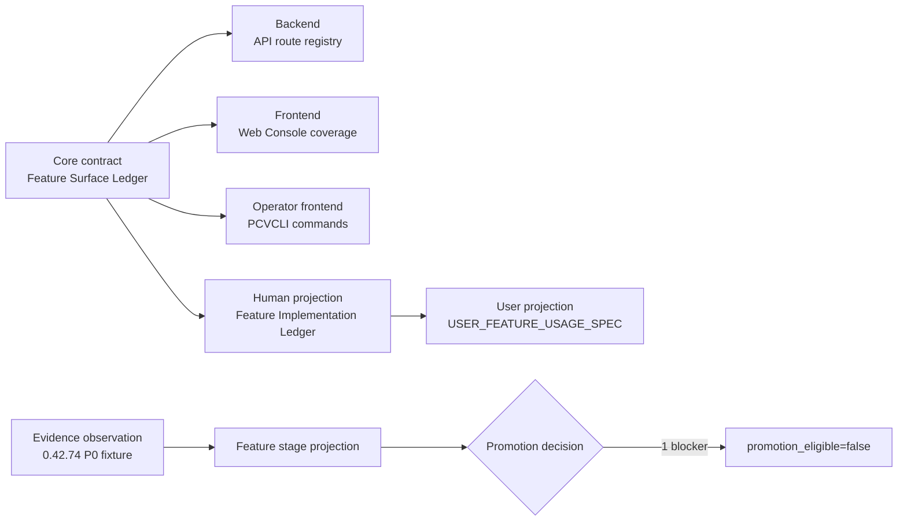

# Desktop Node Feature Implementation Ledger

## 경계와 단일 진실

이 문서는 Desktop Node 기능의 사람이 읽는 투영이다. 기계 계약의 단일 진실은
`config/desktop-node-feature-surface-ledger.json`이며, 이 문서는 Feature ID, API route,
Web Console coverage, PCVCLI command binding을 설명하기 위해 그 계약을 투영한다.

기능 승격 evidence는 별도 `config/desktop-node-feature-evidence-ledger.json`과
`packaging/windows-desktop-node/tests/fixtures/feature-evidence-promotion/04274-p0-fail.json`
범위만 사용한다. Surface catalog 27개 전체를 승격 후보로 간주하지 않으며, evidence가 없는
23개 기능의 단계는 `not-assessed`로 표시한다.

## Core / Backend / Frontend / Evidence 흐름

API는 모든 60개 route의 backend 경계다. Web Console과 PCVCLI는 각 route에 대해 실제
binding 또는 이유가 있는 제외 중 하나를 가져야 한다. 이 흐름은 surface 존재 여부와
feature promotion evidence를 서로 다른 계약으로 유지한다.

## Feature ID 요약

| Feature ID | Title | Routes | Web | CLI |
|---|---|---:|---:|---:|
| `pcv.runtime.policy` | Runtime policy | 1 | 1 present / 0 excluded | 1 present / 0 excluded |
| `pcv.host.status` | Host status | 1 | 1 present / 0 excluded | 1 present / 0 excluded |
| `pcv.vm.inventory` | VM inventory | 2 | 2 present / 0 excluded | 2 present / 0 excluded |
| `pcv.job.lifecycle` | Job lifecycle | 5 | 5 present / 0 excluded | 5 present / 0 excluded |
| `pcv.ops.summary` | Operations summary | 1 | 1 present / 0 excluded | 1 present / 0 excluded |
| `pcv.diagnostics.bundle` | Diagnostic bundles | 3 | 3 present / 0 excluded | 3 present / 0 excluded |
| `pcv.account.session` | Account and RBAC session | 6 | 6 present / 0 excluded | 0 present / 6 excluded |
| `pcv.console.capabilities` | Console capability discovery | 1 | 1 present / 0 excluded | 0 present / 1 excluded |
| `pcv.network.inventory` | Network inventory | 1 | 1 present / 0 excluded | 1 present / 0 excluded |
| `pcv.vm.delete` | VM delete lifecycle | 2 | 2 present / 0 excluded | 2 present / 0 excluded |
| `pcv.vm.console-handoff` | VM console handoff | 1 | 1 present / 0 excluded | 1 present / 0 excluded |
| `pcv.vm.telemetry` | VM telemetry | 2 | 0 present / 2 excluded | 2 present / 0 excluded |
| `pcv.vm.qos` | VM QoS | 6 | 6 present / 0 excluded | 6 present / 0 excluded |
| `pcv.vm.guest-service-readback` | Guest service readback | 2 | 2 present / 0 excluded | 2 present / 0 excluded |
| `pcv.vm.guest-execution` | Guest execution | 2 | 1 present / 1 excluded | 2 present / 0 excluded |
| `pcv.vm.guest-channel` | Guest channel configuration | 3 | 2 present / 1 excluded | 3 present / 0 excluded |
| `pcv.checkpoint.lifecycle` | Checkpoint lifecycle | 3 | 3 present / 0 excluded | 3 present / 0 excluded |
| `pcv.vm.create` | VM creation | 1 | 1 present / 0 excluded | 1 present / 0 excluded |
| `pcv.checkpoint.restore` | Checkpoint restore | 1 | 1 present / 0 excluded | 1 present / 0 excluded |
| `pcv.vm.power-lifecycle` | VM power lifecycle | 4 | 4 present / 0 excluded | 4 present / 0 excluded |
| `pcv.vm.pause-lifecycle` | VM pause lifecycle | 2 | 0 present / 2 excluded | 2 present / 0 excluded |
| `pcv.vm.saved-lifecycle` | VM saved lifecycle | 2 | 2 present / 0 excluded | 2 present / 0 excluded |
| `pcv.vm.rename` | VM rename | 1 | 0 present / 1 excluded | 1 present / 0 excluded |
| `pcv.vm.managed-import` | Managed VM import | 1 | 1 present / 0 excluded | 1 present / 0 excluded |
| `pcv.vm.media-eject` | VM media eject | 1 | 1 present / 0 excluded | 1 present / 0 excluded |
| `pcv.vm.media-attach` | VM media attach | 1 | 1 present / 0 excluded | 1 present / 0 excluded |
| `pcv.vm.resource-limits` | VM resource limits | 4 | 3 present / 1 excluded | 4 present / 0 excluded |

## 60-route surface 투영

| Feature ID | Operation ID | Canonical API route | Permission | Web Console | PCVCLI |
|---|---|---|---|---|---|
| `pcv.runtime.policy` | `runtime.policy` | `GET /api/v1/runtime/policy` | none | present — `runtime.policy` | present — `pcvcli runtime policy` |
| `pcv.host.status` | `host.status` | `GET /api/v1/host/status` | `read` | present — `host.status` | present — `pcvcli host status` |
| `pcv.vm.inventory` | `vm.list` | `GET /api/v1/vms` | `read` | present — `vm.list` | present — `pcvcli vm list` |
| `pcv.vm.inventory` | `vm.detail` | `GET /api/v1/vms/{vmId}` | `read` | present — `vm.detail` | present — `pcvcli vm get vm-01` |
| `pcv.job.lifecycle` | `job.list` | `GET /api/v1/jobs` | `read` | present — `job.list` | present — `pcvcli job list` |
| `pcv.job.lifecycle` | `job.detail` | `GET /api/v1/jobs/{jobId}` | `read` | present — `job.detail` | present — `pcvcli job get job-01` |
| `pcv.job.lifecycle` | `job.cancel` | `POST /api/v1/jobs/{jobId}/cancel` | `operate` | present — `job.cancel` | present — `pcvcli job cancel job-01` |
| `pcv.job.lifecycle` | `job.retry` | `POST /api/v1/jobs/{jobId}/retry` | `operate` | present — `job.retry` | present — `pcvcli job retry job-01` |
| `pcv.job.lifecycle` | `job.reconcile` | `POST /api/v1/jobs/{jobId}/reconcile` | `operate` | present — `job.reconcile` | present — `pcvcli job reconcile job-01` |
| `pcv.ops.summary` | `ops.summary` | `GET /api/v1/ops/summary` | `read` | present — `ops.summary` | present — `pcvcli ops summary` |
| `pcv.diagnostics.bundle` | `diagnostic.bundle.list` | `GET /api/v1/diagnostics/bundles` | `diagnostics.read` | present — `diagnostic.bundle.list` | present — `pcvcli diagnostics bundle list` |
| `pcv.diagnostics.bundle` | `diagnostic.bundle.create` | `POST /api/v1/diagnostics/bundles` | `diagnostics.create` | present — `diagnostic.bundle.create` | present — `pcvcli diagnostics bundle create` |
| `pcv.diagnostics.bundle` | `diagnostic.bundle.download` | `GET /api/v1/diagnostics/bundles/{bundleId}/download` | `diagnostics.read` | present — `diagnostic.bundle.download` | present — `pcvcli diagnostics bundle download bundle-01 --output D:\evidence\bundle.json` |
| `pcv.account.session` | `auth.login` | `POST /api/v1/auth/login` | none | present — `auth.login` | excluded — Account and JWT session lifecycle is Web/API-only; PCVCLI uses protected bearer-token resolution. |
| `pcv.account.session` | `auth.loopback-session` | `POST /api/v1/auth/loopback-session` | none | present — `auth.loopback-session` | excluded — Account and JWT session lifecycle is Web/API-only; PCVCLI uses protected bearer-token resolution. |
| `pcv.account.session` | `auth.refresh` | `POST /api/v1/auth/refresh` | none | present — `auth.refresh` | excluded — Account and JWT session lifecycle is Web/API-only; PCVCLI uses protected bearer-token resolution. |
| `pcv.account.session` | `auth.logout` | `POST /api/v1/auth/logout` | none | present — `auth.logout` | excluded — Account and JWT session lifecycle is Web/API-only; PCVCLI uses protected bearer-token resolution. |
| `pcv.account.session` | `auth.session` | `GET /api/v1/auth/session` | `read` | present — `auth.session` | excluded — Account and JWT session lifecycle is Web/API-only; PCVCLI uses protected bearer-token resolution. |
| `pcv.account.session` | `auth.rbac` | `GET /api/v1/auth/rbac` | `read` | present — `auth.rbac` | excluded — Account and JWT session lifecycle is Web/API-only; PCVCLI uses protected bearer-token resolution. |
| `pcv.console.capabilities` | `console.capabilities` | `GET /api/v1/console/capabilities` | `read` | present — `console.capabilities` | excluded — Global console capability discovery is API/Web-only; PCVCLI exposes VM-specific console handoff. |
| `pcv.network.inventory` | `network.inventory` | `GET /api/v1/network/inventory` | `read` | present — `network.inventory` | present — `pcvcli network list` |
| `pcv.vm.delete` | `vm.delete-status` | `GET /api/v1/vms/{vmId}/delete-status` | `read` | present — `vm.delete-status` | present — `pcvcli vm delete-status vm-01` |
| `pcv.vm.delete` | `vm.delete` | `DELETE /api/v1/vms/{vmId}` | `operate` | present — `vm.delete` | present — `pcvcli vm delete vm-01 --yes` |
| `pcv.vm.console-handoff` | `console.session` | `GET /api/v1/vms/{vmId}/console` | `console.view` | present — `console.session` | present — `pcvcli vm console vm-01` |
| `pcv.vm.telemetry` | `vm.memory-stats` | `GET /api/v1/vms/{vmId}/memory-stats` | `read` | excluded — Web Console uses inventory and ops-summary projections instead of raw per-VM telemetry endpoints. | present — `pcvcli vm memory-stats vm-01` |
| `pcv.vm.telemetry` | `vm.cpu-stats` | `GET /api/v1/vms/{vmId}/cpu-stats` | `read` | excluded — Web Console uses inventory and ops-summary projections instead of raw per-VM telemetry endpoints. | present — `pcvcli vm cpu-stats vm-01` |
| `pcv.vm.qos` | `vm.blkio-get` | `GET /api/v1/vms/{vmId}/blkio` | `read` | present — `vm.blkio-get` | present — `pcvcli vm blkio-get vm-01` |
| `pcv.vm.qos` | `vm.bandwidth` | `GET /api/v1/vms/{vmId}/bandwidth` | `read` | present — `vm.bandwidth` | present — `pcvcli vm bandwidth vm-01` |
| `pcv.vm.qos` | `vm.qos.storage.preview` | `POST /api/v1/vms/{vmId}/qos/storage/preview` | `operate` | present — `vm.qos.storage.preview` | present — `pcvcli vm blkio-set vm-01 --disk disk0 --maximum-iops 1200 --dry-run` |
| `pcv.vm.qos` | `vm.qos.network.preview` | `POST /api/v1/vms/{vmId}/qos/network/preview` | `operate` | present — `vm.qos.network.preview` | present — `pcvcli vm bandwidth-set vm-01 --adapter adapter0 --maximum-kbps 2048 --dry-run` |
| `pcv.vm.qos` | `vm.qos.storage.set` | `POST /api/v1/vms/{vmId}/qos/storage` | `operate` | present — `vm.qos.storage.set` | present — `pcvcli vm blkio-set vm-01 --disk disk0 --maximum-iops 1200 --yes` |
| `pcv.vm.qos` | `vm.qos.network.set` | `POST /api/v1/vms/{vmId}/qos/network` | `operate` | present — `vm.qos.network.set` | present — `pcvcli vm bandwidth-set vm-01 --adapter adapter0 --maximum-kbps 2048 --yes` |
| `pcv.vm.guest-service-readback` | `vm.guest-agent-status` | `GET /api/v1/vms/{vmId}/guest-agent/status` | `read` | present — `vm.guest-agent-status` | present — `pcvcli vm guest-agent-status vm-01` |
| `pcv.vm.guest-service-readback` | `vm.guest-ping` | `GET /api/v1/vms/{vmId}/guest-agent/ping` | `read` | present — `vm.guest-ping` | present — `pcvcli vm guest-ping vm-01` |
| `pcv.vm.guest-execution` | `vm.guest.exec.preview` | `POST /api/v1/vms/{vmId}/guest/exec/preview` | `guest.exec` | excluded — Web Console exposes explicit direct control; this preview route remains API/CLI-only. | present — `pcvcli vm guest-exec vm-01 --dry-run --credential-ref wincred:PureCVisor/guest/admin -- hostname` |
| `pcv.vm.guest-execution` | `vm.guest.exec` | `POST /api/v1/vms/{vmId}/guest/exec` | `guest.exec` | present — `vm.guest.exec` | present — `pcvcli vm guest-exec vm-01 --credential-ref wincred:PureCVisor/guest/admin -- hostname` |
| `pcv.vm.guest-channel` | `vm.guest.channel.preview` | `POST /api/v1/vms/{vmId}/guest/channel/preview` | `guest.channel.configure` | excluded — Web Console exposes explicit direct control; this preview route remains API/CLI-only. | present — `pcvcli vm guest-agent-ensure-channel vm-01 --dry-run` |
| `pcv.vm.guest-channel` | `vm.guest.channel.verify` | `POST /api/v1/vms/{vmId}/guest/channel/verify` | `guest.channel.configure` | present — `vm.guest.channel.verify` | present — `pcvcli vm guest-agent-ensure-channel vm-01 --verify --credential-ref wincred:PureCVisor/guest/admin` |
| `pcv.vm.guest-channel` | `vm.guest.channel.ensure` | `POST /api/v1/vms/{vmId}/guest/channel` | `guest.channel.configure` | present — `vm.guest.channel.ensure` | present — `pcvcli vm guest-agent-ensure-channel vm-01 --repair --yes` |
| `pcv.checkpoint.lifecycle` | `checkpoint.list` | `GET /api/v1/vms/{vmId}/checkpoints` | `read` | present — `checkpoint.list` | present — `pcvcli vm checkpoint list vm-01` |
| `pcv.checkpoint.lifecycle` | `checkpoint.create` | `POST /api/v1/vms/{vmId}/checkpoints` | `operate` | present — `checkpoint.create` | present — `pcvcli vm checkpoint create vm-01 --name before-upgrade` |
| `pcv.checkpoint.lifecycle` | `checkpoint.delete` | `DELETE /api/v1/vms/{vmId}/checkpoints/{checkpointId}` | `operate` | present — `checkpoint.delete` | present — `pcvcli vm checkpoint delete vm-01 before-upgrade` |
| `pcv.vm.create` | `vm.create` | `POST /api/v1/vms` | `operate` | present — `vm.create` | present — `pcvcli vm create vm-01 --vcpu 2 --memory_mb 4096 --disk_size_gb 40 --iso_path D:\isos\windows.iso` |
| `pcv.checkpoint.restore` | `checkpoint.restore` | `POST /api/v1/vms/{vmId}/checkpoints/{checkpointId}/restore` | `operate` | present — `checkpoint.restore` | present — `pcvcli vm checkpoint restore vm-01 before-upgrade` |
| `pcv.vm.power-lifecycle` | `vm.start` | `POST /api/v1/vms/{vmId}/start` | `operate` | present — `vm.lifecycle` | present — `pcvcli vm start vm-01` |
| `pcv.vm.power-lifecycle` | `vm.shutdown` | `POST /api/v1/vms/{vmId}/shutdown` | `operate` | present — `vm.lifecycle` | present — `pcvcli vm guest-shutdown vm-01` |
| `pcv.vm.power-lifecycle` | `vm.poweroff` | `POST /api/v1/vms/{vmId}/poweroff` | `operate` | present — `vm.lifecycle` | present — `pcvcli vm stop vm-01` |
| `pcv.vm.power-lifecycle` | `vm.restart` | `POST /api/v1/vms/{vmId}/restart` | `operate` | present — `vm.lifecycle` | present — `pcvcli vm restart vm-01` |
| `pcv.vm.pause-lifecycle` | `vm.pause` | `POST /api/v1/vms/{vmId}/pause` | `operate` | excluded — Web Console intentionally omits transient pause/resume controls; this route remains API/CLI-only. | present — `pcvcli vm pause vm-01` |
| `pcv.vm.pause-lifecycle` | `vm.resume` | `POST /api/v1/vms/{vmId}/resume` | `operate` | excluded — Web Console intentionally omits transient pause/resume controls; this route remains API/CLI-only. | present — `pcvcli vm resume vm-01` |
| `pcv.vm.saved-lifecycle` | `vm.save` | `POST /api/v1/vms/{vmId}/save` | `operate` | present — `vm.save` | present — `pcvcli vm save vm-01` |
| `pcv.vm.saved-lifecycle` | `vm.resume-saved` | `POST /api/v1/vms/{vmId}/resume-saved` | `operate` | present — `vm.resume-saved` | present — `pcvcli vm resume-saved vm-01` |
| `pcv.vm.rename` | `vm.rename` | `POST /api/v1/vms/{vmId}/rename` | `operate` | excluded — Web Console does not expose rename in the current operator flow; this route remains API/CLI-only. | present — `pcvcli vm rename vm-01 vm-02` |
| `pcv.vm.managed-import` | `vm.manage` | `POST /api/v1/vms/{vmId}/manage` | `operate` | present — `vm.manage` | present — `pcvcli vm manage vm-01 --yes` |
| `pcv.vm.media-eject` | `vm.eject` | `POST /api/v1/vms/{vmId}/eject` | `operate` | present — `vm.media` | present — `pcvcli vm eject vm-01` |
| `pcv.vm.media-attach` | `vm.attach` | `POST /api/v1/vms/{vmId}/attach` | `operate` | present — `vm.media.attach` | present — `pcvcli vm attach vm-01 --iso D:\isos\windows.iso` |
| `pcv.vm.resource-limits` | `vm.limit` | `POST /api/v1/vms/{vmId}/limit` | `operate` | excluded — Web Console exposes explicit QoS controls instead of the combined limit command; this route remains API/CLI-only. | present — `pcvcli vm limit vm-01 --cpu 4 --memory-mb 4096` |
| `pcv.vm.resource-limits` | `vm.set-memory` | `POST /api/v1/vms/{vmId}/set-memory` | `operate` | present — `vm.resource-mutation` | present — `pcvcli vm set-memory vm-01 4096` |
| `pcv.vm.resource-limits` | `vm.set-vcpu` | `POST /api/v1/vms/{vmId}/set-vcpu` | `operate` | present — `vm.resource-mutation` | present — `pcvcli vm set-vcpu vm-01 4` |
| `pcv.vm.resource-limits` | `vm.disk-resize` | `POST /api/v1/vms/{vmId}/disk-resize` | `operate` | present — `vm.resource-mutation` | present — `pcvcli vm disk-resize vm-01 80` |

## Evidence stage 투영

Operational current package/service anchor는 `0.42.74-admin-smoke`다. 이것은 별도의
feature promotion 결정과 동일하지 않다. 현재 feature promotion은
`promotion_eligible=false`, `blocker_count=1`이다.

| Feature ID | code_tested | packaged | installed_tested | actual_vm_tested | manual_admin_tested | blocker |
|---|---|---|---|---|---|---|
| `pcv.runtime.policy` | not-assessed | not-assessed | not-assessed | not-assessed | not-assessed | none |
| `pcv.host.status` | not-assessed | not-assessed | not-assessed | not-assessed | not-assessed | none |
| `pcv.vm.inventory` | not-assessed | not-assessed | not-assessed | not-assessed | not-assessed | none |
| `pcv.job.lifecycle` | not-assessed | not-assessed | not-assessed | not-assessed | not-assessed | none |
| `pcv.ops.summary` | not-assessed | not-assessed | not-assessed | not-assessed | not-assessed | none |
| `pcv.diagnostics.bundle` | not-assessed | not-assessed | not-assessed | not-assessed | not-assessed | none |
| `pcv.account.session` | not-assessed | not-assessed | not-assessed | not-assessed | not-assessed | none |
| `pcv.console.capabilities` | not-assessed | not-assessed | not-assessed | not-assessed | not-assessed | none |
| `pcv.network.inventory` | not-assessed | not-assessed | not-assessed | not-assessed | not-assessed | none |
| `pcv.vm.delete` | not-assessed | not-assessed | not-assessed | not-assessed | not-assessed | none |
| `pcv.vm.console-handoff` | not-assessed | not-assessed | not-assessed | not-assessed | not-assessed | none |
| `pcv.vm.telemetry` | not-assessed | not-assessed | not-assessed | not-assessed | not-assessed | none |
| `pcv.vm.qos` | not-assessed | not-assessed | not-assessed | not-assessed | not-assessed | none |
| `pcv.vm.guest-service-readback` | not-assessed | not-assessed | not-assessed | not-assessed | not-assessed | none |
| `pcv.vm.guest-execution` | not-assessed | not-assessed | not-assessed | not-assessed | not-assessed | none |
| `pcv.vm.guest-channel` | not-assessed | not-assessed | not-assessed | not-assessed | not-assessed | none |
| `pcv.checkpoint.lifecycle` | not-assessed | not-assessed | not-assessed | not-assessed | not-assessed | none |
| `pcv.vm.create` | not-assessed | not-assessed | not-assessed | not-assessed | not-assessed | none |
| `pcv.checkpoint.restore` | pass | pass | pass | pass | pass | none |
| `pcv.vm.power-lifecycle` | not-assessed | not-assessed | not-assessed | not-assessed | not-assessed | none |
| `pcv.vm.pause-lifecycle` | not-assessed | not-assessed | not-assessed | not-assessed | not-assessed | none |
| `pcv.vm.saved-lifecycle` | pass | pass | pass | fail | pass | `pcv.vm.saved-lifecycle/actual_vm_tested/fail` |
| `pcv.vm.rename` | not-assessed | not-assessed | not-assessed | not-assessed | not-assessed | none |
| `pcv.vm.managed-import` | pass | pass | pass | pass | pass | none |
| `pcv.vm.media-eject` | not-assessed | not-assessed | not-assessed | not-assessed | not-assessed | none |
| `pcv.vm.media-attach` | pass | pass | pass | pass | pass | none |
| `pcv.vm.resource-limits` | not-assessed | not-assessed | not-assessed | not-assessed | not-assessed | none |

## 현재 blocker

유일한 승격 blocker는
`pcv.vm.saved-lifecycle/actual_vm_tested/fail`이다. Saved lifecycle의 code, package,
installed, manual-admin 관측은 pass지만 operational current `0.42.74-admin-smoke`의
actual VM 관측은 fail이므로 feature promotion eligible로 판정하지 않는다.

설치본 `0.42.75-admin-smoke` Lane 2 SavedOnly r2와 Full r4는
`docs/ga-ready/evidence/service-plan-p0-actual-vm-2026-08-27-04275.md`에서 PASS다.
그 증거는 04275 candidate actual-VM이며, 04274 ledger `current.verdict=fail`과
`docs/ga-ready/current-evidence.json`의 `promotion_eligible=false`를 바꾸지 않는다.

## Non-claims

- 이 문서는 public trusted signing을 증명하지 않는다.
- 이 문서는 external stable publication을 증명하지 않는다.
- `0.42.74-admin-smoke` operational current 상태가 27개 feature의 promotion 완료를 뜻하지 않는다.
- `not-assessed`는 pass도 fail도 아니며, 실제 VM 또는 manual-admin evidence를 추정하지 않는다.
- 이 문서 생성 과정에서 host, VM, service, package mutation을 수행하지 않았다.
