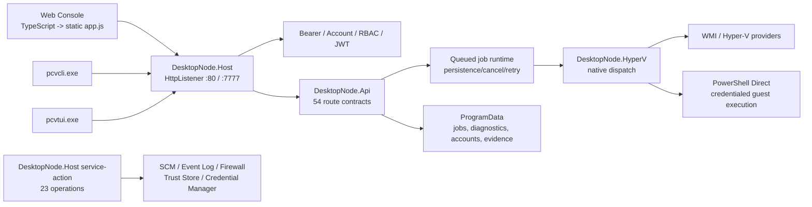

# PureCVisor Desktop Node 프로젝트 현재 상태 전수 조사 보고서

- 조사 기준 시각: 2026-07-13 (Asia/Seoul)
- 조사 대상: `D:\data\projects\codex-zone\purecvisor-desktop-node`
- 기준 브랜치/커밋: `main` / `0285a242db308010f22508eeb1a8085f63e31065`
- 조사 방식: 저장소·코드·문서·ADR·로컬 evidence·원격 GitHub·비파괴 검증 직접 점검
- 제외: 관리자 권한 MSI/SCM/Hyper-V/방화벽/Event Log/trust-store mutation 재실행, 자동 reboot, public publication

## 1. 종합 판정

**종합 상태: 조건부 양호(YELLOW).**

제품은 Windows 전용 내부 사설망 서비스라는 경계 안에서 상당한 기능과 운영 증거를 갖추고 있다. 최신 operational anchor는 `0.42.59-admin-smoke`이며 package, full admin host mutation, manual-admin package-pair, 설치본 Web/TUI/CLI current-card 증거와 로컬 artifact가 모두 존재한다. clean package MSI와 full-gate MSI의 SHA-256도 문서와 실제 파일이 일치한다.

그러나 2026-07-13 현재 개발 기준선을 그대로 “완전 정상”으로 판정할 수는 없다.

1. `dotnet test src/DesktopNode.sln`이 비상승 계정에서 실패한다. 관찰된 실패는 CLI 13건과 Host 6건이며, 설치본 token 파일과 ACL-hardening 테스트 파일에 결합된 테스트 격리/권한 전제 문제다.
2. 마지막 커밋과 마지막 운영 증거가 2026-05-29로, 조사일 기준 약 45일 동안 갱신되지 않았다. `0.42.60-admin-smoke`는 후보로만 열려 있고 실체화되지 않았다.
3. 최신 상태를 여러 문서에 복제한 결과 `0.42.59`, `0.42.55`, `0.42.41`이 같은 “현재” 범위 안에 혼재하고, 최신 GitHub CI run도 문서보다 한 단계 앞서 있다.
4. GitHub의 green check는 public-boundary Pester 두 항목만 실행한다. 전체 .NET, Web, packaging/installer suite의 지속 통합 상태를 대표하지 않는다.
5. 운영 artifact는 `.gitignore` 대상이다. 현재 워크스테이션에는 존재하지만 Git 저장소만 clone해서는 증거를 재현하거나 검증할 수 없다.

즉 **설치본 내부 운영 anchor는 PASS**, **현재 소스의 비파괴 개발 검증은 부분 PASS**, **공개 stable release는 미완료/out-of-scope**다.

## 2. 상태 대시보드

| 영역 | 판정 | 조사 결과 |
| --- | --- | --- |
| Git 기준선 | PASS | `main` clean, `origin/main`과 동일한 `0285a24` |
| 최신 GitHub CI | PASS(제한적) | HEAD run `26637170360`, job `78500330569` 성공 |
| .NET build | PASS | .NET 10 솔루션 전체 restore/build 성공 |
| .NET tests | FAIL | CLI 13건 + Host 6건의 권한/환경 결합 실패 |
| Web TypeScript | PASS | `npm test --prefix web` 성공 |
| Web static parity | PASS | served asset, manifest, static parity, browser fixture 성공 |
| Packaging Pester | PASS | 377/377 |
| Installer Pester | PASS | 50/50 |
| Web Pester | PASS | 48/48 |
| 최신 package evidence | PASS | `0.42.59-admin-smoke`, clean MSI hash 일치 |
| 최신 full admin gate evidence | PASS | `full-admin-host-mutation-gate-20260529-04259`, full-gate MSI hash 일치 |
| Manual-admin package-pair | PASS | `0.42.58 -> 0.42.59`, 6 runners, missing/not-pass 0/0 |
| 설치본 operator surfaces | PASS | Web/TUI/CLI current-card `0.42.59` |
| 문서 일관성 | WARN | current anchor와 CI head가 여러 문서에서 불일치 |
| 증거 freshness | WARN | 마지막 갱신 2026-05-29, 약 45일 경과 |
| Public stable release | NOT READY | public signing, timestamp, stable URL, winget, external publication 미실행 |
| 저장소 운영 위생 | WARN | local branches 25개, worktrees 15개, release 0개 |

## 3. 저장소와 Git 현황

### 3.1 기준선

- 저장소 시작: 2026-04-29, root commit `c4c3a0a`
- 현재 HEAD: `0285a242db308010f22508eeb1a8085f63e31065`
- 현재 HEAD 시각: 2026-05-29 21:27:02 +09:00
- commit 수: 570
- contributor: Codex 401 commits, HardcoreMonk 169 commits
- working tree: clean
- `origin/main`: local HEAD와 동일
- open PR: 0
- open issue: 0
- GitHub release: 0
- tag: archive 용도 1개

원격 저장소에는 2026-05-29 이후 main 변경이 없다. 개발이 안정화되어 멈춘 것인지, 일시 중단된 것인지, 사실상 maintenance 상태인지 문서에 명시된 lifecycle 상태는 없다.

### 3.2 파일 구성

추적 파일은 885개, 합계 약 14.4 MB다.

| 상위 경로 | 파일 수 | 역할 |
| --- | ---: | --- |
| `docs/` | 576 | 계획, ADR, 운영/검증 정책, GA-ready evidence |
| `src/` | 132 | .NET 제품 코드와 xUnit 테스트 |
| `packaging/` | 85 | 제품 wrapper, WiX, Pester, admin smoke tooling |
| `archive/` | 46 | 과거 PowerShell spike/API/CLI/Hyper-V/service baseline |
| `web/` | 28 | TypeScript source, generated served asset, fixture/tests |
| `output/` | 12 | 추적된 UI screenshot |

주요 확장자는 Markdown 586개, C# 114개, PowerShell 111개(`.ps1` + `.psm1`), C# project 15개, TypeScript 11개다.

| 코드/문서 범주 | 파일 | 줄 수 |
| --- | ---: | ---: |
| C# production | 83 | 23,906 |
| C# tests | 31 | 14,392 |
| PowerShell production/tools | 51 | 21,486 |
| PowerShell tests | 60 | 20,938 |
| TypeScript/JavaScript | 19 | 12,628 |
| Markdown | 586 | 80,427 |

문서가 추적 파일의 약 66%를 차지한다. Evidence-first 프로젝트라는 성격에는 맞지만, current 상태 블록의 반복 복제로 인한 drift 비용이 이미 나타나고 있다.

### 3.3 로컬 운영 부산물

- local branch: 25개
- remote branch: 3개
- worktree: 15개
- `.worktrees/`, `.superpowers/`, `artifacts/`, `bin/`, `obj/`, `node_modules/`는 ignore 대상

대부분의 worktree와 branch는 0.42.12~0.42.30 시기 작업이다. 현재 작업에는 영향을 주지 않지만, 디스크 사용과 잘못된 기준선 선택 위험을 줄이기 위한 정리 후보로 보인다. 삭제는 별도 확인 후 수행해야 한다.

## 4. 제품 경계와 아키텍처

### 4.1 제품 경계

이 저장소의 단일 진실은 **Windows Desktop Node**다.

- 포함: .NET Windows Service host, Local API, Hyper-V native adapter, Web Console, PCVCLI, PCVTUI, MSI/Burn/MSIX 관련 내부 도구와 운영 evidence
- 제외: Linux `purecvisorsd`, KVM/libvirt/LXC/ZFS/OVS/OVN, cluster/federation/live migration, public stable distribution
- 배포 경계: ADR-0006 `internal-private-network-only`
- 기본 listener: Web `http://127.0.0.1/`, API `http://127.0.0.1:7777/`
- LAN: 명시적 opt-in, token source, firewall approval 필요

### 4.2 실행 구조



### 4.3 핵심 모듈

| 모듈 | 역할 | 주요 관찰 |
| --- | --- | --- |
| `DesktopNode.Host` | Windows Service, dual listener, static Web, auth boundary, service actions | 제품 process entry point |
| `DesktopNode.Api` | 54개 route contract, request hardening, jobs, diagnostics, auth/RBAC, ops summary | 중앙 request processor가 큼 |
| `DesktopNode.HyperV` | host/VM/checkpoint/QoS/guest native provider와 dispatch | WMI 중심, guest exec는 PowerShell Direct |
| `DesktopNode.Contracts` | runtime/QoS/guest execution/security contract | API와 operator surface의 공통 계약 |
| `DesktopNode.Runtime` | job state transition policy | 작고 독립적인 상태 머신 |
| `DesktopNode.Service` | service lifecycle candidate/adapter contract | 얇은 계약 모듈 |
| `DesktopNode.Cli` | HTTP thin client, table/json/plain/csv, interactive shell | 기본 protected-token 자동 탐색 |
| `DesktopNode.Tui` | HTTP operator client, runtime/job/VM/diagnostics 화면 | SCM service가 아닌 API client |
| `web/` | TypeScript source와 정적 Web Console | `served-app.ts`에서 `app.js` 생성·parity 검증 |
| `packaging/` | product orchestration, WiX MSI, evidence runner | PowerShell은 제품 runtime이 아니라 packaging/ops 경계에 집중 |

### 4.4 API와 mutation 경계

`ApiHandlerAdapterContract`는 54개 route를 단일 registry로 관리한다.

- Native read-only: 11
- Native product operation: 2
- Native queued mutation: 22
- Runtime read-only: 11
- Runtime product operation: 8

지원 범위에는 host/network/VM inventory, VM lifecycle, checkpoint, memory/vCPU/disk, storage/network QoS, jobs, diagnostics, auth/session/RBAC, console/noVNC, guest channel verify/ensure, credentialed guest execution이 포함된다.

`DesktopNode.Host service-action`은 23개 host operation을 가진다. 서비스 configure/repair/remove, token rotation, Credential Manager transition/proof, Event Log, firewall, trust store, data-root, config/job-store migration이 여기서 수행된다. 실제 mutation은 관리자 opt-in gate로 분리되어 있다.

### 4.5 보안 경계

확인된 방어선은 다음과 같다.

- loopback 기본값과 명시적 LAN opt-in
- LAN 사용 시 token source 강제
- inline host token 금지
- DPAPI LocalMachine protected token과 Credential Manager 전환 경로
- Account/RBAC/JWT와 bearer token 병행
- route timeout, rate limit, max body size
- guest credential reference, redaction, audit, timeout/cancel contract
- noVNC target의 loopback 기본 제한
- service/firewall/trust-store owner verification
- admin-smoke와 public trusted release의 명시적 구분

보안 경계는 비교적 명시적이지만, 테스트는 실제 설치본의 보호 파일 존재 여부에 영향을 받는다. 보안 구현의 강도가 테스트 hermeticity를 깨뜨린 상태다.

## 5. 현재 operational evidence

### 5.1 최신 anchor

| 항목 | 현재 값 |
| --- | --- |
| Package/current-card | `0.42.59-admin-smoke` |
| Full admin host mutation | `full-admin-host-mutation-gate-20260529-04259` |
| Manual-admin pair | `0.42.58-admin-smoke -> 0.42.59-admin-smoke` |
| Descriptor | `manual-admin-campaign-descriptor-20260529-04258-04259-closed` |
| Provenance commit | `63d57feba605f82dabd44a96ed50a4d622f6310a` |
| Clean package MSI | `6976e4f8c862f30884adfbdfda2fb4008aa877a30585e4acd35430750e480585` |
| Full-gate MSI | `dff0fce83096ecdf16683307af327af35ae387ed02ac0504948de6633d425596` |
| Manual-admin result | 6 runners, `missing_count=0`, `not_pass_count=0` |
| Installed surfaces | Web/TUI/CLI PASS |
| Signing mode | `AllowUnsignedDev` |
| Public release claim | 없음 |

### 5.2 직접 검증 결과

- 문서가 가리키는 13개 핵심 artifact/provenance/summary 파일이 모두 로컬에 존재한다.
- clean package MSI의 실제 SHA-256이 ledger/evidence와 일치한다.
- full-gate MSI의 실제 SHA-256이 ledger/evidence와 일치한다.
- manual-admin descriptor JSON은 baseline/target `0.42.58/0.42.59`, `overall_status=pass`, runner 6, missing/not-pass 0/0을 기록한다.
- installed current-card summary는 `status=pass`, `version=0.42.59-admin-smoke`다.
- provenance commit `63d57fe`는 현재 HEAD의 ancestor다.

### 5.3 증거 해석 한계

이 결과는 **내부 admin-smoke** 범위다. public trusted signing, trusted timestamp, winget submission, public stable URL, external clean-host distribution을 증명하지 않는다.

또한 `artifacts/`는 Git에 포함되지 않는다. 현재 PC에는 검증 가능한 파일이 남아 있지만, 원격 repository나 새 clone의 독립 검증 가능성은 확인되지 않는다. 장기 보존 위치·retention·immutable storage 정책이 별도로 필요하다.

## 6. 검증 결과

### 6.1 실행 환경

- .NET SDK `10.0.301`
- Node.js `24.18.0`
- npm `11.13.0`
- PowerShell `7.6.3`
- Pester `5.7.1`
- WiX CLI 사용 가능
- 실행 계정 `AMD_5800X\Operator`, elevated administrator 아님

### 6.2 통과 항목

| 명령/범위 | 결과 |
| --- | --- |
| `npm test --prefix web` | PASS |
| `npm run verify:parity --prefix web` | PASS |
| Packaging Pester | 377/377 PASS |
| Installer Pester | 50/50 PASS |
| Web Pester | 48/48 PASS |
| .NET restore/build | PASS |

Web 검증은 TypeScript typecheck, served `app.js` freshness, frontend completion batch 5개/25 work items, static parity manifest, browser fixture까지 통과했다.

### 6.3 .NET test 실패와 원인

`dotnet test src/DesktopNode.sln`은 exit 1이다. 성공한 것으로 확인된 주요 suite에는 API 270건, Runtime 17건, Contracts 15건, Service 11건이 있다. 실패는 다음 두 패턴으로 모인다.

#### CLI 13건

`DesktopNodeCliApplication.RunAsync`를 explicit token 없이 호출하는 테스트 13건이 현재 머신의 기본 protected token 경로를 자동 탐색한다. 실제 설치본 파일 `C:\ProgramData\PureCVisor\desktop-node\api-token.dpapi.json`이 존재하지만 비상승 사용자에게 읽기 권한이 없어 `File.ReadAllText`에서 `UnauthorizedAccessException`이 발생한다.

테스트의 `environment: _ => null` 주입은 환경 변수만 격리하며 기본 ProgramData path 탐색은 차단하지 못한다. 따라서 설치되지 않은 CI/개발 PC와 설치된 운영 개발 PC에서 결과가 달라지는 환경 결합 테스트다.

#### Host 6건

Host service-action 테스트 6건은 `EnsureProtectedTokenFile` 또는 account bootstrap file을 temp directory에 만든다. 구현은 즉시 ACL inheritance를 끊고 `BuiltinAdministrators`와 `LocalSystem`에만 read를 허용한다. 현재 test process는 elevated administrator가 아니므로, 같은 테스트가 뒤이어 파일을 읽을 때 `UnauthorizedAccessException`이 발생한다.

이는 제품의 ACL 정책 자체가 틀렸다는 증거가 아니라 **단위 테스트가 제품 ACL을 실제 적용한 뒤 동일 비상승 process에서 내용을 다시 읽을 수 있다고 가정한 것**이 원인이다. 문서가 기본 검증 명령으로 요구하는 non-admin `dotnet test`와 테스트 설계가 불일치한다.

### 6.4 GitHub CI 범위

현재 HEAD의 GitHub Actions run은 [Public Boundary Contract run 26637170360]([private-archive-repository]/actions/runs/26637170360)이며 성공했다.

그러나 workflow가 실행하는 실질 검사는 다음 두 개다.

1. `PcvAdminSmokeEvidenceDocs.Tests.ps1`
2. `PcvBatchSupervisor.Tests.ps1`의 `*public boundary guard*`

따라서 GitHub green은 문서/evidence public-boundary contract의 PASS이지, 전체 제품 build/test PASS가 아니다. 현재 로컬에서 드러난 .NET test isolation 실패를 CI가 탐지하지 못한다.

## 7. 문서와 ADR 상태

### 7.1 적용 중인 결정

- ADR-0001: 독립 Windows 저장소/evidence-first 이력
- ADR-0002: release/version와 installer artifact contract
- ADR-0003: 내부 Root/leaf `RequireSigned` trust model
- ADR-0004: 내부 전용 GA-ready .NET product runtime
- ADR-0006: internal private network distribution
- ADR-0007: PCVCLI Hyper-V QoS/guest readback-first parity
- ADR-0008: Hyper-V QoS mutation policy
- ADR-0009: Guest Execution security boundary
- ADR-0010: noVNC target config mutation 정책 후보

ADR-0005 public distribution expansion은 현재 내부 서비스 완료 기준이 아니며, public release는 계속 out-of-scope다.

### 7.2 확인된 drift/모순

1. `AGENTS.md` 최상단은 0.42.59를 최신으로 기록하지만, 뒤쪽 “저장소 경계”는 0.42.41을 최신이라고 다시 선언한다.
2. `docs/ADR_INDEX.md`의 2026-05-29 current section 안에 full admin host mutation anchor가 0.42.55라고 남은 문단이 있다.
3. ADR-0009 적용 표는 Guest Execution route/CLI/Web/TUI가 다음 payload까지 disabled라고 쓰지만, 같은 문서 앞부분과 0.42.53~0.42.55 evidence는 이미 provider/direct-control/실제 guest 실행을 PASS로 기록한다.
4. README, ledger, 주요 인덱스는 최신 public-boundary를 head `5a2f917`, run `26636072420`으로 기록한다. 실제 current HEAD `0285a24`에도 후속 run `26637170360`이 성공했다.
5. `web/package.json` version은 `0.23.8-phase25`로 product anchor `0.42.59-admin-smoke`와 다르다. 독립 frontend package version이라면 그 의미를 명시해야 하고, 아니면 operator에게 혼동을 준다.

### 7.3 문서 구조 평가

문서 진입점과 evidence 분류는 매우 촘촘하다. 반면 “최신 current” 본문을 README, AGENTS, developer index, verification policy, public boundary, ADR index, control plane, evidence index에 복사한 구조는 maintenance 비용이 높다.

`CURRENT_EVIDENCE_LEDGER.md`를 machine-readable 단일 진실로 두고 다른 문서는 짧은 링크/생성 블록만 유지하는 방향이 적합하다. historical predecessor는 별도 archive/index로 이동시키면 현재 상태를 읽는 비용도 크게 줄어든다.

## 8. 품질·유지보수 위험

### P1 — 즉시 처리 권고

#### P1-1. 기본 .NET 검증이 비상승 환경에서 hermetic하지 않음

- 영향: 문서가 요구하는 기본 개발 gate를 일반 developer와 설치본 보유 workstation에서 통과할 수 없음
- 원인: CLI default token path와 실제 ProgramData 상태 결합, Host ACL-hardening test와 비상승 process 전제 충돌
- 권고: default protected-token path를 테스트에서 명시적으로 override/disable할 seam을 제공하고, ACL unit test와 elevated integration test의 소유권을 분리한다.

#### P1-2. CI가 전체 제품 회귀를 검사하지 않음

- 영향: main의 green 상태가 .NET/Web/installer 전체 품질을 나타내지 않음
- 권고: Windows runner에서 `dotnet test`, Web npm/parity, packaging/installer/web Pester를 분리 job으로 실행하고 public-boundary job은 별도 required check로 유지한다.

### P2 — 단기 처리 권고

#### P2-1. operational evidence freshness와 0.42.60 후보 상태 불명확

- 마지막 product/evidence 활동이 약 45일 전이다.
- 권고: 프로젝트가 maintenance/paused/active 중 무엇인지 선언하고, 0.42.60 후보를 닫거나 fresh package chain으로 승격한다.

#### P2-2. current 문서 drift

- 최신 anchor, Guest Execution 상태, CI run이 문서 사이에서 어긋난다.
- 권고: ledger 중심으로 current block을 생성하고 stale anchor guard를 추가한다.

#### P2-3. artifact 장기 보존이 local ignore directory에 의존

- Git clone만으로 evidence를 검증할 수 없다.
- 권고: immutable internal artifact store, retention, checksum manifest, 접근 정책을 명시하고 ledger에 canonical URI를 기록한다.

#### P2-4. 대형 중앙 파일

- `DesktopNodeHostServiceAction.cs`: 약 3,573줄
- `DesktopNodeApiRequestProcessor.cs`: 약 3,077줄
- `DesktopNodeHyperVNativeAdapter.cs`: 약 1,891줄
- `ApiRuntimePolicyRequestProcessorTests.cs`: 약 4,388줄
- `PcvAdminSmokeEvidenceDocs.Tests.ps1`: 약 414 KB

변경 충돌과 review 비용이 커질 수 있다. 기능별 handler/operation으로 분해하되, 현재 route registry와 evidence contract를 유지하는 점진적 분리가 적합하다.

#### P2-5. branch/worktree 누적

25개 local branch와 15개 worktree 대부분이 historical 상태다. 보존 필요성을 확인한 뒤 archive/delete 기준을 적용할 필요가 있다.

### P3 — 전략 결정 필요

#### P3-1. 제품 maturity 명칭

내부 운영 증거는 강하지만 GitHub release/tag/public stable artifact는 없다. “GA-ready”, “internal operational”, “public release”를 분리한 현재 정책을 사용자-facing 문서에서도 더 명확히 해야 한다.

#### P3-2. public distribution의 영구 제외 여부

ADR-0006 경계를 유지할지, ADR-0005 계열 public ops를 다시 채택할지 제품 결정이 필요하다. 현재 코드 상태만으로 public stable을 주장해서는 안 된다.

## 9. 권고 실행 순서

1. **개발 gate 복구:** CLI/Host 테스트 격리 문제를 수정하고 non-admin Windows에서 `dotnet test src/DesktopNode.sln`을 green으로 만든다.
2. **CI 확대:** full .NET + Web + Pester matrix를 HEAD required checks로 추가한다.
3. **current 문서 정규화:** 0.42.59/0.42.60 상태, Guest Execution, 최신 HEAD CI run을 ledger 기준으로 동기화하고 중복 current 블록을 축소한다.
4. **freshness 결정:** maintenance 선언 또는 0.42.60 fresh package/fullgate/manual-admin/current-card campaign 중 하나를 선택한다.
5. **artifact 보존:** ignored local artifact를 내부 immutable store와 연결한다.
6. **구조 개선:** API processor와 host service-action을 기능 단위로 점진 분할한다.
7. **저장소 정리:** historical branch/worktree 정리안을 만든 뒤 승인된 항목만 제거한다.
8. **release 경계 결정:** internal-only 유지 또는 public distribution 재개를 ADR로 명시한다.

## 10. 최종 결론

PureCVisor Desktop Node는 단순 prototype을 넘어선 **내부 Windows/Hyper-V 운영 제품 후보**다. .NET service/runtime, Web/CLI/TUI, native Hyper-V, packaging, host mutation guard와 evidence chain은 폭넓게 구현되어 있고, `0.42.59-admin-smoke` 운영 증거도 로컬에서 검증 가능하다.

현재 가장 큰 문제는 기능 부족이 아니라 **검증 기준선과 상태 관리의 신뢰성**이다. non-admin 전체 .NET test가 환경에 따라 실패하고, GitHub green이 그 실패를 포함하지 않으며, 최신 상태가 많은 문서에 중복되어 drift했다. 이 세 가지를 먼저 닫으면 프로젝트는 내부 운영 기준에서 다시 명확한 green 상태를 가질 수 있다.

공개 release 관점에서는 아직 준비 완료가 아니다. 현재 증거는 internal admin-smoke이고, public trusted signing·timestamp·external publication·stable distribution은 의도적으로 미완료 상태다.

## 부록 A. 주요 근거 파일

- `README.md`
- `AGENTS.md`
- `docs/DEVELOPER_INDEX.md`
- `docs/DEVELOPMENT_VERIFICATION_POLICY.md`
- `docs/PUBLIC_RELEASE_BOUNDARY.md`
- `docs/ADR_INDEX.md`
- `docs/ga-ready/CURRENT_EVIDENCE_LEDGER.md`
- `docs/ga-ready/CONTROL_PLANE_INDEX.md`
- `docs/ga-ready/EVIDENCE_INDEX.md`
- `docs/ga-ready/evidence/admin-smoke-package-2026-05-29-04259.md`
- `docs/ga-ready/evidence/full-admin-host-mutation-gate-2026-05-29-04259-hostmutation.md`
- `docs/ga-ready/evidence/manual-admin-campaign-2026-05-29-04258-04259.md`
- `docs/ga-ready/evidence/installed-operator-surface-current-card-2026-05-29-04259.md`
- `src/DesktopNode.Api/ApiHandlerAdapterContract.cs`
- `src/DesktopNode.Api/DesktopNodeApiRequestProcessor.cs`
- `src/DesktopNode.Host/DesktopNodeHostApplication.cs`
- `src/DesktopNode.Host/DesktopNodeHostServiceAction.cs`
- `src/DesktopNode.HyperV/DesktopNodeHyperVNativeAdapter.cs`
- `web/package.json`
- `.github/workflows/public-boundary.yml`

## 부록 B. 실행한 핵심 명령

```powershell
git status --short --branch
git ls-remote origin refs/heads/main
gh run list --branch main
gh pr list --state open
gh issue list --state open
dotnet test src/DesktopNode.sln --nologo --verbosity minimal
npm test --prefix web
npm run verify:parity --prefix web
Invoke-Pester -Path packaging/windows-desktop-node/tests
Invoke-Pester -Path packaging/windows-desktop-node/installer/tests
Invoke-Pester -Path web/tests
Get-FileHash -Algorithm SHA256 <clean-package-msi>
Get-FileHash -Algorithm SHA256 <full-gate-msi>
```

## 부록 C. 2026-07-13 개발 게이트 복구 closure addendum

이 부록은 위 전수 조사 snapshot을 수정하거나 소급 재해석하지 않는다. 조사에서 확인한
P1 개발 게이트 문제에 대한 후속 구현·로컬 검증 상태만 추가한다.

### 로컬에서 해소된 항목

- 환경 결합 .NET 실패 `19`건(CLI `13`, Host `6`)을 해소했다.
- CLI application/interactive shell 테스트는 고유한 누락 default protected-token 경로를
  주입하며 설치본 ProgramData token을 읽지 않는다.
- Host 테스트는 recording ACL hardener를 주입하며 실제 ACL을 변경하지 않는다.
- 비관리자 Windows에서 `dotnet test src/DesktopNode.sln -c Release`가 총 `737`건,
  실패 `0`으로 통과했다.
- 새 workflow 계약 추가 뒤 packaging Pester는 기존 `377`건에서 `378`건으로 늘었고 전부
  통과했다. Installer Pester `50`, Web Pester `48`도 실패 `0`이다.

### 새로 강제한 항목

- `.github/workflows/development-gates.yml`에 `dotnet-tests`, `web-tests`,
  `packaging-pester`, `installer-web-pester` 네 비변경 job을 추가했다.
- pull request, `main`, `codex/**` push와 manual dispatch 계약, read-only contents 권한,
  concurrency cancellation, job timeout, .NET `10.0.x`, Node `24`, Pester `5.7.1`을 고정했다.
- 기존 `Public Boundary Contract`는 그대로 유지하며 새 workflow가 이를 대체하지 않는다.

### 원격 CI closure

- 사용자 승인 뒤 correction head `2f9902801124c1bf095a2b01d9c77790d37a011f`를 push했다.
- Development Gates run `29231097324`의 `dotnet-tests`, `web-tests`,
  `packaging-pester`, `installer-web-pester`가 모두 PASS했다.
- Public Boundary run `29231097334`의 `public-boundary-ci-required`가 PASS했다.
- 최초 run `29230775541`의 기존 API test `500ms` timing failure는 read route가 blocking
  mutation 종료 전에 반환하는 조건 기반 검증으로 교체했고, 생산 API 코드는 변경하지
  않았다.

### 변경되지 않은 항목

- 조사 시점 기준 약 `45`일의 installed evidence staleness는 그대로다.
- 배포 경계는 계속 internal-only이며 public trusted signing과 external stable publication을
  주장하지 않는다.
- 설치본/package 운영 anchor는 `0.42.59-admin-smoke`로 유지한다.
- `0.42.60-admin-smoke`는 별도 승인이 필요한 다음 installed candidate다.

### 이번 slice에서 제외한 항목

- package build
- full admin host mutation gate
- manual-admin package-pair campaign
- service/MSI/Burn/MSIX/Hyper-V/firewall/trust-store/Event Log mutation
