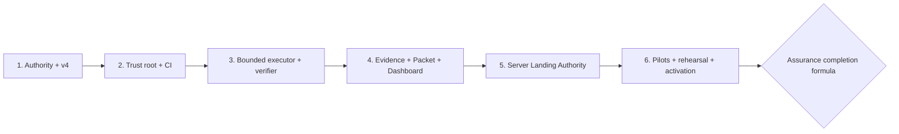

# PureCVisor Desktop Node No-Human-Code-Review Assurance Program Plan

> **Status:** proposed implementation plan; separate user execution approval is pending.
>
> **For agentic workers:** execute one checked task and one pull request boundary at a time. Do not
> interpret this plan, its eventual review approval, or a green repository test as package, service,
> Hyper-V, rollback, materialization, activation, promotion, or landing authority.

**Plan-ID:** `purecvisor-desktop-node-no-human-code-review-assurance-20260804`

**Plan-Revision:** `purecvisor-desktop-node-no-human-code-review-assurance-v1`

**Goal:** Build a frozen-spec, bounded-execution, independent-verification, immutable-evidence and
server-enforced landing environment so that the user can decide from Decision Packets without reading
source code.

**Architecture:** Six ordered child plans turn the approved assurance design into a protected trust
root, a confined executor/verifier pair, an evidence/decision plane, a server Landing Authority and
representative product pilots. Machine JSON is authoritative; Markdown is generated. Every later plan
consumes the previous plan's signed exit attestation and fails closed when that attestation, an exact
artifact, an actor boundary, or a server capability is missing.

**Pinned planning baseline:** branch source `dcae9b0d0050397fc1e5145e12bdd99414bfe654`, observed
`origin/main=3cc7726dcd12c573d815afe6c0c7c2d910f0c7de`, operational anchor
`0.42.65-admin-smoke`. These are authoring facts, not future execution targets. Every executable
Packet must bind the then-current exact `main` commit and tree.

**Source design:**
`docs/superpowers/specs/2026-08-03-purecvisor-desktop-node-no-human-code-review-assurance-design.md`

**Written-spec approval:**
`User-Approval: no-human-code-review-assurance-written-spec-20260804`

---

## 1. Current truth and hard boundary

- The predecessor plan
  `docs/superpowers/plans/2026-08-02-purecvisor-desktop-node-csharp-architecture-improvement.md`
  remains effective current until a separately approved activation completes.
- Successor v3 is inactive. Its materialization approval
  `User-Approval: luna-control-materialization-dbac0ae5abd8-20260803` is stale and must not be reused.
- `docs/superpowers/plans/luna-completion/**` is not materialized at this baseline.
- The two current workflows do not prove server-side required checks, no-bypass, or merge-queue
  enforcement. Current `required_enforced=false`, `automatic_landing=false`, and
  `overall_readiness=red` remain truthful until Plan 5 exits.
- This planning change may create only the seven plan documents listed below. It must not modify
  product code, workflows, execution state, current evidence, GA evidence, installed software, a
  service, a network binding, or Hyper-V.
- User-owned untracked files are never staged, deleted, rewritten, or treated as plan evidence.

## 2. Ordered child plans

| Order | Planning work IDs | Child plan | Required exit before next plan |
|---|---|---|---|
| 1 | `NHA-A00..A05` | `2026-08-04-purecvisor-assurance-authority-contracts.md` | exact seven-plan manifest is approved; approved design is a `main` ancestor; stable authority integration, successor v4 and derived policy are merged; fresh T01-only trust-root bootstrap Packet is ready |
| 2 | `NHA-T01..T08` | `2026-08-04-purecvisor-assurance-trust-root-ci.md` | schemas and validators reject the known-bad corpus; current evidence is typed; PlanOnly/Pester false-green paths are closed; two clean shadow runs agree |
| 3 | `NHA-X00..X09` | `2026-08-04-purecvisor-assurance-bounded-executor-verifier.md` | all new paths are protected first; exact-path confinement, capability denial, actor separation, trusted Git diff and clean verifier dispatch pass negative tests |
| 4 | `NHA-E01..E09` | `2026-08-04-purecvisor-assurance-evidence-decision-dashboard.md` | raw artifacts are accessible/hash-valid/fresh; notary, Packet, immutable decision and Dashboard truth tables pass |
| 5 | `NHA-L01..L09` | `2026-08-04-purecvisor-assurance-landing-authority.md` | provider API attests protected `main`, seven required gates, no covered-role bypass, latest-base serialization and signed lineage |
| 6 | `NHA-P01..P10` | `2026-08-04-purecvisor-assurance-pilot-activation.md` | three waiver-free S/M pilots, one category-child L/Release rehearsal, packet-only user exercise and activation attestation pass |

The IDs above are implementation-plan work IDs, not materialized Luna card IDs. Successor v4 owns the
canonical card IDs and must map each work ID without omission or alias reuse.

## 3. Dependency and authority flow



No child plan may be started from a working branch containing an unmerged predecessor child. Each plan
starts from fresh `main`, verifies the prior exit attestation, uses a separate branch/PR, and preserves
locator ancestry with the repository's approved commit-preserving merge method.

## 4. Global actor and model routing

| Work class | Implementer | Independent verifier | Minimum lane |
|---|---|---|---|
| Planning, authority, schema, validator, oracle, workflow, policy, notary, decision or landing code | `gpt-5.6-sol`, `ultra` unless a card explicitly permits `high` | different trust-domain Sol actor with non-delegable credential | actual `Release` |
| S product pilot | `gpt-5.6-luna`, `max` | separately dispatched Luna Max actor plus deterministic gates | focused + actual `Fast` |
| M product pilot | `gpt-5.6-luna`, `max` | separately dispatched Luna Max actor plus deterministic gates | focused + actual `Full` |
| L, release, package, service, TLS, Hyper-V, rollback or promotion | `gpt-5.6-sol`, `high|ultra` as frozen by card | separate Sol actor | actual `Release` |

An actor is the tuple of trust domain, principal, credential, task/run and permission set. A different
run label in the same writable workspace is not independent. If canonical model selection cannot be
proved, stop with `blocked/model_identifier_unresolved`; if the selected model cannot be invoked, stop
with `blocked/model_unavailable`. Automatic model fallback is forbidden.

## 5. Global pull request and commit protocol

Every task that changes tracked files uses this sequence:

1. Confirm its prerequisite commit and exit attestation are ancestors of fresh `main`.
2. Freeze exact create/modify/delete paths, protected symbols, commands, capabilities and timeout.
3. Before a protected/trust-root/high-risk write, obtain and consume its exact pre-execution Packet;
   no result/head/tree or PASS field is guessed at this phase.
4. Add independent oracle/negative fixtures in an ancestor or separately authorized trust-root PR.
5. Run RED and preserve the expected failing case IDs and raw logs.
6. Implement only the frozen paths; compute the canonical trusted Git diff.
7. Dispatch verification from a different trust domain against the exact result commit/tree.
8. Run the card's actual lane; `PlanOnly` may describe work but is never PASS evidence.
9. Build a post-verification landing Packet when required, bind the exact candidate and evidence, and
   consume its separate decision immediately before landing.
10. Merge only through the applicable server policy. Record exact PR head, queue candidate, merged
   commit and post-merge verification as separate immutable events.
11. Do not delete failure evidence. A failed task remains failed/blocked/stale until a new valid result
    supersedes it.

Each implementation commit carries `Plan-ID`, `Plan-Revision`, work/card ID and result-tree locator.
Approval, verification and landing attestations are separate artifacts or commits; a result commit must
not claim its own future hash.

A01 is the sole Packet-before-contract exception: its authority is only the exact A00 empty approval
commit, approved seven-file manifest, independent plan review, ordinary CI and unchanged
commit-preserving PR. It emits bootstrap evidence but never assurance GREEN.

After A01 and before Plan 5 makes live enforcement available, every tracked trust-root work item uses a
narrow bootstrap/shadow protocol with **two** distinct decisions: a Packet with
`phase=execution_authorization` binds start commit/tree, exact allowed path operations, commands,
capabilities, oracle, risk and rollback and is consumed immediately before the first tracked edit; after
an immutable candidate is independently verified, a new Packet with `phase=landing_authorization`
binds exact candidate commit/tree/change-set and actual evidence and is consumed immediately before the
unchanged PR merge. Ordinary CI and post-merge attestation remain mandatory, but no result is assurance
GREEN or automatically landable. Direct push and `--admin` remain forbidden. Once Plan 5 exits, this
exception expires permanently and cannot be used for Plan 6 or later recovery.

All bootstrap/shadow decisions after A01 use one bounded interim authenticated decision channel frozen
inside A00's bootstrap trust profile. The profile binds immutable provider/channel and user-principal
IDs; the provider-signed export or OIDC issuer/subject/audience and verification key; exact three-command
grammar; nonce, issue/expiry and revocation rules; and create-only external request, approval and consume
locators. It has separately named
`bootstrap_decision_request_schema_sha256=b719c93bebef0fe5028e551069304b0a12d7d894c41c93be89df52c60ed47a0e`,
`bootstrap_artifact_publication_receipt_schema_sha256=a4f7e6bf835c0b91f1bf2e642fb037d2e6b912df29900ffe84d04ae140319ea0`
and `bootstrap_exit_schema_sha256=c398ac5f2d13df77a579697f052df259e12aed147212b817b16f0e6c081de115`
fields plus two separately named external validator and canonicalizer binary digests. It also freezes the
pre-T03 external publisher/client binary digest, external task-dispatch schema and canonical-generator
digests, two external task-dispatch validator/argv-runner binary digests, dispatch signer principal/key/
algorithm/revocation/namespace and the §5.1 dispatch procedure digest; the external planned-command-
descriptor schema/canonical-generator/two validator binary digests and descriptor procedure digest; two exit-replica provider IDs, distinct write/read
credential roles, all allowed prefix families, minimum retention and the §6.2 conditional-create/readback
receipt semantics. A repository comment, display name, editable transcript, model assertion or unsigned copy is
never authentication. If the channel cannot produce independently verifiable evidence, A00/A02 and all
later work stop. The same channel remains the input authenticator after E05 canonicalizes decision events
and through the durable L04 cutover transaction itself. Plan 5 L04 alone may replace it through a
separately approved, dual-readback, atomic cutover; there is no overlap or fallback, and the interim
identity is revoked for later decisions while its historical events remain verifiable.

The only two pre-phase exceptions are A00's raw approval exit and A01's raw program-approval-consume exit:
A00's approved trust profile/request prebinds both exact finalizer argv/digests, prefixes, providers,
retention and readback, and A01's one-time typed `program_approval` consume binds its own finalizer. They
authorize no other publication. Except for those two exits and a mandatory raw exit/final attestation
emitted as the finalizer of the same consumed execution or landing transaction, with exact finalizer
argv/digest, prefix, provider, retention and readback/notary facts prebound by that decision, every
independent post-merge, aggregate, projection or publication
command requires a fresh artifact-only `packet_type=trust_root`, `phase=execution_authorization` decision. It binds exact
fresh-main/input locators, protected tool and argv digests, output prefixes, providers, retention,
conditional-create/readback/notary operations, expiry, abort/reconciliation and zero tracked/host/product
mutation. It is consumed immediately before its first side effect and cannot be inferred from or reused as
a landing decision. Every owning task must name that decision/consume locator in its exit.

For canonical `trust_root/execution_authorization` Packets, the generator always writes the explicit Plan
2 `execution_scope`: any nonempty repository operation set is `tracked_change`; zero repository
operations plus external evidence writes is `artifact_only`; any external provider resource/policy/key/
credential/dispatch administration—other than the prebound conditional creation of immutable evidence
objects—is `provider_administration`. A `mutation_authorization/execution_authorization` Packet does not
reuse those scope values: it selects exactly one closed `mutation_kind`. `brokered_code_change` requires a
nonempty exact repository operation set plus broker lease/revert and sets provider/host mutation false;
`host_or_artifact_mutation` requires `operations=[]` and exactly one closed artifact/host category branch.
The two Packet types and all of these branches are mutually exclusive, host mutation belongs only to
`host_or_artifact_mutation`, and any mixed, ambiguous or omitted branch rejects. Child-plan shorthand never
permits the implementer to choose a broader scope.

### 5.1 Normative task-dispatch closure

No work ID is executable from prose, a directory alias or a model-chosen command. Before each range's
owning execution or landing request, exactly one signed `pcv-assurance-task-dispatch-v1` task manifest and
the applicable immutable range record must be frozen and independently
validated. It binds the approved Program/Plan revision, source plan Git path/blob and task-section digest,
predecessor exit and one ordered nonempty range manifest. Each range binds exact start objects or artifact
target, repository-identity envelope when applicable, a unique range ID/fresh decision consumer and one
closed `path_resolution` branch:

- `exact_paths`: nonempty ordinal create/modify/delete operations with old blob/mode and exactly one
  `authority_mapping`: either `trust_root/tracked_change`, or
  `mutation_authorization/brokered_code_change` with the exact broker lease/revert and
  `provider_mutation=false`, `host_mutation=false`; a mixed mapping rejects;
- `artifact_only`: `operations=[]` plus exact immutable inputs, protected tool argv and create-only output
  prefixes/provider/retention/readback/notary facts; or
- `approval_empty_commit`: permitted only for NHA-A00, with exact parent, identical parent/result tree,
  canonical message/trailers and one prebound ref transition; file operations are empty;
- `approved_candidate_landing`: permitted only for NHA-A01, with exact approved base/head/tree/change-set,
  commit-preserving merge method, provider candidate and ref compare-and-swap; it authorizes no new file
  operation or candidate amendment;
- `verified_candidate_landing`: an exact post-verification landing decision, target ref, base/head/tree/
  change-set, queue or fenced-lease candidate, commit-preserving merge method and ref compare-and-swap;
  it authorizes no candidate edit. Canary uses must target only a Packet-named expendable ref, never main;
- `provider_administration`: `operations=[]` plus exact provider resources/before-state/API/credential/
  cost/readback/rollback/revocation operations and no host or repository file/content/candidate-
  construction capability. NHA-L08 may select closed `canary_setup_reservation`, `canary_setup_forward`,
  `canary_setup_rollback` or `canary_setup_unused_release` subbranches. Their immutable setup lineage is the
  root-dispatch/setup-range/template digest set plus one stable reservation slot; it is not a probe pair plan.
  Setup reservation binds exact initial ETags/before-state, the
  approved/unconsumed setup-failure rollback and stable slot, a sufficient rollback-capability horizon and
  CAS/reservation/readback/WORM argv. Its fresh consumed decision alone creates/readbacks the reservation and
  `reserved` pair state; rollback approval writes nothing. Setup forward binds that measured receipt and
  only the exact setup/readback operations, then uses atomic consume-and-claim before its first side effect.
  Setup rollback binds the same lineage/receipt and only inverse/restore/readback operations, is approved
  before reservation, stays unconsumed until failure and uses rollback claim before inverse. Setup unused-release is a fresh
  decision allowed either before setup start with zero pair-attributable effect, or after separately
  authorized terminal cleanup proves exact initial state. It atomically releases that reservation and writes
  the terminal event/receipt. Partial/started failure consumes rollback; uncertainty is reconciliation-only.
  Only NHA-L08 may select the closed `canary_enforcement_probe` subbranch: it
  selects exactly one `probe_role=attempt|rollback|reservation|unused_release`. `rollback` binds already-created immutable candidate
  bytes, Packet-named non-main ref/PR/queue IDs, exact pre-probe ETags, a signed closed
  `probe_attempt_plan` URI/digest containing attempt operation ID/argv/actor class/nonce/expected transition
  and inverse requirements, plus only inverse/cancel/restore/readback operations. It binds the signed
  stage-two `probe_attempt_resolution` parent emitted with the rollback child, whose rollback and
  reservation-receipt output slots contain no future values. `reservation` binds that plan/parent, rollback Packet/approval, stable output slot, exact
  pre-probe ETags and atomic CAS/reservation/readback/WORM argv; a fresh consumed decision performs only the
  reservation and emits an immutable measured receipt. Approval of the rollback does not write it.
  `attempt` exists only as that parent's post-reservation resolved child and binds the same plan/IDs/ETags,
  the measured preapproved rollback Packet/decision/reservation receipt, resolved child range/descriptor and provider/Git API attempt with
  `expected_outcome=reject|pending`; validators require bidirectional equality, inverse-operation
  compatibility and one rollback-to-one-attempt cardinality. It forbids main, commit/content creation,
  bypass/admin/unenforced credentials and successful unauthorized merge/ref transition. It requires an
  exact ordinary non-bypass actor/credential permission digest that may attempt the named contents/ref API
  but has no successful direct-write capability under the enforced policy, plus zero successful transition
  readback. Each attempt has one fresh paired rollback approval and separately consumed reservation before
  attempt consume. `unused_release` is a fresh consumed provider decision that binds the plan, receipt,
  root/slot, outcome and exact revocation/release/readback/WORM argv. It always requires signed independent
  proof that the probe attempt caused zero successful transition. Its pre-attempt-abort and expected-reject
  branches additionally require zero target-ref transition; its pending-supersession branch instead requires
  exactly one successful transition equal to the separately authorized landing decision/head/tree/ref/CAS,
  plus zero extra transition and exact post-landing readback. After winning the release claim, pre-attempt
  abort terminalizes only still-open stage-two/attempt and rollback targets; post-reject or authorized-landing
  release terminalizes only the still-unconsumed rollback/release lineage and never the already-consumed
  attempt. Every approval remains immutable, and each terminalized approval must have consume count zero;
  the released reservation and terminal receipt make later consume fail current-state validation. It
  then atomically releases the reservation. Thus expected reject uses this
  explicit unused-release transaction; expected pending retains the reservation until that verified landing
  release or until rollback is consumed for terminal cancel. Uncertain landing never releases it;
  and an unexpected transition consumes it immediately and fails L08; uncertainty permits only fresh
  reconciliation. Only NHA-P08/P09 may instead select the closed `mutation_guard_reserve` subbranch: it
  binds one signed `reversible_mutation_plan`, its rollback Packet/approval and stable reservation output
  slot, exact root/fencing/current guard state, `mode=acquire_root|add_child_guards`, atomic CAS/reservation/
  readback/WORM argv and a typed receipt slot. It permits only that reserve operation, requires a fresh
  consumed provider-administration decision, and emits the measured immutable receipt used by the forward
  resolver and later rollback. The same two work IDs may select `mutation_guard_abort_release` only after a
  successful reserve and before that pair's forward consume or that pair's host side effect. It binds the exact plan, resolver,
  rollback approval, reserve receipt, root/guards, signed zero-forward-consume and zero-side-effect proof
  attributable to that pair/newly delegated surfaces and, if present, an exact resolved-child terminal-
  cancellation record. The immutable forward approval remains unconsumed and becomes stale against the
  released reservation/current state. A fresh consumed decision permits
  one matching release mode. `release_acquired_root` is valid only for an `acquire_root` receipt with zero
  other active/delegated child and releases that reservation, its complete guards and the empty root.
  `remove_unused_child_guards` is valid only for an `add_child_guards` receipt and releases only that pair's
  reservation/newly added disjoint guards while proving the shared root/fencing token and every other guard
  unchanged. Both require owner/epoch CAS equality and a WORM receipt; uncertainty or any started forward for that pair is
  rollback/reconciliation-only. The same two work IDs may select `mutation_guard_close`: after all child rollback/reservation and credential readbacks, it binds
  one exact current campaign root/fencing token, the complete guard set, every required terminal receipt,
  atomic close/readback/WORM argv and `operations=[]`; it permits no host/repository/credential/other
  provider mutation, cannot restore state, and rejects any missing/failed/uncertain receipt; or
- `mutation_authorization`: permitted only for the canonical Packet's
  `mutation_kind=host_or_artifact_mutation`; `operations=[]` and one closed category bind one exact
  artifact/host/command/capability set, before-state and success/rollback oracle. A reversible forward
  host category (`package_service/install`, `http_binding_tls`, or `hyperv_actual_vm`) is executable only
  as a `reversible_mutation_forward_resolution` child binding the shared signed pair plan, the corresponding
  separately approved/still-unconsumed `lifecycle_rollback` decision and measured guard-reserve receipt;
  `package_service/build` binds no host and no rollback reservation, while `lifecycle_rollback` consumes
  only the inverse branch of the shared plan, prebinds a stable reservation receipt slot, validates its
  measured receipt at consume and never reserves another rollback. It cannot contain a repository or
  unrelated provider operation, and
  `brokered_code_change` cannot use this range branch; or
- `deferred_resolver`: one closed `resolver_kind`. `selection_resolution` binds an exact immutable
  selection or Plan-Revision artifact and protected resolver digest. `candidate_landing_resolution`
  instead binds the prior execution range ID, protected candidate/evidence resolver digest, exact typed
  candidate/evidence output slots, target ref and intended boundary but no future candidate value.
  `program_approval_empty_commit` binds the exact planning parent/same-tree constraint, canonical commit
  template, approval-event namespace/nonce/locator slot and commit-output slot.
  `program_approved_candidate_landing` binds the A00-commit/exit output slots, exact approved candidate,
  target ref, merge method, CAS and landing-output slots.
  `probe_pair_plan_resolution` is NHA-L08-only and
  `reversible_mutation_pair_plan_resolution` is NHA-P08/P09-only. Each initial parent is fixed in the
  original task manifest with exact work/pair ordinal, pair kind/category, typed candidate-or-artifact/
  host/before-state/plan producer slots, plan schema and protected plan-generator/resolver digests, a stable
  rollback/reservation slot set, fixed four-output arity/order/boundaries and no future value. The owning campaign manifest fixes every pair and any
  conditional TLS branch; wildcard or later pair append rejects. After actual inputs exist, the first
  resolver validates the signed plan and emits exactly four ordered signed outputs: (1) executable rollback
  child, (2) closed reservation executable template, (3) matching stage-two
  `probe_attempt_resolution` or `reversible_mutation_forward_resolution` parent, and (4) closed conditional
  `unused_release` or `mutation_guard_abort_release` executable template. The plan binds its initial parent/
  slot but no child, bundle or stage-two digest; the rollback child may bind the plan/initial parent but no
  stage-two/resolution digest; the stage-two parent binds plan and rollback-child digests plus empty decision/
  reservation-receipt slots; and the signed first-resolution envelope binds all four outputs in order. The
  reservation/abort templates use only closed authority-output slots; each later request dereferences the
  unique producer chain into exact IDs/ETags/root/argv and validates slot equality, never caller values. The
  rollback request binds the complete lineage. Only after the distinct reservation decision is consumed and its measured receipt is read back
  may the stage-two resolver emit exactly one signed attempt or mutation-forward executable child. These are
  the only pair-specific stage-two kinds and emit no deferred child; only their two initial pair resolvers may
  emit one stage-two parent inside the fixed bundle. A third pair stage, recursion, sibling resolver,
  amendment or skipped stage rejects; other resolver kinds retain their own closed arity. Every branch has
  `ready=false` and is non-executable until the resolver emits a
  new signed child-range record with `exact_paths`, `artifact_only`, `provider_administration`,
  `mutation_authorization` or `verified_candidate_landing`. Only
  `program_approval_empty_commit` for NHA-A00 may instead emit `approval_empty_commit`, and only
  `program_approved_candidate_landing` for NHA-A01 may instead emit `approved_candidate_landing`; a
  generic deferred resolver cannot emit either special branch. A fresh execution or landing Packet then
  binds the child digest, except for the two narrowly preapproved A00/A01 derivations defined below.
  Earlier range records and decisions are never amended
  or reused. Single-range tasks have exactly one range; multi-transaction X08/X09, pilot/state closure and
  rehearsal tasks use explicit ordered ranges.

Each executable range requires ordered RED command IDs/complete argv/expected exit and case IDs, or a closed
`red_not_applicable` reason allowed only for a no-implementation approval/readback exercise with a named
fail-closed oracle; ordered implementation and protected-finalizer command boundaries; ordered final
verification command IDs/complete argv/cwd/bounded environment/timeout; exact independent actor, model,
lane and trust domain; rollback trigger plus exact argv or immutable no-mutation reason; and exactly one
range boundary mode: `tracked_pr`, `state_only_pr`, `artifact_only_no_commit`, or
`approval_empty_commit`; an exact-path implementation range that creates a candidate but cannot merge it
uses `candidate_commit_no_merge`. The task manifest fixes the complete ordered range/boundary sequence; a later
range never inherits an earlier range's Packet, capability or boundary.
Unknown/missing fields, unresolved aliases, wildcard/glob paths, future output digests, direct free-form
commands or a task/Packet mismatch reject.
File-map shorthand such as “and tests”, “focused tests”, “corresponding tests” or an unenumerated fixture
directory never authorizes a new path. It means in-memory cases inside an already exact named test file
unless the owning plan enumerates deterministic repo-relative filenames. If neither condition is true, the
dispatch cannot materialize and the plan requires revision; an implementation model may not invent a name.

The canonical invocations after T03 are exactly:

```powershell
pwsh -NoProfile -File packaging/windows-desktop-node/tools/Test-PcvAssuranceTaskDispatch.ps1 `
  -InputPath <packet-bound-task-dispatch> -RangeRecordPath <selected-range-record> `
  -PlannedCommandDescriptorPath <planned-command-descriptor> `
  -ValidationPhase PreRequest -ExpectedWorkId <authorized-target-work-id> `
  -ExpectedPlanRevision purecvisor-desktop-node-no-human-code-review-assurance-v1
pwsh -NoProfile -File packaging/windows-desktop-node/tools/Test-PcvAssuranceTaskDispatch.ps1 `
  -InputPath <packet-bound-task-dispatch> -RangeRecordPath <selected-range-record> `
  -PlannedCommandDescriptorPath <planned-command-descriptor> `
  -TaskDispatchPublicationReceiptPath <task-dispatch-publication-receipt> `
  -RangeRecordPublicationReceiptPath <selected-range-publication-receipt> `
  -PlannedCommandDescriptorPublicationReceiptPath <planned-descriptor-publication-receipt> `
  -ValidationPhase PostConsume -ExpectedWorkId <authorized-target-work-id> `
  -AuthorizationRequestPath <exact-authorization-request> `
  -DecisionEventPath <exact-approval-event> -ConsumeEventPath <exact-consume-event> `
  -ExpectedPlanRevision purecvisor-desktop-node-no-human-code-review-assurance-v1
pwsh -NoProfile -File packaging/windows-desktop-node/tools/Invoke-PcvAssuranceTaskVerification.ps1 `
  -TaskDispatchPath <packet-bound-task-dispatch> -RangeRecordPath <selected-range-record> `
  -PlannedCommandDescriptorPath <planned-command-descriptor> `
  -TaskDispatchPublicationReceiptPath <task-dispatch-publication-receipt> `
  -RangeRecordPublicationReceiptPath <selected-range-publication-receipt> `
  -PlannedCommandDescriptorPublicationReceiptPath <planned-descriptor-publication-receipt> `
  -AuthorizationRequestPath <exact-authorization-request> `
  -DecisionEventPath <exact-approval-event> -ConsumeEventPath <exact-consume-event> -Phase Red `
  -ArtifactRoot <packet-bound-red-artifact-root>
pwsh -NoProfile -File packaging/windows-desktop-node/tools/Invoke-PcvAssuranceTaskVerification.ps1 `
  -TaskDispatchPath <packet-bound-task-dispatch> -RangeRecordPath <selected-range-record> `
  -PlannedCommandDescriptorPath <planned-command-descriptor> `
  -TaskDispatchPublicationReceiptPath <task-dispatch-publication-receipt> `
  -RangeRecordPublicationReceiptPath <selected-range-publication-receipt> `
  -PlannedCommandDescriptorPublicationReceiptPath <planned-descriptor-publication-receipt> `
  -AuthorizationRequestPath <exact-authorization-request> `
  -DecisionEventPath <exact-approval-event> -ConsumeEventPath <exact-consume-event> -Phase Final `
  -ArtifactRoot <packet-bound-final-artifact-root>
```

Landing and consume-only prelanding validation omit the planned descriptor but still require the distinct
root-dispatch and selected/derived-range publication receipts. Every derived child additionally requires its
signed resolution publication receipt. Append this exact conditional suffix to every applicable
`PostConsume`, Red and Final invocation for any derived child; it is forbidden on an unresolved/root range:

```powershell
  -ResolutionReceiptPath <signed-resolution-publication-receipt>
```

Only a pair/setup child that actually promotes sealed intrinsic request attachments additionally appends this
second suffix; generic selection/candidate-derived children neither require nor accept it:

```powershell
  -AttachmentPromotionReceiptPath <sealed-attachment-promotion-publication-receipt>
```

Angle-bracket metavariables above are resolved from the authenticated Packet to exact immutable values;
they are never literal or caller overrides. Each child plan's normative task-dispatch matrix fixes the
work-ID-specific path mode, RED contract and boundary. The signed dispatch fixes the complete exact argv
and files before consume. A00 freezes the external closed task-dispatch schema digest, one canonical
generator binary digest, two independent validator/argv-runner binary digests, the dispatch signer
principal/key/algorithm/revocation locator, create-only namespace and this procedure digest, plus the
external planned-command-descriptor schema/canonical-generator/two validator binary digests and closed
descriptor procedure for A00 through T03. Every dispatch has an independently verifiable signature and immutable locator. The
candidate repository implementation may only cross-check them. T03 materializes the semantically
equivalent schema/tools and corpus; T04 onward requires both repository and external validation. A
missing matrix row, duplicate work ID, missing phase, absent/replayed decision or consume, unexpected
commit/PR or external-artifact side effect stops the task. `PreRequest` validates only locally signed bytes
before a request exists and is never executable authority; `PostConsume`, Red and Final all open the exact
request/decision/consume chain and reject a merely valid but unconsumed dispatch.
The invocation block is the complete execution-range form. A landing-only range has no planned descriptor
or RED/implementation command and therefore omits descriptor/descriptor-receipt arguments under its closed
landing branch, while still validating the dispatch receipt and landing authorization.
Only the task-matrix-named NHA-A03 `spec_revision` prelanding range and NHA-P03
`requirements_approval` plus conditional `spec_revision` prelanding ranges may use an `artifact_only`
decision-consume-only landing branch. Such a range has `operations=[]`, no descriptor and no repository/
provider/host/merge capability; after the mandatory signed dispatch/range publication and readback receipt,
it publishes only its prebound immutable consume receipt. The immediately
following fresh `verified_candidate_landing` range must open that receipt and prove exact candidate/tree/
change-set/order equality before consuming its own distinct landing decision. Any other packet type/work
ID, missing receipt, range reuse or attempt to merge in the consume-only range rejects.

Normally `request.work_id == request.target_work_id == dispatch.work_id == range.work_id ==
descriptor.work_id == consume.consumer_work_id`, and that value is `<authorized-target-work-id>`. The only
exception is `successor_execution_handoff`: request owner/packet prefix remains NHA-A05 while
`target_work_id`, dispatch, range, descriptor, matrix row and eventual consume consumer are all exactly
NHA-T01. Wrong owner, wrong target, an A05 consumer or any cross-substitution rejects; A05 cannot execute
the T01 range and T01 cannot amend the handoff request.

`New-PcvAssuranceTaskDispatch.ps1` produces only the canonical unsigned payload. A separately controlled
Dispatch Authority, whose principal/key/algorithm/revocation and namespace are frozen by A00 and later
rotated only through an approved trust-root revision, signs it create-only. The implementation actor,
task verifier, landing actor and repository workflow cannot hold that key or self-sign. The envelope
schema requires payload digest, signer/trust-domain/key/algorithm, signature/attestation locator,
issued/expiry UTC, nonce and revocation locator. Validators reject unsigned, revoked, expired, replayed,
cross-work/cross-range or implementation-actor-signed dispatches.

Until the E06 terminal dispatch-store cutover, signed dispatch envelopes are conditionally created and independently read back only under
`assurance-bootstrap://task-dispatch/<WORK-ID>/<PAYLOAD-SHA256>/...` using §6.2 receipts and A00-bound
publisher/provider/principal/retention policy; after T03 the repository publisher and independent external
validator replace the bootstrap binary but preserve that namespace and receipt contract. T08, X09 and E05
freeze import-candidate inventories for their respective histories. E06 imports all of them plus E06's own
bootstrap dispatch/range/receipt and every execution descriptor/receipt, then publishes one immutable
cutover attestation. Only E07 and later may
use `assurance-control://task-dispatch/...`. E06 uses bootstrap grade for all of its ordered ranges, and a
mixed namespace inside one task manifest, a control URI before the cutover exit, or a bootstrap URI after
it rejects.

Before any bootstrap-namespace request through E06 is presented, the independent Dispatch Authority signs
the complete canonical root-dispatch and selected-range bytes and preallocates their distinct immutable
bootstrap URIs. For an
execution range, the applicable pinned external or post-cutoff repository generator then derives the
canonical planned-command descriptor from those fixed bytes and preallocates its content-addressed URI.
Two independent validators verify all three objects, digests and exact root/range/descriptor equality locally;
nothing is published and no side effect occurs yet. The request binds all three URIs/digests, ordered range IDs
and exact root-dispatch/range/descriptor publication finalizers and prefixes. Immediately after the matching
decision is consumed, those finalizers must conditionally create and independently read back the signed root
dispatch, selected range and descriptor, and create one separate §6.2 receipt for each object before any RED,
implementation, landing, artifact or provider action in the authorized range. A landing-only range omits only
the descriptor object/receipt. Every derived child additionally creates its signed resolution record and
receipt; a pair/setup child that promotes sealed attachments also creates an attachment-promotion record and
receipt. A missing,
existing, ambiguous, reordered or mismatched publication blocks without executing the
range. A00 and A01 are the only two special sequencing exceptions. Their deferred parents are separate signed
range objects, not fields covered only by a root receipt. After the A00 approval event, its prebound finalizer
creates exactly the A00 root and A00 deferred-parent range plus their two receipts, the A01 root and A01
deferred-parent range plus their two receipts, and the resolved A00 child range and signed A00 resolution
record plus one receipt for each. All six receipts must validate before the empty commit. After the A00
commit/exit is immutable, A01 reopens the byte-identical A01 root/parent objects and original receipts, creates
only its resolved child range and signed resolution record plus their two new receipts, then performs typed
consume/merge. Root recreation, root/parent digest drift, an existing current child, cross-parent substitution
or a missing resolution receipt rejects. Neither exception publishes a descriptor, and a published special
child is not authority by publication alone: the A00 approval-empty child may execute only as the exact
authenticated approval event's prebound recording finalizer and is the sole no-consume special child; the
A01 child requires its one typed consume before merge.

For a normal immutable multi-range task, only the first consumed root range conditionally creates the signed
task-dispatch envelope and its receipt, then creates its own range/descriptor/receipts. Every later root range
must reopen the byte-identical root envelope and original receipt and creates only its own range/descriptor/
receipts; recreating the root, changing its digest, missing the first receipt or finding an existing current-
range record rejects. Deferred and pair-resolved children never amend the root: they create only their signed
child range/descriptor and resolution receipts linked to the original root receipt. Landing and prelanding
consumers also reopen that root receipt. Thus an existing identical root dispatch is required after range one,
while an existing record for the range currently being materialized is forbidden.

All L08 setup-failure/probe rollback and P08/P09 lifecycle-rollback approvals have one narrowly non-
executable request-construction rule, not a third executable-range publication exception. For a probe/host
pair, the initial parent already exists in the owning task-dispatch publication and, after actual inputs
exist, the canonical signed pair plan,
signed first-resolution envelope and its four-output bundle are stored atomically as content-addressed
`intrinsic_request_attachments` by the Decision Plane, independently read back, and bound by URI/hash/
signature in the rollback request before approval.
The setup-failure variant has no late pair plan but seals its exact signed rollback range/descriptor and
setup-reservation slot the same way.
That create-only attachment write grants no execution authority and cannot mutate repository, provider or
host state. A later reservation range must reopen those immutable attachments rather than caller-local
bytes. Full signed rollback/template bytes are sealed in this non-executable attachment namespace; they are
not active task-dispatch records merely because an approval exists. Each executable output is promoted/
published and read back byte-equal in the active range/descriptor namespace only by its own matching decision
consume: reservation first, conditional abort/unused-release only when selected, and rollback only immediately
before its inverse. Reservation consume also publishes/readbacks the first-resolution envelope and stage-two
parent as immutable lineage; it activates no sibling template. A later stage-two forward/attempt child follows
the normal child publication rule under its own consume. An unused-release transaction appends
an immutable terminal-cancellation receipt for the attachment/resolver lineage and records zero consumption;
it never mutates an approval event. Backfill, replacement or publication
of different bytes rejects.

Pair-bundle rollback, reservation, setup-forward and conditional-abort planned-command descriptors have a closed third input branch,
`authority_output_slot`, in addition to frozen input and same-descriptor prior-command output. It is allowed
only for L08/P08/P09 rollback/reservation/setup-forward/conditional-abort roles and binds exactly one closed lineage:
`lineage_kind=pair_plan` with signed plan digest, or L08-only `lineage_kind=canary_setup` with immutable root-
dispatch/setup-range/template digest set. It also binds the stable slot name, expected authority/receipt
schema and role, exact producer work/range/subbranch and create-only provider prefix, with no future
value/hash/size. Its `slot_kind` is exactly one of: `future_reservation_receipt`, allowed only in a rollback
descriptor and unresolved at approval but resolved from exactly one consumed reserve chain at rollback;
`approved_unconsumed_rollback_decision`, allowed only in a reservation template and requiring APPROVE,
consume count zero and active/unexpired rollback child/request; `consumed_reservation_receipt`, allowed only
in abort/release and requiring the exact reserve request/decision/consume plus one receipt;
`consumed_reservation_receipt_for_setup_forward`, allowed only in an L08 setup-forward template and requiring
the exact consumed setup-reservation chain before request and consume; or
`verified_terminal_outcome`, allowed only in abort/
unused-release and requiring the pair-scoped zero-count/reject/authorized-landing attestation. The rollback
request alone may leave its future reservation slot unresolved at approval and must resolve it at rollback
consume. Reservation, setup-forward and conditional-abort requests dereference all required predecessor
outputs into exact request facts and revalidate them at consume; an unresolved setup-forward template is
never executable. The runner reopens the appropriate immutable ledger/publication
chain and requires exactly one value per slot before the first protected command. Cross-pair slot use, producer substitution, zero/multiple value,
backfill or an unmeasured receipt rejects.

The pair graph is one-way, never digest-cyclic: the initial parent precedes all measured values; the plan may
bind only that initial parent/slot, not a future child; the rollback child cannot reference the stage-two
parent or first-resolution digest; the stage-two parent then binds the plan and rollback child with empty
typed approval/receipt slots; and the first-resolution envelope binds all four ordered outputs—rollback,
reservation template, stage-two parent and conditional-release template. Maximum nesting depth is
two, resolution uses one-shot compare-and-swap and each output slot is single assignment. Recursive
verification requires ancestor-only references, exact work/pair/category/slot equality, signature/
revocation/expiry and output order/cardinality. The rollback request binds the entire lineage.
Every rollback reservation and immediate pre-forward/pre-attempt check also emits a closed
`rollback_capability_horizon` receipt. Its minimum over decision expiry, inverse credential/lease expiry,
required baseline/checkpoint/inverse-artifact and sealed-attachment retention, signer/key verification
window and bounded-monitor availability must be at least
`now + bounded_forward_or_queue + readback + restore_or_cancel + safety_margin`; the receipt fixes that
terminal deadline. A pending canary has a bounded monitor with the same credential horizon and must consume
its terminal cancel before the deadline. Insufficient horizon, rotation/revocation drift or deadline race
blocks forward. Expiry or uncertainty after a side effect leaves the fence active, makes normal success
impossible and permits only a fresh exact reconciliation transaction.

All pair reservations share one authoritative pair-state key under the receipt's owner/fencing token/epoch;
reserve alone creates `reserved`. Before any external target side effect, the Decision Plane performs one
serializable `consume_and_claim` transaction that both appends the winning consume event and CAS/readbacks the
same key. Allowed claims are `reserved -> forward_claimed|attempt_claimed|setup_claimed|release_claimed`,
`pending -> landing_claimed|rollback_claimed`,
`eligible_reject_release|eligible_landing_release|eligible_setup_release -> release_claimed`, and
`forward_claimed|rollback_required|setup_claimed|setup_active -> rollback_claimed`, plus the separately
authorized normal-cleanup claim `setup_active -> cleanup_claimed` and the zero-effect abandoned-setup claim
`setup_claimed -> release_claimed` only after fencing the old runner and proving effect count zero. Only the winner receives
a consume/claim receipt. If the stores cannot couple them atomically, they must persist one fenced claim
intent and complete consume/readback before any external effect; any partial or uncertain result blocks every
competing branch and requires reconciliation.

After its claim, exact readback moves `attempt_claimed` to
`eligible_reject_release|pending|rollback_required`, `setup_claimed` to `setup_active`, and a successful host
forward remains fenced until rollback. Verified landing performs `pending -> landing_claimed` before merge,
then only exact authorized post-landing readback yields `eligible_landing_release`; terminal cleanup claims
`setup_active -> cleanup_claimed` before cleanup and yields `eligible_setup_release` only after exact initial-
state readback. Release reaches `released` only after its external release/readback succeeds; rollback reaches
`restored` only after inverse/readback succeeds. Campaign guard close similarly CASes `open -> closing` and
must race-exclude add-child. A losing race, stale epoch, crash between claim/consume/side effect, duplicate
transition or sibling-key substitution never performs the external effect and cannot be reclassified as
success. Every claim/outcome is WORM-recorded and independently read back.

For every `exact_paths` implementation range—whether mapped to `trust_root/tracked_change` or
`mutation_authorization/brokered_code_change`—whose matrix boundary is displayed as `tracked_pr` or
`state_only_pr`, that displayed boundary is a closed planning shorthand only—even inside a multi-range
row. Its materialized record must expand that range to `candidate_commit_no_merge`, immediately followed
at the task-specified sequence point by a `candidate_landing_resolution` deferred range; only after the
immutable candidate passes may the child resolve to `verified_candidate_landing` with the displayed
final boundary. A01's already-complete `approved_candidate_landing` range and any range that explicitly
enumerates its own candidate-landing child are not expanded again. Other external ranges retain their
own decisions and order. The shorthand never lets an execution decision authorize landing.

A00 approval binds the two signed deferred parent manifests and resolver digests, never a guessed A00
commit or A01 merge head. After the authenticated approval event exists, Dispatch Authority may resolve
only the A00 parent to one `approval_empty_commit` child using the event locator and exact commit message;
the child authorizes a fixed commit message that does not contain its own digest. Its independently
published child-range and resolution receipts and A00 exit bind the measured child digest; the commit object does not. After the A00
commit/exit are immutable, Dispatch Authority may resolve only the A01 parent to one
`approved_candidate_landing` child. A01 consumes that child once through the typed
`program_approval` bridge. These two preapproved resolver derivations are the only no-fresh-Packet
exceptions, cannot change the approved candidate or plan, and are never reusable.

## 6. Approval ledger

| Approval | Earliest point | What it authorizes | What it never authorizes |
|---|---|---|---|
| Written design approval | already recorded | implementation planning | plan execution, materialization, activation, mutation |
| Program/child-plan review approval | after these seven documents are committed and reviewed | execute A01 only, in order, from the exact approved plan manifest | any A02+ edit, product change or host mutation |
| A02/A03/A04 execution decisions | immediately before each task's first tracked edit | exact start tree, path operations, commands and oracle for that one task | PASS, candidate landing or later task |
| A02/A03/A04 landing decisions | after each immutable candidate passes review | merge only that exact reviewed candidate tree/change-set | candidate amendment, materialization or later trust-root work |
| A05 artifact-publication decision | before A05's first external write | exact zero-repository-operation request/decision/exit prefixes and A00-pinned publisher | T01 execution, tracked edit, provider administration or landing |
| Fresh T01 bootstrap decision | after Plan 1 documents are merged on exact `main` | exact Plan 2 T01 create/modify set only | T02+, product, activation, package install or host mutation |
| Per-task trust-root decisions | Plans 2–5 when required | one exact execution scope or one exact verified landing candidate, never both | a later task or revision |
| Trust-root Packet decision | Plans 2–5 when required | exact trust-root change | a later trust-root revision |
| Activation Packet decision | Plan 6 after all environment gates | exact activation pointer/target | product promotion or mutation |
| Mutation child decisions | Plan 6 rehearsal | only one exact category/host/artifact/command; rollback separately | any other child or aggregate campaign execution |

Only the grammar `APPROVE|DENY|REQUEST-CHANGES <packet-id> <request-payload-sha256>` is accepted by the
A00-frozen interim channel and, after E05, by the canonical Decision Authority. Earlier conversational
approval locators that predate A00 remain historical inputs and are not silently transformed into
digest-bound decisions.

Canonical post-T03 decision history is append-only. Besides request, authenticated verdict and consume,
`terminal_cancellation` is the only non-consume terminal event. Its variant is exactly one of
`authorization_cancellation|template_terminalization|resolved_lineage_cancellation`, matching respectively
one approved-unconsumed decision, sealed template or resolved lineage ID; approval fields are required only
for `authorization_cancellation`. It binds the immutable pair/bundle, owning winning consume-and-claim
transaction and terminal receipt, records the
target's consume count and uses a closed reason
`unused_release|abort_release|superseded_by_forward_consume|superseded_by_rollback_consume`. Exactly one
terminal event per target is allowed. Only after the corresponding pair-state claim wins may that transaction
terminalize the most-materialized still-open losing subject that has become permanently impossible: an
approval if present, otherwise a resolved lineage, otherwise its template. Winning host-forward
consume-and-claim closes its still-open abort subject as `superseded_by_forward_consume`; later rollback must
not write that target again. A canary attempt leaves unused-release and rollback open until a verified outcome.
Expected rejection or successful post-landing readback makes the fresh release branch eligible; only its
winning release consume-and-claim terminalizes the incompatible open subject with reason `unused_release`.
Winning rollback consume-and-claim may terminalize the most-materialized still-open incompatible landing,
forward, probe-unused-release or setup-unused-release subject as `superseded_by_rollback_consume`. Thus the
reason compatibility is closed: forward winner targets abort as `superseded_by_forward_consume`; zero-effect
abort-release targets forward as `abort_release`; eligible release targets rollback as `unused_release`; and
rollback winner targets the incompatible subjects just enumerated as `superseded_by_rollback_consume`. A
landing claim alone never cancels rollback. Every consumer requires no
terminal event for its own target plus active matching pair state/reservation. Events never edit/delete an
approval, pair state remains authoritative, and an event written before the winning claim, with no owning
transaction, for a second target instance or followed by a later consume rejects.

The program review approval is recorded before A01 as an empty Git approval commit whose parent is the
exact planning commit. Its message records `Program-Approval`, approved plan commit/tree, an RFC 8785
path/blob manifest SHA-256 and authenticated user-approval locator. It changes no file, and broad program
approval never substitutes for A02/A03/A04 exact candidate decisions.

For the bootstrap schema only, A00 maps that pre-Packet approval into a deterministic
`program_approval` authorization object. `packet_id` is
`NHA-A00:<approved-plan-commit>:<approved-plan-manifest-sha256>`; `request_sha256` is the RFC 8785 digest
of the presented plan commit/tree/manifest, bootstrap trust-profile digest and A01-only statement;
`decision_id` is the authenticated `User-Approval` locator; and `approval_event` is the immutable empty
approval commit object. The A00 exit records `state=approved` with
`lineage.kind=approval_commit`, base=planning commit/tree and result=empty approval commit/same tree. A01
appends exactly one signed create-only consume event immediately before merge and records the same
authorization as `state=consumed`; its tracked-candidate lineage binds PR/CI/candidate/merged objects.
This is a typed historical bridge, not a canonical Decision Authority Packet, and it cannot be reused.

### 6.1 Closed pre-T03 bootstrap decision-request contract

A02 through T02 do not wait for or guess Plan 2's future Decision Packet schema. Before A00 approval, the
plan manifest extracts and hashes the closed schema below and freezes two independent external Draft
2020-12 validator/canonicalizer binary digests in the bootstrap trust profile. Every A02-through-T02
request is a `pcv-assurance-bootstrap-decision-request-v1` surrogate validated and canonicalized
identically by both tools before the interim channel may approve it. A05 has two intentionally distinct
branches: an artifact-only A05 publication authority and an unconsumed successor-execution handoff for
T01. T01 uses that A05 request only for execution and creates its own landing request; T02 creates its own
execution and landing requests. T03 is the cutoff to the T02-merged canonical decision schema. The
approval event binds its `packet_id` and `request_payload_sha256`; execution and landing remain separate
requests. Unknown fields, a work/target/purpose mismatch, an empty tracked operation or output-prefix set,
a noncanonical path, future result in an execution request or missing actual evidence in a landing request
rejects.
Every execution request also binds the already-generated planned-command descriptor URI/digest. Both
external validators open that descriptor plus the signed dispatch/range and require work/range,
operations, commands/finalizers, capabilities, actor/lane, output prefixes and boundary equality before
approval. The descriptor is generated before the request and contains no future Packet/decision/consume or
result field; after consume, the runner and finalizers open the authorization and prove the complete
Packet → range → descriptor chain.
Both A00 validators and T03 semantic validation additionally require exact Unicode NFC, forward-slash
repo-relative spelling, Windows ordinal-ignore-case uniqueness across operations, and rejection of every
reserved device segment (`CON`, `PRN`, `AUX`, `NUL`, `COM1`–`COM9`, `LPT1`–`LPT9`, including extensions)
or segment ending in dot/space. Case-fold duplicates and normalization aliases reject rather than merge.

The A00 trust profile likewise freezes one closed external planned-command-descriptor schema, one
canonical generator, two independent validators and their exact procedure digests. A02 through T02 use
only those pinned tools to derive a descriptor from the already signed dispatch/range before each
execution request. Both validators must accept identical descriptor bytes/digest and exact range equality;
the request binds them. T02 materializes the semantic successor contract/corpus, and T03 candidate tools
must agree with both external implementations before merge. Only T03 post-merge tools become authoritative
for T04 and later; a repository candidate cannot bootstrap or validate its own earlier authority.

The A00 bootstrap trust profile also freezes two independent external repository-identity
canonicalizer/verifier binary digests and one exact procedure digest. That procedure accepts only an
authenticated provider event plus signed provider/server repository readback, resolves the immutable
provider/repository IDs and start commit/tree, canonicalizes the closed signed project-identity envelope
and rejects unsigned, forged, stale or cross-repository input. After T02 is merged and before T03's
execution Packet is requested, both pinned tools must independently produce/accept the same envelope
bytes and digest for T03's exact project start objects. The T03 candidate repository tools may only
cross-check that external result; they cannot authorize their own candidate. Any external-tool
disagreement or candidate/external mismatch blocks. Repository identity tools become authoritative only
after T03 is merged; T04 and later require both the repository validator and an independent external
check.

The extraction algorithm is the Program §7 algorithm with this section's unique marker. Hash only the
UTF-8 bytes strictly between the `json` opening delimiter and LF before the closing delimiter; BOM, CRLF
and terminal LF are excluded/forbidden exactly as in §7. A00 binds the resulting literal into a separately
named trust-profile field and approval trailer. Plan 2 T02 materializes byte-identical
`bootstrap-decision-request.schema.json`. Before T03 execution, the T02-merged schema plus both A00-pinned
external validators remain authoritative. T03 candidate/post-verification cross-checks its new locked
validator against both external validators; only after T03 is merged do T04 and later require both. T08
publishes import candidates, and Plan 4 E06 alone canonically imports them without changing their
bootstrap grade.

<!-- pcv-bootstrap-decision-request-schema-anchor-v1 -->
```json
{
  "$schema": "https://json-schema.org/draft/2020-12/schema",
  "$id": "urn:purecvisor:pcv-assurance-bootstrap-decision-request-v1",
  "type": "object",
  "additionalProperties": false,
  "required": ["contract", "request_payload", "request_payload_sha256"],
  "properties": {
    "contract": { "const": "pcv-assurance-bootstrap-decision-request-v1" },
    "request_payload": {
      "type": "object",
      "additionalProperties": false,
      "required": ["schema_version", "packet_id", "work_id", "target_work_id", "packet_type", "purpose", "phase", "task_dispatch_uri", "task_dispatch_sha256", "task_dispatch_range_ids", "authorized_range_id", "authorized_range_sha256", "start_commit", "start_tree", "operations", "oracle_refs", "risk", "rollback", "created_utc", "expiry_utc"],
      "properties": {
        "schema_version": { "const": 1 },
        "packet_id": { "type": "string", "pattern": "^NHA-(A0[2-5]|T0[1-2]):[A-Za-z0-9._:-]+$" },
        "work_id": { "enum": ["NHA-A02", "NHA-A03", "NHA-A04", "NHA-A05", "NHA-T01", "NHA-T02"] },
        "target_work_id": { "enum": ["NHA-A02", "NHA-A03", "NHA-A04", "NHA-A05", "NHA-T01", "NHA-T02"] },
        "packet_type": { "enum": ["trust_root", "spec_revision"] },
        "purpose": { "enum": ["tracked_change", "spec_revision_approval", "bootstrap_artifact_publication", "successor_execution_handoff"] },
        "phase": { "enum": ["execution_authorization", "landing_authorization"] },
        "task_dispatch_uri": { "type": "string", "pattern": "^assurance-bootstrap://task-dispatch/[A-Za-z0-9._~:/-]+$" },
        "task_dispatch_sha256": { "$ref": "#/$defs/sha256" },
        "task_dispatch_range_ids": { "type": "array", "minItems": 1, "items": { "type": "string", "pattern": "^[A-Za-z0-9._:-]+$" }, "uniqueItems": true },
        "authorized_range_id": { "type": "string", "pattern": "^[A-Za-z0-9._:-]+$" },
        "authorized_range_sha256": { "$ref": "#/$defs/sha256" },
        "planned_command_descriptor_uri": { "type": "string", "minLength": 1 },
        "planned_command_descriptor_sha256": { "$ref": "#/$defs/sha256" },
        "start_commit": { "$ref": "#/$defs/gitObject" },
        "start_tree": { "$ref": "#/$defs/gitObject" },
        "operations": { "type": "array", "items": { "$ref": "#/$defs/pathOperation" }, "uniqueItems": true },
        "commands": { "type": "array", "minItems": 1, "items": { "$ref": "#/$defs/commandPlan" } },
        "finalizer_commands": { "type": "array", "minItems": 1, "items": { "$ref": "#/$defs/commandPlan" } },
        "capabilities": { "$ref": "#/$defs/capabilities" },
        "oracle_refs": { "type": "array", "minItems": 1, "items": { "$ref": "#/$defs/digestRef" }, "uniqueItems": true },
        "output_prefixes": { "type": "array", "minItems": 1, "items": { "type": "string", "minLength": 1 }, "uniqueItems": true },
        "publication_policy": { "$ref": "#/$defs/publicationPolicy" },
        "result_commit": { "$ref": "#/$defs/gitObject" },
        "result_tree": { "$ref": "#/$defs/gitObject" },
        "change_set_sha256": { "$ref": "#/$defs/sha256" },
        "evidence_refs": { "type": "array", "minItems": 1, "items": { "$ref": "#/$defs/digestRef" }, "uniqueItems": true },
        "risk": { "$ref": "#/$defs/digestRef" },
        "rollback": { "$ref": "#/$defs/digestRef" },
        "created_utc": { "type": "string", "format": "date-time" },
        "expiry_utc": { "type": "string", "format": "date-time" }
      },
      "allOf": [
        { "if": { "properties": { "phase": { "const": "execution_authorization" } }, "required": ["phase"] }, "then": { "required": ["planned_command_descriptor_uri", "planned_command_descriptor_sha256", "commands", "finalizer_commands", "capabilities", "output_prefixes", "publication_policy"], "not": { "anyOf": [{ "required": ["result_commit"] }, { "required": ["result_tree"] }, { "required": ["change_set_sha256"] }, { "required": ["evidence_refs"] }] } } },
        { "if": { "properties": { "phase": { "const": "landing_authorization" } }, "required": ["phase"] }, "then": { "required": ["finalizer_commands", "result_commit", "result_tree", "change_set_sha256", "evidence_refs", "output_prefixes", "publication_policy"], "not": { "anyOf": [{ "required": ["commands"] }, { "required": ["capabilities"] }] } } },
        { "if": { "properties": { "purpose": { "const": "bootstrap_artifact_publication" } }, "required": ["purpose"] }, "then": { "properties": { "capabilities": { "properties": { "repository_write": { "const": false }, "provider_admin": { "const": false } } } } } },
        { "if": { "properties": { "purpose": { "enum": ["tracked_change", "successor_execution_handoff"] }, "phase": { "const": "execution_authorization" } }, "required": ["purpose", "phase"] }, "then": { "properties": { "capabilities": { "properties": { "repository_write": { "const": true } } } } } },
        { "if": { "properties": { "work_id": { "const": "NHA-A02" } }, "required": ["work_id"] }, "then": { "properties": { "packet_id": { "pattern": "^NHA-A02:" }, "target_work_id": { "const": "NHA-A02" }, "packet_type": { "const": "trust_root" }, "purpose": { "const": "tracked_change" }, "operations": { "minItems": 1 } } } },
        { "if": { "properties": { "work_id": { "const": "NHA-A03" } }, "required": ["work_id"] }, "then": { "properties": { "packet_id": { "pattern": "^NHA-A03:" }, "target_work_id": { "const": "NHA-A03" } }, "oneOf": [{ "properties": { "packet_type": { "const": "trust_root" }, "purpose": { "const": "tracked_change" }, "phase": { "const": "execution_authorization" }, "operations": { "minItems": 1 } } }, { "properties": { "packet_type": { "const": "spec_revision" }, "purpose": { "const": "spec_revision_approval" }, "phase": { "const": "landing_authorization" }, "operations": { "maxItems": 0 } } }, { "properties": { "packet_type": { "const": "trust_root" }, "purpose": { "const": "tracked_change" }, "phase": { "const": "landing_authorization" }, "operations": { "minItems": 1 } } }] } },
        { "if": { "properties": { "work_id": { "const": "NHA-A04" } }, "required": ["work_id"] }, "then": { "properties": { "packet_id": { "pattern": "^NHA-A04:" }, "target_work_id": { "const": "NHA-A04" }, "packet_type": { "const": "trust_root" }, "purpose": { "const": "tracked_change" }, "operations": { "minItems": 1 } } } },
        { "if": { "properties": { "work_id": { "const": "NHA-A05" } }, "required": ["work_id"] }, "then": { "properties": { "packet_id": { "pattern": "^NHA-A05:" } }, "oneOf": [{ "properties": { "target_work_id": { "const": "NHA-A05" }, "packet_type": { "const": "trust_root" }, "purpose": { "const": "bootstrap_artifact_publication" }, "phase": { "const": "execution_authorization" }, "operations": { "maxItems": 0 } } }, { "properties": { "target_work_id": { "const": "NHA-T01" }, "packet_type": { "const": "trust_root" }, "purpose": { "const": "successor_execution_handoff" }, "phase": { "const": "execution_authorization" }, "operations": { "minItems": 1 } } }] } },
        { "if": { "properties": { "work_id": { "const": "NHA-T01" } }, "required": ["work_id"] }, "then": { "properties": { "packet_id": { "pattern": "^NHA-T01:" }, "target_work_id": { "const": "NHA-T01" }, "packet_type": { "const": "trust_root" }, "purpose": { "const": "tracked_change" }, "phase": { "const": "landing_authorization" }, "operations": { "minItems": 1 } } } },
        { "if": { "properties": { "work_id": { "const": "NHA-T02" } }, "required": ["work_id"] }, "then": { "properties": { "packet_id": { "pattern": "^NHA-T02:" }, "target_work_id": { "const": "NHA-T02" }, "packet_type": { "const": "trust_root" }, "purpose": { "const": "tracked_change" }, "operations": { "minItems": 1 } } } }
      ]
    },
    "request_payload_sha256": { "$ref": "#/$defs/sha256" }
  },
  "$defs": {
    "sha256": { "type": "string", "pattern": "^[0-9a-f]{64}$", "not": { "const": "0000000000000000000000000000000000000000000000000000000000000000" } },
    "gitObject": { "type": "string", "pattern": "^([0-9a-f]{40}|[0-9a-f]{64})$" },
    "digestRef": { "type": "object", "additionalProperties": false, "required": ["uri", "sha256"], "properties": { "uri": { "type": "string", "minLength": 1 }, "sha256": { "$ref": "#/$defs/sha256" } } },
    "pathOperation": { "type": "object", "additionalProperties": false, "required": ["path", "operation"], "properties": { "path": { "type": "string", "minLength": 1, "pattern": "^(?!/)(?!.*//)(?!.*[\\\\:\\u0000-\\u001f\\u007f])(?!(?:\\.|\\.\\.)(?:/|$))(?!.*\\/(?:\\.|\\.\\.)(?:/|$))[^/]+(?:/[^/]+)*$" }, "operation": { "enum": ["create", "modify", "delete"] } } },
    "commandPlan": { "type": "object", "additionalProperties": false, "required": ["argv", "cwd", "timeout_seconds"], "properties": { "argv": { "type": "array", "minItems": 1, "items": { "type": "string" } }, "cwd": { "type": "string", "minLength": 1 }, "timeout_seconds": { "type": "integer", "minimum": 1 } } },
    "capabilities": { "type": "object", "additionalProperties": false, "required": ["repository_write", "external_artifact_write", "provider_admin", "host_mutation", "secret_access"], "properties": { "repository_write": { "type": "boolean" }, "external_artifact_write": { "const": true }, "provider_admin": { "type": "boolean" }, "host_mutation": { "const": false }, "secret_access": { "type": "boolean" } } },
    "publicationPolicy": { "type": "object", "additionalProperties": false, "required": ["publisher_sha256", "receipt_schema_sha256", "targets", "conditional_create", "readback_required"], "properties": { "publisher_sha256": { "$ref": "#/$defs/sha256" }, "receipt_schema_sha256": { "$ref": "#/$defs/sha256" }, "targets": { "type": "array", "minItems": 1, "items": { "type": "object", "additionalProperties": false, "required": ["provider_id", "write_principal_id", "readback_principal_id", "minimum_retention_until"], "properties": { "provider_id": { "type": "string", "minLength": 1 }, "write_principal_id": { "type": "string", "minLength": 1 }, "readback_principal_id": { "type": "string", "minLength": 1 }, "minimum_retention_until": { "type": "string", "format": "date-time" } } } }, "conditional_create": { "const": true }, "readback_required": { "const": true } } }
  }
}
```

Expected bootstrap decision-request schema payload SHA-256:
`b719c93bebef0fe5028e551069304b0a12d7d894c41c93be89df52c60ed47a0e`.

### 6.2 Closed bootstrap artifact-publication receipt contract

The A00-pinned external publisher used before the repository publisher is trusted emits only the receipt
below. A00 freezes its byte-exact schema digest, publisher/client binary digest, provider IDs, distinct
write/read principal roles, allowed prefix families and minimum retention. Conditional create and
independent remote readback are mandatory; an existing or ambiguously acknowledged object blocks. T02
materializes this payload byte-identically, and T03 proves its repository publisher compatible before
T04 may use it. A later schema cannot retrofit authority onto an earlier receipt.

<!-- pcv-bootstrap-artifact-publication-receipt-schema-anchor-v1 -->
```json
{
  "$schema": "https://json-schema.org/draft/2020-12/schema",
  "$id": "urn:purecvisor:pcv-assurance-bootstrap-artifact-publication-receipt-v1",
  "type": "object",
  "additionalProperties": false,
  "required": ["contract", "packet_id", "packet_request_sha256", "logical_prefix", "source_sha256", "source_size", "provider_id", "object_id", "object_version", "conditional_create", "write_principal_id", "readback_principal_id", "remote_sha256", "remote_size", "retention_until", "readback_utc"],
  "properties": {
    "contract": { "const": "pcv-assurance-bootstrap-artifact-publication-receipt-v1" },
    "packet_id": { "type": "string", "minLength": 1 },
    "packet_request_sha256": { "$ref": "#/$defs/sha256" },
    "logical_prefix": { "type": "string", "pattern": "^assurance-bootstrap://[A-Za-z0-9._~:/-]+/$" },
    "source_sha256": { "$ref": "#/$defs/sha256" },
    "source_size": { "type": "integer", "minimum": 0 },
    "provider_id": { "type": "string", "minLength": 1 },
    "object_id": { "type": "string", "minLength": 1 },
    "object_version": { "type": "string", "minLength": 1 },
    "conditional_create": { "const": true },
    "write_principal_id": { "type": "string", "minLength": 1 },
    "readback_principal_id": { "type": "string", "minLength": 1 },
    "remote_sha256": { "$ref": "#/$defs/sha256" },
    "remote_size": { "type": "integer", "minimum": 0 },
    "retention_until": { "type": "string", "format": "date-time" },
    "readback_utc": { "type": "string", "format": "date-time" }
  },
  "$defs": {
    "sha256": { "type": "string", "pattern": "^[0-9a-f]{64}$", "not": { "const": "0000000000000000000000000000000000000000000000000000000000000000" } }
  }
}
```

Expected bootstrap artifact-publication receipt schema payload SHA-256:
`a4f7e6bf835c0b91f1bf2e642fb037d2e6b912df29900ffe84d04ae140319ea0`.

Both A00-pinned semantic validators require `source_sha256 == remote_sha256` and
`source_size == remote_size`; zero-byte stdout/stderr is valid, while any mismatch rejects.

## 7. Bootstrap exit-attestation protocol

Plans 1–3 and Plan 4 E01–E05 run before the complete canonical notary/Packet/decision plane exists.
Each such work item therefore emits a temporary bootstrap envelope at
`assurance-bootstrap://exits/<WORK-ID>/<TARGET-TREE>/<PAYLOAD-SHA256>` with:

- contract `pcv-assurance-bootstrap-exit-v1`, work/plan IDs, exact target commit/tree and prerequisite
  digests;
- exact commands, actor tuples, exit codes and raw artifact locator/hash/size;
- semantic verdict and explicit `bootstrap_grade=true`, `assurance_green=false`;
- created/expiry UTC and two different trust-domain detached signatures over the canonical payload;
- at least two immutable replicas: authenticated task transcript locator and CI/provider artifact/run
  locator with matching digest.

The signer algorithm, public keys/identities, interim authenticated decision-channel profile, embedded
bootstrap-contract digest, external validator and canonicalizer digests are frozen by the A00 program
approval manifest and its
`Approved-Bootstrap-Trust-Profile-SHA256` trailer. Missing/expired replica or signature blocks the next work item. Plan 4 imports these
envelopes into the canonical store, revalidates them, and keeps the bootstrap limitation; import never
upgrades them to GREEN.

The following closed Draft 2020-12 schema payload is the normative pre-Plan-2 bootstrap contract. Its
bytes are extracted from the approved Program Git blob, never from a checkout: read
`git cat-file blob <APPROVED-PROGRAM-COMMIT>:docs/superpowers/plans/2026-08-04-purecvisor-desktop-node-no-human-code-review-assurance-program.md`,
locate the unique HTML-comment marker on the line immediately before the fence, then the first opening
delimiter made of three ASCII backticks, `json` and LF, and the first closing delimiter made of LF,
three ASCII backticks and LF. Hash the
bytes strictly between those delimiters, excluding both delimiters and the LF before the closing
delimiter. The Git blob and extracted payload are UTF-8 without BOM; no CRLF conversion or terminal LF
is permitted. A00 records the expected payload SHA-256 literal shown immediately after this fence and
binds it into the approved bootstrap trust profile. Plan 2 T02 materializes those byte-identical bytes
as `bootstrap-exit.schema.json`, and T03 adds the locked generator/validator. Unknown properties or a
nonmatching embedded-contract digest reject.

<!-- pcv-bootstrap-schema-anchor-v1 -->
```json
{
  "$schema": "https://json-schema.org/draft/2020-12/schema",
  "$id": "urn:purecvisor:pcv-assurance-bootstrap-exit-v1",
  "type": "object",
  "additionalProperties": false,
  "required": ["contract", "payload", "payload_sha256", "signatures", "replicas"],
  "properties": {
    "contract": { "const": "pcv-assurance-bootstrap-exit-v1" },
    "payload": {
      "type": "object",
      "additionalProperties": false,
      "required": ["schema_version", "work_id", "plan_id", "bootstrap_contract_sha256", "trust_profile_sha256", "target_commit", "target_tree", "prerequisites", "decisions", "lineage", "commands", "actors", "artifacts", "semantic_verdict", "bootstrap_grade", "assurance_green", "created_utc", "expiry_utc"],
      "properties": {
        "schema_version": { "const": 1 },
        "work_id": { "type": "string", "pattern": "^NHA-[ATXE][0-9]{2}$" },
        "plan_id": { "type": "string", "minLength": 1 },
        "bootstrap_contract_sha256": { "$ref": "#/$defs/sha256" },
        "trust_profile_sha256": { "$ref": "#/$defs/sha256" },
        "target_commit": { "$ref": "#/$defs/gitObject" },
        "target_tree": { "$ref": "#/$defs/gitObject" },
        "prerequisites": { "type": "array", "items": { "$ref": "#/$defs/digestRef" }, "uniqueItems": true },
        "decisions": { "type": "array", "minItems": 1, "items": { "$ref": "#/$defs/authorization" }, "uniqueItems": true },
        "lineage": { "$ref": "#/$defs/lineage" },
        "commands": { "type": "array", "minItems": 1, "items": { "$ref": "#/$defs/command" } },
        "actors": { "type": "array", "minItems": 2, "items": { "$ref": "#/$defs/actor" }, "uniqueItems": true },
        "artifacts": { "type": "array", "minItems": 1, "items": { "$ref": "#/$defs/artifact" }, "uniqueItems": true },
        "semantic_verdict": { "enum": ["pass", "fail", "blocked"] },
        "bootstrap_grade": { "const": true },
        "assurance_green": { "const": false },
        "created_utc": { "type": "string", "format": "date-time" },
        "expiry_utc": { "type": "string", "format": "date-time" }
      }
    },
    "payload_sha256": { "$ref": "#/$defs/sha256" },
    "signatures": { "type": "array", "minItems": 2, "items": { "$ref": "#/$defs/signature" }, "uniqueItems": true },
    "replicas": { "type": "array", "minItems": 2, "items": { "$ref": "#/$defs/artifact" }, "uniqueItems": true }
  },
  "$defs": {
    "sha256": { "type": "string", "pattern": "^[0-9a-f]{64}$" },
    "gitObject": { "type": "string", "pattern": "^(?:[0-9a-f]{40}|[0-9a-f]{64})$" },
    "digestRef": { "type": "object", "additionalProperties": false, "required": ["uri", "sha256"], "properties": { "uri": { "type": "string", "minLength": 1 }, "sha256": { "$ref": "#/$defs/sha256" } } },
    "authorization": {
      "type": "object",
      "additionalProperties": false,
      "required": ["role", "packet_id", "request_sha256", "decision_id", "state", "approval_event"],
      "properties": {
        "role": { "enum": ["program_approval", "planning_authorization", "execution_authorization", "landing_authorization"] },
        "packet_id": { "type": "string", "minLength": 1 },
        "request_sha256": { "$ref": "#/$defs/sha256" },
        "decision_id": { "type": "string", "minLength": 1 },
        "state": { "enum": ["approved", "consumed"] },
        "approval_event": { "$ref": "#/$defs/artifact" },
        "consume_id": { "type": "string", "minLength": 1 },
        "consume_event": { "$ref": "#/$defs/artifact" }
      },
      "allOf": [
        { "if": { "properties": { "state": { "const": "consumed" } }, "required": ["state"] }, "then": { "required": ["consume_id", "consume_event"] } },
        { "if": { "properties": { "state": { "const": "approved" } }, "required": ["state"] }, "then": { "not": { "anyOf": [{ "required": ["consume_id"] }, { "required": ["consume_event"] }] } } }
      ]
    },
    "lineage": {
      "type": "object",
      "additionalProperties": false,
      "required": ["kind", "base_commit", "base_tree", "result_commit", "result_tree", "ci_evidence"],
      "properties": {
        "kind": { "enum": ["tracked_candidate", "approval_commit", "artifact_only"] },
        "base_commit": { "$ref": "#/$defs/gitObject" },
        "base_tree": { "$ref": "#/$defs/gitObject" },
        "result_commit": { "$ref": "#/$defs/gitObject" },
        "result_tree": { "$ref": "#/$defs/gitObject" },
        "candidate_commit": { "$ref": "#/$defs/gitObject" },
        "candidate_tree": { "$ref": "#/$defs/gitObject" },
        "merged_commit": { "$ref": "#/$defs/gitObject" },
        "merged_tree": { "$ref": "#/$defs/gitObject" },
        "pr_uri": { "type": "string", "minLength": 1 },
        "ci_evidence": { "$ref": "#/$defs/artifact" }
      },
      "allOf": [
        { "if": { "properties": { "kind": { "const": "tracked_candidate" } }, "required": ["kind"] }, "then": { "required": ["candidate_commit", "candidate_tree", "merged_commit", "merged_tree", "pr_uri"] } },
        { "if": { "properties": { "kind": { "const": "approval_commit" } }, "required": ["kind"] }, "then": { "not": { "anyOf": [{ "required": ["candidate_commit"] }, { "required": ["candidate_tree"] }, { "required": ["merged_commit"] }, { "required": ["merged_tree"] }, { "required": ["pr_uri"] }] } } },
        { "if": { "properties": { "kind": { "const": "artifact_only" } }, "required": ["kind"] }, "then": { "not": { "anyOf": [{ "required": ["candidate_commit"] }, { "required": ["candidate_tree"] }, { "required": ["merged_commit"] }, { "required": ["merged_tree"] }, { "required": ["pr_uri"] }] } } }
      ]
    },
    "command": { "type": "object", "additionalProperties": false, "required": ["argv", "cwd", "exit_code", "stdout", "stderr"], "properties": { "argv": { "type": "array", "minItems": 1, "items": { "type": "string" } }, "cwd": { "type": "string", "minLength": 1 }, "exit_code": { "type": "integer" }, "stdout": { "$ref": "#/$defs/artifact" }, "stderr": { "$ref": "#/$defs/artifact" } } },
    "actor": { "type": "object", "additionalProperties": false, "required": ["trust_domain", "principal_id", "credential_id", "run_id", "permission_set_sha256"], "properties": { "trust_domain": { "type": "string", "minLength": 1 }, "principal_id": { "type": "string", "minLength": 1 }, "credential_id": { "type": "string", "minLength": 1 }, "run_id": { "type": "string", "minLength": 1 }, "permission_set_sha256": { "$ref": "#/$defs/sha256" } } },
    "artifact": { "type": "object", "additionalProperties": false, "required": ["uri", "sha256", "size", "accessible", "provider_id", "immutable", "retention_until", "version_id"], "properties": { "uri": { "type": "string", "minLength": 1 }, "sha256": { "$ref": "#/$defs/sha256" }, "size": { "type": "integer", "minimum": 0 }, "accessible": { "const": true }, "provider_id": { "type": "string", "minLength": 1 }, "immutable": { "const": true }, "retention_until": { "type": "string", "format": "date-time" }, "version_id": { "type": "string", "minLength": 1 } } },
    "signature": { "type": "object", "additionalProperties": false, "required": ["trust_domain", "principal_id", "algorithm", "key_id", "signature", "signed_payload_sha256"], "properties": { "trust_domain": { "type": "string", "minLength": 1 }, "principal_id": { "type": "string", "minLength": 1 }, "algorithm": { "type": "string", "minLength": 1 }, "key_id": { "type": "string", "minLength": 1 }, "signature": { "type": "string", "minLength": 1 }, "signed_payload_sha256": { "$ref": "#/$defs/sha256" } } }
  }
}
```

Expected bootstrap schema payload SHA-256:
`c398ac5f2d13df77a579697f052df259e12aed147212b817b16f0e6c081de115`.

JSON Schema validates shape; the bootstrap verifier separately requires two distinct trust domains,
`expiry_utc > created_utc`, payload digest equality, signature verification/revocation, exact Git
objects and ancestry, authorization state/history, approval/tracked/artifact lineage, all command/artifact
hashes and two different immutable replica providers whose retention covers every dependent task. For
`approval_commit`, it additionally proves result parent equals base, result tree equals base tree and the
commit diff is empty; for `artifact_only`, base/result commit and tree must be identical.

## 8. Mutation authorization matrix

| Category | Required child Packet | Additional precondition |
|---|---|---|
| `package_service/build` | exact source, recipe, output root, version and expected inputs | no host capability or lifecycle rollback reservation; no uncommitted source; signed provenance output |
| `package_service/install` | exact MSI hash, host, install/repair/uninstall command | matching actual build artifact; shared pair plan; rollback approval; consumed guard-reserve receipt; resolved forward child; a later reinstall is a second pair |
| `http_binding_tls` | exact URL ACL/certificate/firewall target and command | shared pair plan and exact TLS-binding rollback approval/reservation before resolved forward state |
| `hyperv_actual_vm` | exact VM/switch/disk forward operations; cleanup/recovery side effects are excluded | shared pair plan and exact Hyper-V lifecycle rollback approval/reservation before resolved forward; sacrificial isolated host; no unrelated package/service mutation |
| `lifecycle_rollback` | closed `rollback_kind=installer_lifecycle|tls_binding|hyperv_actual_vm`; exact baseline/target, binding before-state, or VM/switch/disk before-state; rollback/cleanup/recovery command and oracle | binds the signed pair plan plus stable reservation slot, is approved before guard reserve, validates the measured receipt at consume, and requires no child rollback of its own |

An aggregate `campaign_summary` has no execution authority. Uncertain mutation outcome blocks retry
until read-only reconciliation proves the exact state. Physical-host execution requires a documented
known-clean reimage and credential-rotation procedure.

Every reversible host forward uses this noncircular order, with no skipped or reordered stage:

1. The original immutable campaign manifest already contains one
   `reversible_mutation_pair_plan_resolution` parent for this exact pair ordinal/category, with typed actual-
   artifact/host/before-state/plan slots, protected generator/resolver digests and fixed four-output bundle
   shape but no future value.
2. After the actual artifact and before-state are readable, freeze/sign one non-executable
   `reversible_mutation_plan` containing a unique pair ID, exact forward and inverse category/argv/
   capabilities, host/surfaces/before-state/oracles and the initial-parent/slot digest, but no child, bundle,
   stage-two, Packet, decision or receipt value. The first resolver validates it and emits in exact order the
   rollback child, reservation template, `reversible_mutation_forward_resolution` stage-two parent and abort-
   release template, plus one envelope binding all four. Seal/read back that bundle as intrinsic request
   attachments, then approve the rollback child over the inverse branch and stable reservation slot; keep it
   unconsumed.
3. Prove the rollback's remaining expiry covers the bounded forward/readback/restore and safety margin,
   dereference the bundle's reservation template against the exact rollback approval, then
   create/approve/consume a fresh `trust_root/execution_authorization`,
   `execution_scope=provider_administration`, `operations=[]`,
   `provider_subbranch=mutation_guard_reserve` Packet. It atomically CAS-acquires/readbacks the root and
   complete surfaces or adds disjoint child guards under the same fencing token, appends/readbacks the
   reservation and emits its immutable receipt. Approval alone never writes the reservation.
4. The stage-two protected resolver fills only the measured rollback Packet/decision/receipt refs and emits a new
   signed forward child range/planned descriptor. A fresh forward mutation Packet/decision binds that child
   and is consumed immediately before its first host side effect.
5. At restore, rollback consume reopens the same plan, initial/first/stage-two resolver lineage and measured reservation receipt.
   Cross-plan, cross-pair, future-value backfill, wrong inverse, receipt reuse or any digest disagreement
   rejects.

If stage 3 succeeds but stage 4 is denied, expires or fails before forward consume, dereference the sealed
abort-release template and create/approve/consume the closed `mutation_guard_abort_release` provider Packet.
It first proves that pair's forward consume count and side-effect count on its delegated surfaces are both
zero and atomically performs abort consume-and-claim from `reserved` to `release_claimed`. Only the winning
transaction then appends/readbacks one `terminal_cancellation` for the most-materialized still-open forward
subject, leaves any approval immutable with consume count zero, and repeats the reserve receipt's acquisition
mode. For `acquire_root`, it proves zero other
active/delegated child before releasing the reservation, all acquired guards and empty root. For
`add_child_guards`, it releases only that unused child reservation and the exact newly added guards while
proving the shared root/fencing token and all other guards unchanged. It then writes the terminal WORM
receipt and transitions `release_claimed -> released` only after exact release readback. A losing/partial/
uncertain claim writes no cancellation and performs no release. It is invalid after a forward consume or
under uncertain host state; those states remain
rollback/reconciliation-only. The analogous L08 probe path uses a separately consumed
`canary_enforcement_probe/reservation` before resolution and a fresh `unused_release` decision for pre-attempt
abort, expected rejection or verified-landing supersession; provider transition or uncertainty requires the
paired rollback/reconciliation instead.

## 9. Common verification contract

All plans eventually feed exactly these seven hard gates:

1. `spec-contract`
2. `scope-integrity`
3. `product-verification`
4. `independent-verifier`
5. `quality-ratchet`
6. `security`
7. `artifact-attestation`

Common invariants:

- Required requirement-to-landing bidirectional traceability is 100%; orphan count is 0.
- Every ready card has `ambiguity_status=resolved` and exact path operations.
- Required tests have discovered and executed count greater than zero; assertion, parse, discovery,
  container, skip/not-run and adapter failures propagate nonzero.
- Changed-line coverage is at least 90%, changed-branch coverage at least 85%, targeted mutation score
  at least 90%, and critical surviving mutants are zero, in addition to the existing baseline ratchet.
- Every PASS binds exact commit/tree, spec lock, actor, argv, cwd, non-secret environment, toolchain,
  raw artifact hash/size/retention and freshness.
- A schema-valid RED observation is allowed; a false GREEN is not.

## 10. NHR coverage map

| Requirements | Contract owner | Actual proof producer |
|---|---|---|
| `NHR-001`, `NHR-002`, `NHR-003`, `NHR-004`, `NHR-007`, `NHR-030` | Plan 1 | Plan 6, with execution/actor inputs from Plans 3–5 |
| `NHR-010`, `NHR-011`, `NHR-012`, `NHR-013`, `NHR-017`, `NHR-018`, `NHR-024`, `NHR-025` | Plan 2 | Plans 2 and 6 actual runs |
| `NHR-005`, `NHR-006`, `NHR-008`, `NHR-009`, `NHR-014` | Plan 3 | Plans 3 and 6 actual runs |
| `NHR-015`, `NHR-016`, `NHR-019`, `NHR-020`, `NHR-021`, `NHR-028` | Plan 4 | Plans 4–6 actual evidence/decision runs |
| `NHR-022`, `NHR-029` | Plan 5 | Plans 5 and 6 live enforcement/recovery drills |
| `NHR-023`, `NHR-026`, `NHR-027` | Plan 6 | Plan 6 child decisions, pilots and rehearsal |

Plan 6 must materialize an exact `NHR-001..030` matrix and reject completion if any requirement has no
actual immutable proof. Plan 1's contract text is never counted as completion proof.

## 11. Weekly exit projection

Weeks are gate labels, not schedule promises.

| Gate week | Plan output | Advance condition |
|---|---|---|
| 1 | approved authority integration, successor v4, frozen contracts | all documents are exact `main` ancestors and the fresh Plan 2 trust-root bootstrap decision exists |
| 2 | validator, typed current evidence, false-green canaries | known-bad corpus rejection and two independent shadow Release runs |
| 3 | confined executor and clean independent verifier | negative capability/path/actor cases all reject; raw execution/verification manifests agree |
| 4 | content-addressed evidence, Packet, decision and Dashboard | digest mutation/replay/staleness/accessibility truth tables pass |
| 5 | Landing Authority plus S/M pilot opening | server enforcement attestation passes before automatic landing |
| 6 | S/M pilots, L/Release rehearsal and activation | full assurance completion formula and packet-only user exercise pass |

## 12. Program stop conditions

Stop without widening scope when any of these occurs:

- prerequisite locator is absent, duplicated, stale or not a `main` ancestor;
- requested model/tier/lane or independent actor cannot be established;
- frozen oracle, rollback oracle or exact allowed operation is missing;
- a protected path or capability is touched outside the card;
- required raw evidence is inaccessible, expired, malformed or hash-invalid;
- server policy is unavailable, unknown, bypassable or reports HTTP 403;
- a decision is expired, replayed, already consumed or no longer matches the target;
- mutation state is uncertain or cleanup/reimage cannot be proved.

The recovery action is a separately reviewed trust-root revision, not a waiver, hidden retry, test
weakening or predecessor restoration.

## 13. Program completion formula

The assurance environment is complete only when the exact formula in the source design §18 is true,
including `NHR-001..030` PASS, three representative S/M pilots, one authorized L/Release child campaign,
independent reproduction, server enforcement, decision invalidation, candidate equivalence, packet-only
user operation and `overall_readiness=green`.

Product completion remains a separate successor formula. Completing this environment does not claim
the product is 100% complete, publicly signed, or externally published.

## 14. Planning-document acceptance

- [ ] All seven plan files exist and link to the approved source design.
- [ ] Child plan order, work IDs and prerequisites form one acyclic chain.
- [ ] Every task has exactly one normative task-dispatch matrix row. Static work resolves exact files;
      dynamic work binds an exact immutable selection/Plan-Revision artifact and remains non-executable
      until its protected resolver materializes exact operations. The row/record closes RED or an allowed
      fail-closed N/A, implementation/finalizer boundary, exact verification argv, independent actor/lane,
      rollback and commit/PR/artifact-only boundary.
- [ ] No plan treats `PlanOnly`, Markdown existence, conversation approval or ordinary PR CI as GREEN.
- [ ] Current RED/server limitation and predecessor current status remain explicit.
- [ ] No product, workflow, state, GA evidence, current evidence, package or host change is included in
      this planning commit.
- [ ] `git diff --check` passes; user-owned
      `docs/functional-correctness-verification-2026-07-15-results.md` and
      `docs/service-core-backend-frontend-implementation-evaluation-2026-07-16.md` remain unstaged; the
      unclassified/generated `testResults.xml` also remains unstaged and unmodified.
