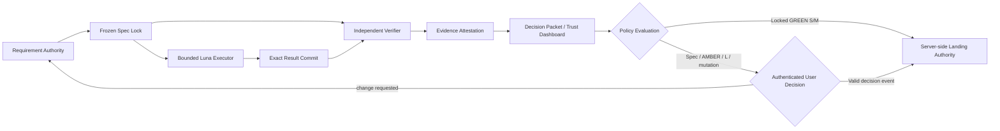

# PureCVisor Desktop Node No-Human-Code-Review Assurance Design

- 날짜: `2026-08-03`
- 설계 ID: `pcv-no-human-code-review-assurance-v1`
- 설계 amendment locator: `Design-Amendment: no-human-code-review-assurance-v1`
- 설계 결정 상태: `approved`
- 설계 승인 source: `authenticated-conversation`
- 설계 결정 승인 locator: `User-Approval: no-human-code-review-assurance-design-20260803`
- 설계 결정 승인 원문: `전체 설계 승인. 명세 문서 작성 및 커밋 진행.`
- 작성된 명세 검토 상태: `approved`
- 작성된 명세 승인 source: `authenticated-conversation`
- 작성된 명세 승인 locator: `User-Approval: no-human-code-review-assurance-written-spec-20260804`
- 작성된 명세 승인 원문: `승인합니다`
- Stable design 권위 통합 상태: `pending-authority-integration`
- 작성 기준 `main`: `3cc7726dcd12c573d815afe6c0c7c2d910f0c7de`
- 관련 stable design:
  `docs/superpowers/specs/2026-08-03-purecvisor-desktop-node-luna-completion-control-design.md`
- 관련 inactive successor:
  `docs/superpowers/plans/2026-08-03-purecvisor-desktop-node-csharp-architecture-improvement-successor.md`
- 현재 effective execution plan:
  `docs/superpowers/plans/2026-08-02-purecvisor-desktop-node-csharp-architecture-improvement.md`
- 제품 경계: `Windows Desktop Node`, `internal-private-network-only`
- public trusted signing: `false`
- external stable publication: `false`

이 문서는 여러 assurance subsystem을 묶는 umbrella normative design이다. 사용자가 제품 소스 코드를
직접 검토하지 않고도 동결된 요구사항, 위험 승인과 독립 검증 증거로 개발 결과를 판단할 수 있게 하는
assurance control plane을 정의한다. 설계 승인 자체는 Luna
control materialization, successor activation, 제품 코드 변경, package build/install, service/HTTP/TLS,
Hyper-V 또는 lifecycle mutation 승인이 아니다. 작성 기준 `main` SHA도 materialization 승인 SHA가 아니다.

## 1. 확정 결정

1. 사용자는 소스 코드가 아니라 요구사항, 위험, 검증 결과와 rollback이 담긴 Decision Packet을 검토한다.
2. 요구사항과 acceptance oracle은 구현 전에 별도 `main` ancestor에서 동결한다.
3. S/M 구현은 제한된 Luna Max executor가 수행하되, 구현 actor와 다른 독립 verifier가 모든 결과를
   깨끗한 환경에서 재검증한다.
4. Schema, oracle, validator, workflow, landing policy와 attestation generator를 포함한 trust root 변경은
   항상 `L / gpt-5.6-sol / Release`이며 별도 독립 검토와 검증을 모두 요구한다.
5. 구현 executor는 trust root, acceptance oracle, 품질 baseline 또는 landing 설정을 변경할 수 없다.
6. PASS는 종료 코드나 Markdown 주장으로 입력하지 않는다. 정확한 commit/tree, 명령, 환경, case 결과와
   원본 artifact에서 결정론적으로 파생한다.
7. Canonical machine JSON이 단일 진실이고 Markdown은 그 JSON의 결정론적 read-only projection이다.
8. 서버 측 required checks, 최신 base merge queue와 covered landing role 우회 방지가 검증되기 전에는 자동 landing과
   successor activation을 허용하지 않는다.
9. 현재 저장소 상태는 이 설계의 완성 상태가 아니다. `overall_readiness=red`다.
10. 이 assurance는 정의된 요구사항과 위험 경계에 대한 재현 가능한 증거를 제공한다. 알려지지 않은 결함이
    절대 없거나 제품이 형식 검증됐다고 주장하지 않는다.

## 2. 목표와 사용자 검토 경계

### 2.1 목표

최종 사용자 경험은 다음과 같다.

1. 사용자가 서비스 요구사항과 사용자 영향 범위를 승인한다.
2. 고수준 controller가 요구사항을 모호성 없는 machine contract와 acceptance case로 동결한다.
3. 제한된 구현 모델이 허용된 제품 파일만 변경한다.
4. 독립 verifier가 구현자의 주장과 작업 공간을 신뢰하지 않고 exact target을 재검증한다.
5. Trust Dashboard가 요구사항 충족, 위험, 증거, rollback과 landing 가능 여부를 요약한다.
6. 사용자는 Packet digest에 결합된 승인, 거부 또는 변경 요청만 내린다.

여기서 `no-human-code-review`는 **사용자에게 소스 검토를 완료 조건으로 요구하지 않는다**는 뜻이다.
독립 technical review, Sol trust-root review, 보안 검토와 Release review를 제거한다는 뜻이 아니다. 소스
접근을 숨기거나 금지하지도 않는다.

### 2.2 성공 기준

사용자가 다음 질문을 코드 없이 답할 수 있어야 한다.

- 무엇을 요구했고 어떤 범위가 제외됐는가?
- 각 요구사항을 어떤 positive, negative, property case가 증명했는가?
- 구현자가 허용된 범위 밖을 변경하지 않았는가?
- 검증자는 구현자와 독립적인가?
- 어떤 commit, 명령, 환경과 artifact가 PASS의 근거인가?
- 어떤 위험이 남았고 blast radius, 완화와 rollback은 무엇인가?
- 현재 결과를 병합 또는 승격해도 되는가?

## 3. 범위

### 3.1 포함

- 요구사항, card blueprint, acceptance, traceability와 assurance 결과의 machine schema
- Exact path/operation과 capability에 제한된 Luna executor
- 구현 actor와 권한이 분리된 독립 verifier
- Spec, scope, product, quality, security와 artifact attestation hard gate
- Current evidence를 포함한 typed machine evidence와 원본 artifact 무결성
- Decision Packet, Trust Dashboard와 digest-bound user approval
- Provider-neutral Landing Authority 계약과 GitHub 적용 경계
- S/M pilot, L/Release rehearsal, recovery와 단계적 activation
- 기존 Luna completion stable design과 successor v4의 정합성 요구

### 3.2 제외

- C++23 또는 Linux runtime 도입
- TypeScript Web Console을 Razor, MVC, Blazor 또는 다른 C# UI로 교체
- ASP.NET Identity, Entity Framework 또는 SQLite의 부수적 도입
- public trusted signing, Winget, 외부 stable publication 또는 저장소 공개 전환
- 관리자 승인 없는 package/install/service/HTTP/TLS/Hyper-V/lifecycle mutation
- 모든 코드에 대한 수학적 형식 검증
- 사용자의 GitHub 구독 변경이나 결제 실행
- 설계 문서 커밋과 동시에 Luna materialization 또는 successor activation 수행

기존 제품 불변조건을 유지한다. Active operator surface는 Web Console과 PCVCLI이고 TUI는 absent다.
TypeScript source/npm/browser runtime, exclusive HTTP transport, single Hyper-V mutation consumer와 uncertain
mutation replay/fallback 금지를 유지한다. Route/operation/action count는 문서 snapshot을 미래 상수로
복사하지 않고 activation rebaseline에서 authoritative source로 다시 측정한다.

## 4. 검토한 접근과 선택

### 4.1 동결 명세 + 제한 executor + 독립 verifier

요구사항과 oracle을 먼저 동결하고 executor, verifier, Landing Authority 권한을 분리한다. 구현 비용은
늘지만 self-validation, test weakening, stale approval과 false-green을 동시에 차단할 수 있다. 채택한다.

### 4.2 단일 구현 모델 + 강화된 일반 CI

구성은 단순하지만 같은 actor가 구현과 테스트를 함께 바꾸고 CI 입력을 통제할 수 있다. 종료 코드 0,
PlanOnly, 누락된 artifact 같은 false-green을 독립적으로 판정할 수 없으므로 채택하지 않는다.

### 4.3 항상 두 개의 독립 구현 생성

결과 비교에는 강하지만 비용과 merge 복잡도가 크고 두 구현이 같은 명세 결함을 공유할 수 있다. 모든
카드의 기본 방식으로 채택하지 않는다. 보안, persistence, mutation safety 같은 고위험 L 카드에서
독립 reference implementation 또는 differential oracle로 선택적으로 사용할 수 있다.

## 5. 권위와 기존 계획과의 관계

| 정보 | 단일 owner |
|---|---|
| 제품 범위, ASP.NET Core rollout, 기존 완료 공식 | Luna completion stable design |
| No-human-code-review assurance 규범 | 이 design amendment |
| Card DAG, 등급, 의존성, rollout projection | 승인될 successor Plan-Revision v4 |
| 요구사항·acceptance·traceability | canonical assurance JSON |
| Exact 작업 범위와 actor policy | card blueprint와 frozen task card |
| Mutable 실행 상태 | `execution-state.json` |
| 실행·검증 원본 결과 | immutable assurance artifact manifests |
| 사용자 승인 요청과 결정 | immutable packet request + 별도 decision record |
| Current operational anchor | `docs/ga-ready/current-evidence.json`과 참조 machine evidence |
| Effective current plan pointer | `docs/DEVELOPER_INDEX.md` |

이 amendment는 기존 stable design의 제품 범위를 대체하지 않고 assurance 규범을 추가한다. 그러나 기존
stable design이 범위, 모델, 승인과 완료 규범의 단일 owner이므로 이 파일만 존재하는 상태에서는 실행
권위가 없다. 작성된 명세의 사용자 검토 뒤 stable design의 owner table, card contract, model/review policy와
완료 공식을 이 amendment에 연결하는 별도 `authority-integration` commit을 먼저 merge한다. 그 다음에만
successor Plan-Revision v4와 derived policy를 작성한다. 두 설계가 충돌한 채 materialization을 시작할 수
없다. 현재 successor v3는 inactive `controller-definition`이고 기존 2026-08-02 predecessor가 effective
current다.

특히 다음 v3 계약은 그대로 실행할 수 없다.

- Product, implementation test와 final state를 같은 result commit에 넣을 수 있는 계약
- S/M card에 독립 verifier가 필수가 아닌 계약
- Schema, validator, guard 또는 workflow를 M/Luna가 작성할 수 있는 배정
- `LC-009` workflow 변경의 `M/Luna/Full` 배정
- Free-form acceptance와 directory 단위 `allowed_paths`
- PASS를 exact actor, argv, environment와 raw artifact에 결합하지 않는 상태 모델

Authority integration 뒤 Plan-Revision v4는 trust-root path를 건드리는 모든 카드를 자동으로
L/Sol/Release로 승격하고 독립 review
**및** required CI를 요구해야 한다. `LC-009`는 명시적으로 L/Sol/Release로 승격한다. LC 번호와 DAG를
어떻게 재분할할지는 implementation plan과 v4가 소유하지만 등급을 낮추거나 같은 executor가 trust root를
자체 검증하도록 유지할 수 없다.

`User-Approval: luna-control-materialization-dbac0ae5abd8-20260803`은 stale/unused다. 이 amendment,
successor v4와 derived policy가 merge된 뒤 exact fresh `main`과 immutable materialization Packet digest에
결합된 별도 승인을 다시 받아야 한다. 이 문서의 사용자 승인은 materialization, activation 또는 host
mutation 승인으로 승계하지 않는다.

## 6. 용어

| 용어 | 정확한 의미 |
|---|---|
| actor | `trust_domain`, `principal_id`, task/session ID, run ID와 permission set의 결합. Model label만으로 구분하지 않는다. |
| independent actor | 별도 trust domain과 non-delegable credential을 가지며 상대 actor가 identity, input, dispatch 또는 result를 통제할 수 없는 actor |
| clean environment | exact target을 새 checkout한 별도 workspace/runner. Executor의 dirty workspace 재사용은 제외한다. |
| oracle | 구현 전 동결된 acceptance cases, test/fixture tree, expected result와 rollback 판정 기준 |
| spec lock | requirements, acceptance, traceability, oracle와 toolchain/baseline reference의 canonical SHA-256 집합 |
| trust root | assurance 판정을 정의하거나 우회할 수 있는 schema, oracle, validator, workflow, policy와 generator |
| immutable evidence | content SHA-256, producer, run, size와 retention이 고정되고 소비 후 덮어쓸 수 없는 artifact |
| fresh evidence | Packet validity와 rollback window보다 늦게 만료되고 exact target/spec/toolchain에 일치하는 evidence |
| Decision Packet request | 승인 대상 scope, risk, proof와 target을 담은 immutable canonical JSON payload |
| decision record | Packet request digest를 승인·거부·변경 요청하는 immutable approval event와 별도 immutable consume event |
| inherent risk class | Requirement/card 자체의 위험 분류 `low|moderate|high|critical`; routing/escalation 입력이며 open finding이 아님 |
| residual risk severity | 검증 뒤 남은 open finding의 `residual_risk_severity=P0|P1|P2|P3`; 각각 critical, high, medium, low. Successor phase P0/P1과 다른 namespace |
| Landing Authority | 서버 측 policy와 credential로 유일하게 protected branch landing을 수행하는 주체 |
| assurance verdict | 일곱 hard gate와 open `residual_risk_severity`에서 파생하는 `green|amber|red` |
| landing eligibility | Server enforcement와 approval에서 파생하는 `eligible|approval_required|eligible_with_accepted_risk|blocked` |
| overall readiness | Assurance verdict와 landing eligibility를 합친 사용자 표시 `green|amber|red` |

같은 model ID를 사용하는 두 task도 별도 trust domain, non-delegable credential, server dispatch와 권한
분리가 증명되면 서로 다른 actor일 수 있다. 단순히 새 run ID를 발급하거나 같은 controller가 두 identity를
만든 것은 독립 검증이 아니다. 같은 세션 또는 같은 writable workspace에서 순차적으로 구현과 검증을
실행한 것도 독립 검증이 아니다.

## 7. 아키텍처와 권한 분리



| 구성요소 | 책임 | 허용 write | 금지 |
|---|---|---|---|
| Requirement Authority | 요구사항, acceptance, risk와 oracle 동결 | 별도 spec/oracle PR | 제품 구현과 동일 PR에서 spec 완화 |
| Trust-root implementer | Schema, validator, workflow와 generator 구현 | 승인된 exact trust-root paths | 제품 behavior 변경, 자기 검증으로 landing |
| Bounded Executor | Frozen card의 최소 제품 구현 | Exact allowed path/operation set | Trust root, oracle, baseline, evidence와 merge |
| Independent Verifier | Server가 지정한 exact target의 재현 검증 | Evidence artifact만 | 제품/trust-root 수정, executor 입력 신뢰, 결과 보정 |
| Evidence Notary | Manifest 검증과 Packet 생성 | Append-only attestation/projection | 하드코딩된 PASS, 증거 없는 주장 |
| User | 요구사항·위험·고위험 mutation 결정 | Digest-bound decision record | 소스 검토 강제 |
| Landing Authority | 서버 정책 확인과 exact candidate landing | Protected branch merge | Required gate 우회, direct push |

Trust-root implementer와 independent reviewer는 서로 다른 actor여야 한다. Bootstrap trust root도 예외가
아니다. 최초 bootstrap은 승인된 design/implementation plan, 외부에서 고정된 schema validator와 known-bad
fixture corpus를 사용하고, 두 번째 Sol actor가 clean environment에서 재검증한 뒤에만 protected trust root가
된다.

S/M verifier는 별도 trust domain의 Luna Max actor일 수 있지만 model 판단은 deterministic gate를 대신하지
않는다. L/Release와 trust root는 별도 Sol actor review가 필수다. Verification Authority가 PR event에서 exact
target을 직접 dispatch하며 executor는 verifier credential, checkout SHA, oracle input 또는 final result를
지정하거나 수정할 수 없다.

## 8. Canonical machine contract

### 8.1 목표 파일 구조

```text
docs/superpowers/plans/luna-completion/
├─ execution-state.json
├─ execution-state.schema.json
├─ <CARD-ID>-<slug>.md
├─ spec-lock.json
├─ requirements.json
├─ card-blueprints.json
├─ traceability.json
├─ trust-dashboard.json
├─ TRUST_DASHBOARD.md
├─ acceptance/
│  └─ <CARD-ID>.json
├─ decision-packets/
│  ├─ <PACKET-ID>.json
│  ├─ <PACKET-ID>.md
│  └─ decisions/
│     ├─ <PACKET-ID>-<DECISION-ID>-approval.json
│     └─ <PACKET-ID>-<DECISION-ID>-consume.json
└─ contracts/
   ├─ spec-lock.schema.json
   ├─ requirements.schema.json
   ├─ card-blueprints.schema.json
   ├─ traceability.schema.json
   ├─ acceptance.schema.json
   ├─ execution-manifest.schema.json
   ├─ verification-result.schema.json
   ├─ review-attestation.schema.json
   ├─ landing-equivalence-attestation.schema.json
   ├─ decision-packet.schema.json
   ├─ decision-record.schema.json
   └─ trust-dashboard.schema.json
```

`execution-state*`와 task-card Markdown은 기존 Luna control architecture를 보존하고 나머지는 assurance
addition이다. `<CARD-ID>`, `<slug>`, `<PACKET-ID>`와 `<DECISION-ID>`는 미완성 placeholder가 아니라 schema가
검증하는 path metavariable이다.

Execution, verification과 review instance는 repository working tree가 아니라 다음 logical artifact URI를
사용한다.

```text
assurance://runs/<CARD-ID>/<TARGET-TREE>/<RUN-ID>/execution-manifest.json
assurance://runs/<CARD-ID>/<TARGET-TREE>/<RUN-ID>/verification-result.json
assurance://runs/<CARD-ID>/<TARGET-TREE>/<RUN-ID>/review-attestation.json
assurance://landings/<PACKET-ID>/<QUEUE-ENTRY-ID>/landing-equivalence-attestation.json
```

Provider-specific URL은 manifest의 immutable artifact locator가 소유한다.

Machine JSON이 authoritative다. Markdown은 canonical JSON에서 결정론적으로 생성하며 사람이 직접
수정할 수 없다. Projection에 machine JSON에 없는 사실, PASS 문장 또는 해석을 추가하면 검증에 실패한다.

### 8.2 Canonicalization과 digest

- Schema는 JSON Schema draft 2020-12를 사용하고 schema version과 content SHA-256을 기록한다.
- Digest 입력은 UTF-8 RFC 8785 JSON Canonicalization Scheme으로 직렬화한다.
- SHA-256은 lowercase 64자 hex다.
- 각 canonical component는 `{ "payload": ..., "payload_sha256": ... }` envelope를 사용하고 hash는
  `payload`에만 계산한다. `payload_sha256` 자신은 hash 입력이 아니다.
- `spec-lock.json`은 `{ "lock_payload": ..., "lock_payload_sha256": ... }` envelope다. `lock_payload`는
  path, component payload digest, oracle commit/tree/digest, toolchain과 baseline ref를 포함하고
  `lock_payload_sha256` 자신을 포함하지 않는다.
- Decision Packet은 `{ "request_payload": ..., "request_payload_sha256": ... }` envelope다. Hash는
  `request_payload`에만 계산하고 digest field 자신을 포함하지 않는다.
- `request_payload`는 승인 후 변경할 수 없다.
- Mutable status, approval history와 consumption 정보는 `request_payload` digest 대상이 아니다.
- Decision record는 packet ID와 immutable `request_payload_sha256`을 참조한다.
- Schema, canonicalization version 또는 digest algorithm 변경은 trust-root L/Release 변경이다.

Envelope와 hash 대상은 schema에서 고정한다. Digest field를 임의로 제외하는 구현별 규칙을 허용하지
않는다. 이 구조는 component/spec/Packet 자기참조와 승인을 기록하는 순간 digest가 바뀌는 순환 의존을
방지한다.

### 8.3 Requirements contract

최소 필드는 다음과 같다.

- Payload의 `schema_version`, `contract`, `design_id`, `spec_revision`
- `oracle_commit`, `oracle_tree`, `oracle_sha256`
- `source_refs`, `approved_at`, `approval_ref`
- 각 requirement의 `requirement_id`, normative statement, priority, inherent risk class와 owner
- `includes`, `excludes`, user-visible outcome와 compatibility constraints
- `acceptance_contract_ref`, `rollback_oracle_ref`, `ambiguity_status`

모든 normative requirement는 고유 ID를 갖고 `ambiguity_status=resolved`여야 한다. Free-form prose만 있는
requirement는 실행 준비 상태가 될 수 없다. Aggregate spec lock은 requirements payload 안이 아니라 별도
`spec-lock.json#/lock_payload_sha256`이 소유한다.

### 8.4 Card blueprint와 acceptance contract

모든 ready card는 최소 다음을 가져야 한다.

- `card_id`, `requirement_ids`, `acceptance_contract_ref`
- `positive_case_ids`, `negative_case_ids`, `property_case_ids`
- Property 또는 mutation test가 적용되지 않으면 구현 전에 승인된 `not_applicable_reason`
- `spec_lock_ref`, `spec_lock_sha256`, `oracle_commit`, `oracle_tree`
- Ready 상태의 `expected_execution_artifact_locator`, `expected_verification_artifact_locator`와
  `rollback_oracle_ref`
- `ambiguity_status=resolved`
- `implementation_actor_policy`, `verification_actor_policy`
- Tier, canonical model, reasoning, verification lane와 escalation policy
- Exact repo-relative path별 `create|modify|delete` operation
- 같은 파일에 writable product code와 보호 대상 contract가 함께 있으면 type/member 단위
  `protected_symbols`; symbol 경계를 안전하게 판정할 수 없으면 파일 전체 보호
- Network, admin, filesystem, process, secret와 host mutation capability
- Timeout, rollback, failure states와 evidence retention class

Directory 전체 glob은 exact allowed path를 대신할 수 없다. 새 파일도 실행 전에 정확한 repo-relative path와
`create` operation을 동결한다. Executor가 작성한 unit test는 보조 증거가 될 수 있지만 독립 oracle을
대신할 수 없다.

Actual `execution_manifest_ref`는 `execution_completed`부터, `verification_manifest_ref`와
`review_attestation_ref`는 `verified`부터 state-conditional required field다. 아직 생성되지 않은 미래
artifact ref를 ready card에 요구하지 않는다.

Acceptance case는 최소 `case_id`, `case_type=positive|negative|boundary|property|mutation|rollback`,
precondition, input 또는 fixture digest, exact expected output/state/error code, timeout, 허용 tolerance,
required capability, cleanup과 artifact expectation을 가진다. Expected result를 `same contract`, `parity` 같은
정의되지 않은 문구로 대신할 수 없다.

### 8.5 Bidirectional traceability

Traceability는 다음 방향을 모두 표현하고 orphan을 허용하지 않는다.

```text
requirement
  <-> acceptance contract
  <-> task card
  <-> case/test
  <-> execution and verification artifacts
  <-> decision packet
  <-> landing/promotion evidence
```

각 traceability edge는 `planned|materialized`를 구분한다. Ready 전에는 expected artifact locator를 가리키는
planned edge를 허용하고, `assurance_verdict=green` 전에는 모든 required edge가 immutable actual ref를 가진 `materialized`여야
한다. In-scope required requirement의 materialized traceability coverage는 100%여야 한다. 같은 artifact를
역할이 다른 proof에 중복 연결하거나 존재만 하는 Markdown을 원본 증거로 사용할 수 없다.

## 9. Spec freeze와 revision

구현 전 다음 순서를 모두 완료한다.

1. Requirement Authority가 requirement와 risk를 작성한다.
2. Positive, negative, boundary/property, rollback case를 별도 oracle commit에 고정한다.
3. Requirements, acceptance, traceability와 oracle tree를 schema validation한다.
4. 독립 reviewer가 모호성, 상충, 누락과 실행 가능성을 확인한다.
5. Spec/oracle commit을 `main`에 먼저 merge하고 implementation target의 ancestor로 만든다.
6. Exact spec lock과 oracle tree를 card에 기록한 뒤에만 executor lease를 연다.

Oracle 결함이 발견되면 구현 PR에서 expected result나 test를 완화하지 않는다.
`blocked/spec-defect`로 중단하고 별도 trust-root revision, 독립 review와 사용자 요구사항 승인을 거친다.
Spec, oracle, risk 또는 rollback 변경은 기존 execution result, verification, Packet과 승인을 모두 stale로
만든다.

## 10. 제한된 구현 실행

### 10.1 모델 routing

| 변경 | 구현 actor | 검증 |
|---|---|---|
| S | `gpt-5.6-luna` / `max` | focused + Fast + independent verifier |
| M | `gpt-5.6-luna` / `max` | focused + actual Full + independent verifier |
| L | `gpt-5.6-sol` / `high|ultra` | Release + independent Sol review + enforced CI |
| Trust root | `gpt-5.6-sol` / `high|ultra` | Release + separate trust-root verifier + enforced CI |

UI label `Luna Max (gpt-5/6-luna, max)`의 slash identifier는 display alias다. Durable selector evidence가
canonical `gpt-5.6-luna`로 resolve되지 않으면 `blocked/model_identifier_unresolved`다. Luna Max가
callable하지 않아도 Sol/Terra로 자동 대체하지 않고 `blocked/model_unavailable`로 중단한다.

### 10.2 실행 sandbox

- Card마다 frozen `start_head`에서 새 worktree를 만든다.
- Controller가 trusted base/head로 canonical diff와 path operation set을 계산한다.
- Executor는 caller-supplied `BaseRef`, `ChangedPath` 또는 낮은 tier로 실제 scope를 덮어쓸 수 없다.
- Executor와 non-operational verifier는 disposable ephemeral runner에서 실행하며 기본 capability는 egress
  denied, non-admin, no secrets, no host mutation이다.
- Filesystem ACL/allowlist가 exact writable path만 열고 process tree, child process, network attempt와 file
  operation을 audit한다. 사후 Git diff만으로 confinement를 주장하지 않는다.
- Dependency fetch가 필요하면 별도 provision stage가 allowlisted endpoint와 lockfile만 사용한다.
- Exact `argv[]`, `cwd`, non-secret environment, toolchain, timeout과 capability를 실행 전에 manifest에
  기록한다.
- Executor는 result commit을 만들 수 있지만 protected branch push, Packet 발행, approval 기록 또는
  merge 권한을 갖지 않는다.
- Repository 안의 문서나 주석은 card capability를 확대할 수 없다. Frozen controller contract만 실행
  권한을 부여한다.

Canonical diff는 trusted Git object에서 계산한다. `merge_base`, exact base/head commit과 tree를 고정하고,
각 entry의 normalized repo path, `create|modify|delete`, old/new blob ID와 old/new file mode를 UTF-8 ordinal
path 순으로 정렬해 RFC 8785 JSON과 SHA-256으로 봉인한다. Rename은 delete+create 두 operation으로
표현한다. Caller path list, working-tree status 또는 untracked file은 canonical diff 입력이 아니다.

Untrusted PR source나 source-controlled script는 admin, secret 또는 Hyper-V capability가 있는 runner에서
실행하지 않는다. Candidate MSI, service와 product binary도 signature/provenance와 무관하게 untrusted payload로
취급한다. Privileged operational stage는 non-privileged 일곱 gate를 통과한 signed/attested artifact와 exact
child approval만 입력으로 받고 source checkout script를 실행하지 않는다.

Candidate payload는 sensitive data와 일반 운영 credential이 없는 sacrificial host/VM에서만 실행한다. Target은
disposable이거나 known-clean immutable image로 out-of-band restore/reimage할 수 있어야 한다. Operation
allowlist, egress deny/allowlist, pre/post full host-state diff, out-of-scope mutation 0건, post-run integrity와
restore/reimage evidence를 필수로 수집한다. Physical Hyper-V가 필요하면 사용자 workstation이 아니라 dedicated
sacrificial host와 known-clean reimage boundary를 사용하고, compromise 의심 시 credential rotation과 reimage를
완료하기 전 재사용하지 않는다. Candidate 안에서 실행되는 자체 rollback만으로 host clean 상태를 증명하지
않는다.

### 10.3 Protected trust root

Successor v4의 protected-path manifest는 다음 category에 속하는 exact path와 validator가 import하거나
실행하는 transitive file을 열거한다. 새 파일 또는 unknown path가 gate 판정, oracle, evidence, approval이나
landing에 영향을 주면 classifier는 이를 자동으로 L/Release trust root로 분류한다.

- Requirements, acceptance, traceability와 oracle tests/fixtures
- Assurance schemas, validators와 negative control corpus
- `.github/workflows/**`, CODEOWNERS, PR template와 landing policy
- Verification runner, tier/path classifier와 changed-path calculator
- Quality/coverage/mutation baseline과 waiver policy
- Evidence validator, attestation, Packet와 Dashboard generator
- Current evidence schema/generator와 operational promotion validator
- Stable design, active plan authority와 approval policy

Protected 경로 변경은 제품 implementation commit/PR과 분리한다. Diff에서 하나라도 발견되면
`rejected/trust-root-mutation`이며 implementation result 전체를 landing할 수 없다.

## 11. 독립 검증 pipeline

### 11.1 Required hard gates

| Gate | PASS 조건 | 대표 negative control |
|---|---|---|
| `spec-contract` | Schema valid, ambiguity 0, frozen ancestor와 digest 일치 | Spec/oracle drift, PlanOnly PASS 입력 |
| `scope-integrity` | Canonical base/head diff와 exact allowed operation 일치 | Hidden path, delete 대신 modify, trust-root edit |
| `product-verification` | 모든 required case 실제 실행·PASS | Exit 0 + XML failure, 0-test, missing case |
| `independent-verifier` | Clean environment와 actor/permission 분리 증명 | 같은 session/workspace/credential |
| `quality-ratchet` | Baseline 무회귀와 frozen changed-code obligations PASS | Surviving critical mutant, branch 미검증 |
| `security` | Secret/SAST/dependency/SBOM 정책 PASS | Secret fixture, known vulnerable dependency |
| `artifact-attestation` | Exact target, raw artifacts, hashes, retention과 freshness PASS | 403/404/expiry/hash mismatch/log truncation |

일곱 gate가 모두 PASS해야 `assurance_verdict=green|amber` 후보가 된다. Landing enforcement는 이 결과 뒤에
적용하는 별도 server eligibility 조건이며 `required_enforced=false`이면 `overall_readiness=red`다.

### 11.2 검증 환경과 actor

- Verifier는 remote의 exact commit/tree를 clean checkout한다.
- Oracle은 target의 ancestor인 frozen `oracle_commit/tree`에서 별도로 가져온다.
- `execution_actor_id != verification_actor_id`뿐 아니라 trust domain, non-delegable credential, dispatcher와
  permission set 분리를 검증한다. 같은 owner가 임의로 만든 두 actor ID는 거부한다.
- Verifier는 제품 또는 trust-root 파일을 수정할 수 없고 evidence artifact만 생성한다.
- Same dirty workspace 재실행, executor가 만든 summary 재사용 또는 model label만 다른 실행은 독립 검증이
  아니다.

### 11.3 실제 test 실행

- 외부 runner의 `PlanOnly` verdict `PLANNED`는 canonical
  `assurance_case_status=planned`, `eligible_for_pass=false`, `eligible_for_green=false`로만 mapping한다.
- Required workflow는 PR의 exact merge-base/head diff로 실제 Full 또는 Release lane을 실행한다.
- 모든 Pester는 exact version을 사용하고 `-CI` 또는 `-PassThru`의 `Result=Passed`,
  `FailedCount=0`, `ErrorCount=0`을 명시적으로 검사한다.
- Assertion failure, parse/discovery/BeforeAll error와 discovered test 0건은 nonzero failure다.
- Expected, discovered, executed, passed, failed, skipped와 error count를 case ID와 함께 기록한다.
- Required case의 `fail|blocked|not_run|skipped`가 하나라도 있으면 PASS가 아니다.
- `git diff --check`는 clean worktree가 아니라 exact base...head committed diff를 검사한다.
- Timeout은 process tree를 종료하고 `blocked/infrastructure`로 기록한다. 자동 PASS로 변환하지 않는다.
- Infrastructure retry는 `mutation_started=false`가 trusted stage에서 attested된 pre-mutation 또는 pure
  idempotent 단계에만 card별 최대 1회 허용한다. Partial/uncertain mutation은 재시도하지 않고 즉시 stop,
  quarantine과 read-only state reconcile까지만 수행한다. Rollback은 원 operation child와 별도로 exact
  `lifecycle_rollback` child Packet/approval이 이미 유효하고 실제 reconcile state가 승인된 rollback precondition과
  일치할 때만 실행한다. 그렇지 않으면 rollback을 실행하지 않고 새 Packet과 승인을 요청한다. 모든 attempt와
  failure fingerprint를 보존한다.

현재 `.github/workflows/public-boundary.yml`의 두 Pester 호출은 실패 assertion을 nonzero로 전파하지 않을
수 있고 exact Pester를 고정하지 않는다. `.github/workflows/development-gates.yml`의 Full runner 검사는
`-PlanOnly`만 실행한다. 두 경계는 trust-root bootstrap의 최초 required false-green 수정 대상이다.

### 11.4 Quality와 adversarial verification

- Existing touched-project line/branch 0.0%p regression ratchet은 유지한다.
- 새 또는 변경된 production decision logic은 changed-line 90% 이상, changed-branch 85% 이상을 요구한다.
- Deterministic C#/TypeScript business logic은 targeted mutation score 90% 이상을 요구한다.
- Authorization, secret handling, idempotency, persistence, Hyper-V mutation safety, rollback과 public error
  compatibility를 바꾸는 surviving mutant는 점수와 무관하게 0건이어야 한다.
- Property/mutation obligation은 acceptance freeze 시 `required` 또는 승인된 `not_applicable`로 고정한다.
  Executor가 구현 뒤 N/A로 바꿀 수 없다.
- Boundary, malformed input, cancellation, retry, rollback과 concurrency case를 해당 requirement마다
  명시한다.
- 고위험 L card는 differential/reference oracle 또는 두 번째 독립 구현 비교를 acceptance에서 요구할 수
  있다.

### 11.5 Security와 supply chain

- Action은 full commit SHA로 pin하고 runner image digest와 tool version을 기록한다.
- Exact .NET SDK `global.json`, NuGet locked restore/lock files, exact Node와 Pester version을 사용한다.
- Secret scan, static analysis, dependency vulnerability scan과 SBOM을 required artifact로 만든다.
- Workflow/check 이름뿐 아니라 trusted app identity, workflow digest와 check-run ID를 검증한다.
- 원본 log에는 token, password, private key 또는 protected secret을 기록하지 않는다. Redaction된 안전한
  log의 digest를 evidence로 사용하고 secret 발견 시 security gate를 실패시킨다.
- Secret이 artifact에 기록된 사고에서는 immutability보다 containment를 우선한다. Artifact를 즉시
  quarantine하고 credential revoke와 restricted incident review 뒤 원문을 cryptoshred/delete할 수 있다.
  대신 content digest, 발견 시각, 접근 audit와 삭제 사유를 가진 signed tombstone을 append-only log에
  보존한다. Secret 원문은 assurance evidence나 장기 retention 대상이 아니다.

### 11.6 Reproducibility

- S/M은 별도 clean runner에서 required acceptance를 최소 한 번 재실행한다.
- L/Release와 trust root의 deterministic build/non-privileged verification은 두 독립 clean run에서
  artifact-class invariant가 같아야 한다.
- Product payload는 normalized path, file mode와 content hash 집합을 비교한다.
- Test/verification manifest는 spec/oracle/toolchain digest, required case 집합과 verdict를 비교하고 run ID,
  clock과 runner identity는 volatile field로 분리한다.
- MSI/signed container는 각 container hash와 signature를 개별 검증하고 normalized payload aggregate는 같아야
  한다. Privileged mutation은 reproducibility를 이유로 자동 반복하지 않는다. 각 actual-VM/host run은 frozen
  precondition, mutation, postcondition과 rollback predicate를 oracle과 비교하며, 반복 실행은 별도 child
  Packet과 승인이 있을 때만 허용한다.
- Artifact class별 invariant와 허용 volatile field는 schema의 exact allowlist가 소유한다. 목록 밖 차이는
  reproducibility failure다.
- Summary는 간략화할 수 있지만 raw log를 자르거나 덮어쓸 수 없다.

## 12. Execution과 verification evidence

### 12.1 Execution manifest

최소 필드는 다음과 같다.

- Card ID, requirement/case IDs, start/base/merge-base/result commit과 tree
- Canonical diff SHA-256과 path별 create/modify/delete
- Executor actor, canonical model, reasoning과 task/run identity
- Exact executable, `argv[]`, `cwd`, allowed non-secret environment와 environment digest
- Toolchain/lockfile refs, network/admin/write/secret/host-mutation capability
- Timeout, start/end UTC, exit code와 process termination state
- Raw stdout/stderr artifact refs, SHA-256, size와 retention

### 12.2 Verification result

최소 필드는 다음과 같다.

- Spec lock, oracle commit/tree/digest와 exact target commit/tree
- Verifier actor, permission set와 independence decision
- Runner OS/image, toolchain, workflow/check identity와 exact commands
- Required case별 `pass|fail|blocked|not_run`, expected와 actual result
- Test expected/discovered/executed/passed/failed/skipped/error counts
- Coverage, mutation, analyzer, security, dependency와 SBOM result
- Raw log, TRX/JUnit/Pester XML, coverage와 generated artifact의 URL, SHA-256, size
- Artifact producer run/check, created/expiry UTC, retention class와 accessibility check
- Rollback oracle/result, inherent risk class, open
  `residual_risk_severity=P0|P1|P2|P3`, limitations와 waiver refs
- `required_enforced` live fact와 final deterministic verdict reason

Verdict는 입력 가능한 임의 boolean이 아니라 위 필드에서 validator가 파생한다. Process exit 0만으로 PASS가
될 수 없다.

### 12.3 Review attestation

Review attestation은 target commit/tree, spec/oracle digest, execution/verification manifest digest, 일곱
gate 결과, reviewer actor와 permission, independence 판정, Packet request digest와 live landing facts를
하나의 subject에 결합한다. Producer workflow/check identity, attestation digest와 검증 가능한 signature 또는
provider attestation ref를 포함한다. Attestation generator와 signature policy는 trust root이며 executor가
수정하거나 임의 attestation을 발행할 수 없다.

Attestation에는 notary key ID, trust chain, trusted timestamp, key rotation/revocation status와 append-only
transparency/object-lock receipt가 있어야 한다. Executor는 notary key나 final attestation storage에 write할 수
없다. Revoked key 또는 transparency receipt가 없는 attestation은 required proof가 아니다.

Post-approval latest-base 검증은 immutable request를 고치지 않고 별도 append-only
`landing-equivalence-attestation`을 생성한다. 이 attestation은 Packet request digest, queue entry, 새
base/candidate/final lineage, 새 required check-run과 approved change-set equivalence를 결합한다. 이를
추가하는 것은 승인된 proof 교체가 아니다. Request 안의 기존 proof를 삭제·교체하거나 결과를 변경하면
승인이 stale이다.

### 12.4 Artifact retention과 freshness

| Retention class | 최소 접근성 |
|---|---|
| S/M development | 생성 후 90일, Packet validity보다 길어야 함 |
| L/Release | Program lifetime 전체 |
| Current operational/rollback | Current인 기간 전체와 historical 전환 후 최소 1년 |
| Trust root/approval | Program lifetime 전체 |

URL, content SHA-256, size, producer와 expiry를 모두 기록한다. Required artifact가 만료, 403/404, 접근 불가,
hash mismatch 또는 Packet validity보다 짧은 retention이면 `stale/evidence`와 `assurance_verdict=red`다.
Markdown 요약만 남고 원본 proof가 없는 상태는 `assurance_verdict=green`이 아니다.

이 retention은 secret이 없는 safe evidence에만 적용한다. Secret incident artifact는 §11.5의 quarantine,
revoke와 cryptoshred 정책을 따르고 signed tombstone이 원본을 대체한다.

### 12.5 Current evidence hardening

`docs/ga-ready/current-evidence.json`은 operational anchor owner로 유지하되 다음을 보강한다.

- 실제 draft 2020-12 schema validator를 사용하고 schema digest를 봉인한다.
- Evidence reference는 role, evidence ID, result, version, batch와 artifact digest를 검증한다.
- SHA/commit의 문자열 형식만 아니라 Git object/tree와 실제 artifact content를 확인한다.
- Additional property, 빈 batch, 0 hash, wrong-role 문서와 같은 문서의 역할 중복을 거부한다.
- Projection의 모든 PASS/limitation 문장은 typed machine evidence에서만 생성한다.
- `PASS_WITH_DOCUMENTED_HOST_LIMITATION`은 일반 PASS로 숨기지 않고 `assurance_verdict=amber`를 유지하며, landing에는
  immutable Packet에 결합된 유효한 residual-risk acceptance를 요구한다.

2026-08-03 authoring audit에서 current generator는 schema 파일을 authoritative validator로 실행하지 않고
일부 결과 문장을 typed record가 아닌 projection literal로 만든다. Semantic-invalid record, wrong-role reference,
0 hash와 documented limitation을 거부하거나 정확히 투영하는 negative fixture가 PASS하기 전에는 current
evidence pipeline을 assurance GREEN 입력으로 사용할 수 없다.

현재 Markdown에서 참조하는 추적되지 않은 `artifacts/**` 경로는 독립 proof가 아니다. Accessible immutable
artifact ref가 없으면 Dashboard는 `overall_readiness=red`를 유지한다. `docs/OPERATIONS_GUIDE.md`처럼 여러 historical version이
섞인 문서는 current value 입력으로 사용하지 않는다.

## 13. Decision Packet과 Trust Dashboard

### 13.1 Immutable request payload

Decision Packet request는 최소 다음을 포함한다.

- Packet ID/type, schema/design/spec lock, generated UTC와 valid-until UTC
- Observed base, exact implementation head/tree, approved change-set digest, target branch와 latest-base policy
- Scope, includes/excludes, user-visible change와 mutation target
- Requirement/acceptance/case와 traceability 상태
- Inherent risk class, open `residual_risk_severity=P0|P1|P2|P3`, blast radius, mitigation, rollback과 expiry
- 필요한 approval category와 consumption rule
- Proof별 result, exact command/environment/target, limitation과 artifact ref/hash/retention
- Current-evidence digest, PR/merge/check-run/workflow refs와 `required_enforced`
- Recommendation, blockers, alternatives와 requested response

`packet_type` enum은
`requirements_approval|spec_revision|residual_risk|trust_root|release_change|mutation_authorization|promotion|landing_attestation|campaign_summary`다.
`campaign_summary`는 execution authority가 없고 child Packet 상태만 projection한다.

Packet Markdown과 Trust Dashboard Markdown은 machine JSON projection이며 직접 편집할 수 없다.
`request_payload_sha256`은 request 안의 field가 아니라 §8.2 envelope의 sibling field다. Merge-queue temporary
candidate와 final merge commit은 immutable user request가 아니라 별도 landing equivalence attestation이
소유한다.

### 13.2 Decision record와 승인 문법

승인 명령은 다음 세 형식만 사용한다.

```text
APPROVE <packet-id> <request-payload-sha256>
DENY <packet-id> <request-payload-sha256>
REQUEST-CHANGES <packet-id> <request-payload-sha256>
```

승인 문자열만으로 identity를 증명하지 않는다. Decision Authority는 allowlisted approver identity와
authenticated channel 또는 signature, nonce, issued/expiry UTC, exact category/scope/target을 검증한다.
첫 append-only approval event는 decision ID, Packet ID/digest, approver principal/source, decision과 expiry를
기록한다. 별도 append-only consumption event가 approval event ID, landing/mutation target과 one-time consume
결과를 기록한다. Approval event 자체를 consumed 상태로 수정하지 않는다.

Implementation head/tree, approved change-set, spec, evidence, risk, rollback, workflow 또는 oracle digest가
바뀌면 기존 decision은 landing 전에 stale이 된다. 최신 base가 움직인 것만으로 user decision을 재사용하려면
§14의 exact candidate equivalence와 모든 required check 재실행이 PASS해야 한다. Decision을 기록하거나
consume해도 immutable request digest는 바뀌지 않는다. Nonce 재사용, allowlist 밖 identity, expired signature와
동일 approval event의 이중 consumption은 거부한다.

새 queue run/log/check ref는 request payload 밖의 append-only landing-equivalence attestation에만 추가한다.
Approved proof의 기존 digest/result를 새 값으로 교체하지 않는다. 새 base 때문에 requirement, user-visible
behavior, risk, capability 또는 rollback 평가가 달라지면 change-set equivalence가 PASS해도 새 Packet과
decision을 요구한다.

### 13.3 색과 landing eligibility

`assurance_verdict`, `landing_eligibility`, `overall_readiness`를 서로 다른 machine field로 유지한다.

| `assurance_verdict` | 판정 |
|---|---|
| `green` | 모든 hard gate PASS, open residual risk 0건, fresh evidence, actor 분리와 rollback ready |
| `amber` | 모든 hard gate PASS, open residual P0/P1 0건, P2/P3만 존재 |
| `red` | Gate 실패, drift, open residual P0/P1, required `not_run`, actor 충돌, oracle 변경, stale proof 또는 rollback 부재 |

| `landing_eligibility` | 판정 |
|---|---|
| `eligible` | Assurance green, server enforcement PASS, 해당 category의 required decision이 없거나 모두 유효 |
| `approval_required` | Assurance amber 또는 하나 이상의 required category decision 부재 |
| `eligible_with_accepted_risk` | Assurance amber, exact residual-risk approval과 server enforcement PASS |
| `blocked` | Assurance red 또는 server enforcement/approval/equivalence 실패 |

Overall truth table은 fail-closed다.

- `required_enforced=false|unknown`, assurance red 또는 landing blocked이면 `overall_readiness=red`다.
- Assurance green + landing `eligible`이면 `overall_readiness=green`이다.
- Assurance green + landing `approval_required`이면 `overall_readiness=amber`다.
- Assurance amber + landing `approval_required|eligible_with_accepted_risk`이면 `overall_readiness=amber`다.
- 위에 열거하지 않은 조합은 invalid이며 `overall_readiness=red`다.

AMBER는 risk approval 뒤에도 색을 GREEN으로 위장하지 않는다. Assurance red는 어떤 승인으로도 landing할
수 없다.

### 13.4 사용자 승인 범위

Locked requirement를 그대로 구현한 GREEN S/M card는 assurance system이 완전히 활성화된 뒤 매번 수동
승인을 요구하지 않고 landing할 수 있다. 다음은 항상 exact Packet 사용자 승인을 요구한다.

- Requirement/spec/oracle 변경
- AMBER residual risk 수락
- Trust-root 변경
- L/Release 변경과 product promotion
- 기존 mutation approval enum 중 하나 이상:
  `package_service/build`, `package_service/install`, `http_binding_tls`, `hyperv_actual_vm`,
  `lifecycle_rollback`

한 종류의 승인은 다른 category로 승계하지 않는다. 여러 mutation을 묶는 campaign은 execution authority가
없는 aggregate Packet만 만들고 category, host, artifact와 exact command별 child Packet/approval event를
가져야 한다. Reversible host mutation은 operation child를 실행하기 전에 대응하는 exact
`lifecycle_rollback` child와 rollback precondition까지 승인돼 있어야 한다. Aggregate approval만으로 child
mutation 또는 rollback을 열 수 없다.

## 14. Landing Authority

Landing Authority 계약은 provider-neutral이지만 현재 저장소의 권장 backend는 GitHub server-side
ruleset/branch protection과 merge queue다. Provider-neutral 필수 capability는 server-side protected branch,
required checks와 serialized latest-base landing이다. GitHub에서는 이를 ruleset과 merge queue로 구현한다.
다음을 provider API와 signed check identity로 증명해야 한다.

- Protected `main`, pull-request-only, force push/delete 금지
- Landing operator와 automation actor의 direct push/bypass 금지
- 일곱 assurance hard gate와 기존 product required checks 강제
- Trust-root path의 independent owner review 강제
- Latest base 반영과 `merge_group` exact candidate 재검증
- Stale approval dismissal과 exact head/tree/Packet digest 결합
- Trusted GitHub App/workflow digest에 의한 check spoofing 방지
- Exact merged commit post-merge attestation

Repository settings를 변경할 수 있는 ultimate owner까지 존재하지 않는다고 주장하지 않는다. Ruleset,
required check, bypass actor 또는 trusted app 변경은 두 독립 trust-root actor의 L/Release review와 audit을
요구하며 기존 enforcement attestation을 즉시 stale로 만든다. Covered landing role에 bypass가 남아 있으면
`required_enforced=false`다.

Client-side 또는 sole landing bot은 covered-role direct push를 서버에서 막지 못하므로 동등한 assurance가
아니다. 2026-08-03 authoring audit에서 현재 private repository의 branch protection/ruleset API는 HTTP 403이며 PR #182 required check가
보고되지 않았다. 두 workflow에도 `merge_group` trigger가 없다. 따라서 현 상태는
`required_enforced=false`, `overall_readiness=red`, `automatic_landing=false`다.

`required_enforced`는 PR 작성자가 넣는 boolean이 아니다. Landing Authority가 provider API에서 수집한
repository, branch, ruleset version, bypass actor, required check와 merge-queue fact를 trusted identity로
attest한 파생값이다. API 403, unknown 또는 일부 필드 누락은 `false`다.

User decision은 approved implementation head/tree와 change-set digest에 결합한다. Merge queue가 최신 base로
temporary candidate를 만들면 Landing Authority가 다음 equivalence를 별도 attestation한다.

- Candidate가 같은 PR과 exact approved implementation head에서 생성됐는가?
- Approved path/blob/mode/operation change set이 conflict resolution 없이 그대로 보존됐는가?
- 새 base와 candidate에 모든 required check가 다시 실행됐는가?
- Requirement, user-visible behavior, capability, risk와 rollback 평가가 그대로인가?
- Temporary candidate, provider queue entry와 final merge commit의 signed lineage가 이어지는가?
- Final merged tree가 attested candidate의 허용된 provider merge 결과인가?

Temporary SHA와 final SHA의 equality는 요구하지 않는다. Approved implementation content가 바뀌거나
equivalence를 증명할 수 없으면 user decision은 stale이며 새 Packet이 필요하다. Base advancement만 있고 위
equivalence가 모두 PASS하면 같은 decision을 사용할 수 있다.

GitHub 기능을 사용할 수 없는 동안 trust root, verifier와 Dashboard를 `shadow` mode로 구축할 수는 있다.
그러나 successor activation, `overall_readiness=green` 선언과 자동 landing은 서버 측 강제가 독립 attestation될 때까지
차단한다. 저장소 공개 전환은 제품 경계 밖이며 이 설계가 승인하지 않는다.

## 15. 실패, 재작업과 recovery

Assurance-specific canonical enum은 다음과 같다.

- `assurance_case_status=planned|pass|fail|blocked|not_run`
- `assurance_control_status=ready|running|approval_required|handoff_required|completed|failed|blocked|stale`
- `recovery_status=normal|assurance_recovery_blocked`
- `landing_eligibility=eligible|approval_required|eligible_with_accepted_risk|blocked`
- `failure_code=null|blocked/spec-defect|failed/implementation|rejected/trust-root-mutation|blocked/infrastructure|stale/evidence|failed/verification-control|blocked/model_identifier_unresolved|blocked/model_unavailable`

`PlanOnly`는 case status `planned`만 만들며 `pass`로 변환할 수 없다. `not-run`, `not run` 같은 다른 철자를
machine JSON에 허용하지 않는다. Existing Luna execution-state enum과의 exact mapping은 authority integration
schema가 소유하고 같은 field에 서로 다른 namespace를 섞지 않는다.

| `failure_code` | 의미 | 허용 처리 |
|---|---|---|
| `blocked/spec-defect` | 명세/오라클 모호성 또는 상충 | 별도 trust-root revision과 재승인 |
| `failed/implementation` | Frozen acceptance 위반 | 동일 card 구현 재작업 |
| `rejected/trust-root-mutation` | Executor가 보호 경계 변경 | Result 폐기, trust-root card로 재분류 |
| `blocked/infrastructure` | Runner/tool/host 불확실성 | Mutation 미시작 attestation 때만 최대 1회 재시도, PASS 금지 |
| `stale/evidence` | Target/digest/artifact/retention 불일치 | Exact target 전체 재검증 |
| `failed/verification-control` | Known-bad fixture를 verifier가 놓침 | Assurance landing 전체 중단 |
| `handoff_required` | S/M에서 L 위험 발견 | Sol L/Release로 재계획 |
| `blocked/model_identifier_unresolved` | UI alias와 canonical execution ID mapping 미증명 | 파일/실행 생성 전 중단 |
| `blocked/model_unavailable` | 지정 모델 호출 불가 | 자동 모델 fallback 금지 |

Test weakening, expected result 변경, inherent/residual risk 하향과 waiver 합성은 retry action이 아니다. 같은
failure fingerprint가 세 번 발생하면 새 가설 또는 설계 revision 없이 재실행하지 않는다.

활성화 뒤 assurance control이 실패하면 Landing Authority는 새 landing을 즉시 중단하고 safe evidence를
보존하며 `recovery_status=assurance_recovery_blocked`로 전환한다. Secret incident artifact는 §11.5 절차를
따른다. 기존 predecessor를 조용히 current로 복구하거나 gate를 낮추지 않는다. Recovery는
L/Sol/Release trust-root card와 별도 사용자 승인을 요구한다.

## 16. 단계적 rollout

주차는 작업 약속이 아니라 exit gate다. Gate가 통과하지 않으면 다음 주차 기능을 열지 않는다.

| 단계 | 목표 | Exit gate |
|---|---|---|
| 1주차 | 이 amendment, authority integration, successor v4와 spec lock | User-reviewed spec, stable owner integration, v4/derived policy merge, fresh-main authority |
| 2주차 | Trust root와 false-green 제거 | Schema/validator, known-bad corpus, Pester/PlanOnly negative canary PASS |
| 3주차 | Bounded executor와 independent verifier | Exact scope/capability, clean actor separation, raw artifact attestation PASS |
| 4주차 | Packet, Dashboard와 Landing shadow | Digest/decision invalidation, accessibility와 server capability audit PASS |
| 5주차 | Control-only와 S/M pilot | Known-bad reject + 대표 S/M 3건 무 waiver PASS |
| 6주차 | L/Release rehearsal와 activation readiness | 승인된 install/service/Hyper-V/rollback rehearsal + server enforcement PASS |

대표 S/M pilot 3건은 최소 S 1건, M 1건과 실제 product-code 변경 2건을 포함한다. 세 건 모두 frozen
oracle, independent verifier와 accessible evidence를 가져야 한다. Docs-only 3건으로 대체할 수 없다.

L/Release rehearsal campaign은 execution authority 없는 aggregate 아래
`package_service/build`, `package_service/install`, 필요한 `http_binding_tls`, `hyperv_actual_vm`과
`lifecycle_rollback` child Packet을 각각 가진다. 각 child는 exact artifact, host, command, capability와
approval event를 소유한다. 하나의 승인으로 다른 mutation을 확장하지 않는다. Rehearsal 실패는 제품
promotion을 열지 않는다.

구현 순서는 다음과 같다.

1. 이 design spec을 review/merge한다.
2. Stable design owner table/card/model/review/완료 공식에 이 amendment를 연결하는 authority-integration을
   review/merge한다.
3. Successor Plan-Revision v4와 derived CODING_GUIDE/verification policy를 별도 merge한다.
4. Exact merged `main`을 대상으로 새 control-only materialization Packet과 승인을 받는다.
5. Sol trust-root bootstrap과 독립 검증을 완료한다.
6. Bounded executor/verifier, evidence와 Dashboard를 shadow mode로 활성화한다.
7. S/M pilot과 child-approved L/Release rehearsal을 수행한다.
8. Server enforcement attestation 후에만 successor activation과 automatic landing을 연다.

## 17. Normative assurance requirements

| ID | MUST requirement | 완료 증거 |
|---|---|---|
| NHR-001 | 사용자는 소스 대신 Packet으로 요구사항·위험·검증·rollback을 판단할 수 있어야 한다. | User packet-only acceptance exercise |
| NHR-002 | Requirement, acceptance와 oracle은 구현 전 ancestor commit에 동결해야 한다. | Spec lock/ancestry attestation |
| NHR-003 | Required traceability는 bidirectional 100%, orphan 0이어야 한다. | Traceability validator result |
| NHR-004 | Ready card의 ambiguity unresolved는 0이어야 한다. | Spec-contract gate |
| NHR-005 | Executor는 exact path/operation/capability 밖을 변경할 수 없어야 한다. | Scope manifest + negative fixtures |
| NHR-006 | Executor는 trust root와 acceptance oracle을 수정할 수 없어야 한다. | Protected-path rejection evidence |
| NHR-007 | S/M은 Luna Max, L/trust root는 Sol routing을 지켜야 한다. | Actor/model routing history |
| NHR-008 | 모든 required card는 execution/verifier trust domain, non-delegable credential과 dispatch 권한이 분리돼야 한다. | Actor/permission attestation |
| NHR-009 | Verifier는 exact target을 clean environment에서 실행해야 한다. | Runner/checkout manifest |
| NHR-010 | Positive, negative와 applicable property/mutation case를 모두 실행해야 한다. | Case-level verification result |
| NHR-011 | Existing baseline ratchet과 changed-code quality obligations을 모두 통과해야 한다. | Coverage/mutation artifacts |
| NHR-012 | Pester assertion/discovery/parse failure와 0-test가 required job을 실패시켜야 한다. | False-green negative canary |
| NHR-013 | PlanOnly는 PASS/GREEN evidence가 될 수 없다. | Schema rejection + actual lane run |
| NHR-014 | PASS는 exact commit/tree/argv/cwd/env/actor/log hash에 결합돼야 한다. | Verification attestation |
| NHR-015 | Raw required artifact가 accessible, hash-valid와 fresh여야 한다. | Artifact accessibility report |
| NHR-016 | L/Release와 trust root는 artifact-class invariant 기준으로 독립 재현 결과가 일치해야 한다. | Two-run reproducibility record |
| NHR-017 | Security, dependency와 SBOM gate를 통과해야 한다. | Security gate artifacts |
| NHR-018 | Machine JSON과 generated Markdown projection이 사실 단위로 같아야 한다. | Deterministic projection test |
| NHR-019 | Authenticated approval event는 immutable request envelope digest에 결합되고 변경·replay 시 stale이어야 한다. | Post-approval mutation/replay test |
| NHR-020 | Assurance verdict, landing eligibility와 overall readiness를 분리해 fail-closed해야 한다. | Decision truth-table fixtures |
| NHR-021 | Assurance red는 어떤 승인으로도 landing할 수 없어야 한다. | Landing rejection fixture |
| NHR-022 | Required checks, serialized latest-base landing과 covered-role no-bypass를 서버에서 강제해야 한다. | Live provider attestation |
| NHR-023 | 모든 고위험/host mutation은 기존 5개 category별 exact child Packet 승인을 요구해야 한다. | Approval transition evidence |
| NHR-024 | Current evidence projection은 typed machine proof에서만 생성해야 한다. | Semantic invalid-record fixtures |
| NHR-025 | Known-bad implementation과 verifier-negative corpus를 모두 차단해야 한다. | Canary suite result |
| NHR-026 | 대표 S/M 3건을 waiver 없이 독립 검증해야 한다. | Pilot Packet set |
| NHR-027 | Category/host/command별 승인된 L/Release child set이 install/service/Hyper-V/rollback을 통과해야 한다. | Rehearsal child Packet set |
| NHR-028 | User decision 뒤 approved implementation/spec/evidence/risk/rollback 변경은 승인을 무효화해야 한다. | Digest invalidation/equivalence evidence |
| NHR-029 | Assurance failure 후 landing을 중단하고 safe evidence 또는 secret tombstone을 보존해야 한다. | Recovery/incident drill result |
| NHR-030 | Spec commit만으로 product/current/evidence/host state를 변경하지 않아야 한다. | Spec-only tracked diff attestation |

## 18. Assurance environment 100% 완료 공식

Assurance environment는 다음 조건이 모두 참일 때만 complete다.

```text
NHR-001 through NHR-030 all PASS
AND stable design authority integration is merged and valid
AND required requirement traceability coverage = 100%
AND ambiguity unresolved = 0
AND protected-path violation = 0
AND all known-bad and verifier-negative controls are rejected
AND every required PASS is bound to exact target/command/environment/actor/raw-artifact digest
AND every required artifact is accessible and fresh
AND three representative S/M pilots pass without waiver
AND one category/host/command-specific authorized L/Release child campaign passes install+service+Hyper-V+rollback
AND independent clean-environment reproduction passes
AND server-side required checks, serialized latest-base landing and covered-role no-bypass are attested
AND the user can approve, deny and request changes from generated packets without source inspection
AND post-approval implementation/spec/evidence/risk/rollback mutation invalidates the decision
AND latest-base candidate equivalence and signed final lineage pass
AND current product/public claims remain internally consistent
AND overall_readiness = green
```

문서, schema 또는 green CI가 존재한다는 사실만으로 완료하지 않는다. Current private/free landing 상태가
유지되거나 원본 artifact가 접근 불가능하면 `overall_readiness=red`이며 incomplete다. 이 environment 완료는
기존 Luna successor의 제품 100% 완료와 별도다. Environment가 먼저 신뢰 기반을 제공하고, 이후 제품 card
완료는 기존 stable design의 제품 공식과 이 assurance gate를 모두 통과해야 한다.

## 19. 이 명세 구현 수용 기준

- 이번 commit의 tracked diff에는 이 파일 하나만 추가되고 product, workflow, control state, current pointer와
  GA evidence를 변경하지 않는다.
- Existing user-owned untracked files를 수정, 삭제 또는 stage하지 않는다.
- 미완성 작업 표식, 상충하는 authority, undefined approval digest와 open-ended allowed path가 없다.
- Successor v4가 필요한 충돌과 current `overall_readiness=red` 상태를 명시한다.
- No-human-code-review를 zero-defect 또는 no-independent-review로 표현하지 않는다.
- Materialization, activation, package 또는 host mutation 승인을 주장하지 않는다.
- `git diff --check`가 PASS한다.

## 20. 명세 검토 후 다음 행동

사용자가 작성된 명세를 검토하고 승인한 뒤에만 implementation planning을 시작한다. 이 문서는 umbrella
design이므로 하나의 거대 실행 문서로 만들지 않고 다음 ordered child plan과 얇은 program index로 분해한다.

1. Stable authority integration, successor v4와 spec/acceptance/traceability contract
2. Trust-root schema/validator, current-evidence hardening과 false-green CI canary
3. Bounded executor, OS confinement와 independent verifier
4. Artifact store, notary, Decision Packet과 Trust Dashboard
5. Server-side Landing Authority, authenticated decision event와 candidate equivalence
6. Control/S/M pilot, category-specific L/Release rehearsal와 activation

각 child plan은 이전 exit gate를 입력으로 사용하고 별도 review/commit/PR 경계를 가진다. Program index와
child plan은 다음을 구체화한다.

- Successor v4 card ID/DAG, commit/PR 순서와 exact file edit 목록
- JSON Schema, validator, fixture와 test command의 구현 단위
- Tool/action/SDK/package exact version과 lockfile 변경
- Artifact store와 runner provisioning
- GitHub ruleset/merge queue enablement에 필요한 별도 사용자 선택
- Pilot card 선택과 weekly execution projection

이 구현 세부사항은 본 설계의 actor 분리, protected set, required fields, canonical digest, 일곱 gate,
assurance/landing/overall 판정, approval invalidation, server enforcement와 완료 공식을 완화할 수 없다.
