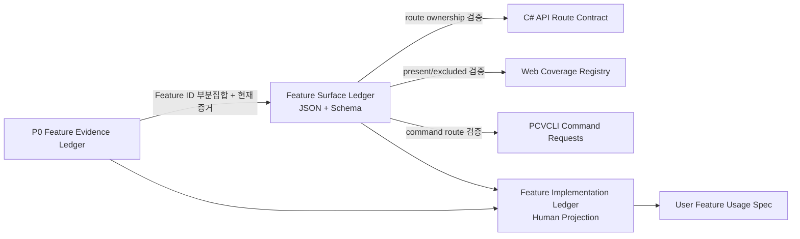

# PureCVisor Desktop Node AR-002 Feature ID Surface Parity 설계

- 상태: `approved-for-design-documentation`
- 작성일: 2026-08-24
- 대상 저장소: `purecvisor-desktop-node` Windows Desktop Node
- 작업 ID: `AR-002 / Task 5 Feature ID Surface Parity`
- 승인 기준: 2026-08-24 대화에서 별도 `featureId` 및 별도 surface ledger 방식을 승인함

## 1. 목적

API, Web Console, PCVCLI, 사용자 기능 명세가 같은 기능을 서로 다른 이름으로 표현해도
하나의 안정적인 Feature ID로 추적할 수 있게 한다. API route 수와 Web/CLI 노출 수를
억지로 같게 만들지 않고, 노출하지 않는 surface에는 기계 검증 가능한 제외 사유를 남긴다.

이 작업은 코드 수준 surface parity 계약이다. 패키지 생성, 설치본 검증, 실제 VM 조작,
호스트 mutation, public trusted signing 또는 외부 stable publication 주장을 만들지 않는다.

## 2. 현재 문제

- `ApiHandlerRouteContract`의 60개 route에는 안정적인 Feature ID가 없다.
- Web의 `PcvRouteCoverageItem.id`는 `vm.save` 같은 동작 ID이며 제품 Feature ID가 아니다.
- CLI는 명령에서 method/path를 만들지만 Feature ID 투영 계약이 없다.
- `docs/USER_FEATURE_USAGE_SPEC.md`의 기능 행은 기계 계약과 연결되지 않는다.
- 기존 `config/desktop-node-feature-evidence-ledger.json`은 전체 기능 catalog가 아니라
  현재 P0 승격 판정 대상 4개만 소유한다. 모든 항목에 실제 version/evidence를 요구하므로
  전체 surface catalog로 확대하면 승격 증거 의미가 오염된다.

## 3. 결정

### 3.1 ID 계층을 분리한다

- 기존 API operation name, Web coverage `id`, CLI 명령 이름은 동작 식별자로 유지한다.
- 모든 API route와 Web/CLI 투영에 별도 `featureId`를 연결한다.
- Feature ID 형식은 기존 계약과 같은 `^pcv\.[a-z0-9._-]+$`를 사용한다.
- 하나의 Feature ID는 여러 route를 소유할 수 있다.
- 하나의 `(method, route_template)`은 정확히 하나의 Feature ID만 소유할 수 있다.

### 3.2 전체 surface ledger와 승격 evidence ledger를 분리한다

새 파일을 추가한다.

- `config/desktop-node-feature-surface-ledger.json`
- `config/desktop-node-feature-surface-ledger.schema.json`

surface ledger는 전체 Feature ID와 route/surface 소유권의 기계적 단일 진실이다.
기존 `config/desktop-node-feature-evidence-ledger.json`은 P0 4개 승격 판정 단일 진실로
보존한다. evidence ledger의 모든 Feature ID는 surface ledger에 존재해야 하지만,
surface ledger의 모든 Feature ID가 승격 후보일 필요는 없다.

### 3.3 기존 계약을 호환 보존한다

- API의 `OperationName`과 route template은 바꾸지 않는다.
- Web의 기존 `id`는 바꾸지 않고 `featureId`만 추가한다.
- CLI 명령 문법과 `DesktopNodeCliRequest` wire shape은 바꾸지 않는다.
- 현재 P0 promotion contract, candidate 수 4개, blocker 1개를 바꾸지 않는다.

## 4. Surface ledger 계약

최상위 계약은 다음 의미를 가진다.

```json
{
  "schema_version": 1,
  "contract": "pcv-feature-surface-ledger-v1",
  "target_surfaces": ["api", "cli", "web"],
  "features": []
}
```

각 feature 항목은 다음 정보를 소유한다.

- `feature_id`: 안정적인 제품 Feature ID
- `title`: 사람이 읽는 기능명
- `routes`: 이 기능이 소유하는 하나 이상의 API route

각 route 항목은 다음 정보를 소유한다.

- `operation_id`: 기존 동작 ID. Web/CLI/API 이름을 연결하는 설명용 안정 키
- `method`: 대문자 HTTP method
- `route_template`: API의 canonical `{vmId}` 형식을 사용한 template
- `required_permission`: API 계약의 권한. 권한이 없으면 `null`
- `present_surfaces`: 실제 제공되는 surface 목록. 모든 route는 `api`를 포함
- `excluded_surfaces`: 미제공 surface와 비어 있지 않은 사유 목록

`cli`와 `web`은 각 route에서 정확히 한 상태만 가져야 한다.

1. `present_surfaces`에 존재하거나
2. `excluded_surfaces`에 정확히 한 번 존재한다.

동일 surface가 present와 excluded에 동시에 존재하거나 둘 다 없으면 계약 위반이다.

## 5. 컴포넌트 변경

### 5.1 API

`src/DesktopNode.Api/ApiHandlerAdapterContract.cs`의 `ApiHandlerRouteContract`에
`FeatureId`를 추가하고 모든 기본 route에 명시한다. helper가 Feature ID를 인자로 받게 해
route 생성 시 누락할 수 없도록 한다.

`src/DesktopNode.Api.Tests/ApiHandlerAdapterContractTests.cs`는 다음을 검증한다.

- 모든 route의 Feature ID 형식과 비어 있지 않음
- method/route별 단일 Feature ID 소유권
- surface ledger의 API route 집합과 C# contract의 완전 일치
- permission과 operation mapping 일치
- evidence ledger Feature ID가 surface ledger Feature ID의 부분집합임

### 5.2 Web Console

`web/src/served/types.ts`의 `PcvRouteCoverageItem`에 `featureId`를 추가하고
`web/src/served/routes.ts`의 각 coverage 항목에 값을 지정한다. 기존 `id`와 렌더링 동작은
보존한다.

Web 검증은 실제 `(method, route)` coverage가 surface ledger에서 `web` present로 선언된
항목과 일치하는지 확인한다. Web에 없는 API route는 ledger에 명시적 제외 사유가 있어야
한다. route parameter 표기 차이는 테스트에서 canonical `{vmId}`, `{jobId}`,
`{checkpointId}`, `{bundleId}`로 정규화한 뒤 비교한다.

### 5.3 PCVCLI

CLI 제품 parser와 request 형식은 변경하지 않는다. 대표 명령 표가 실제로 생성한
`DesktopNodeCliRequest.Method/Path`를 canonical route template으로 정규화해 surface ledger의
Feature ID와 대조한다.

CLI에 노출하지 않는 API route는 ledger의 `excluded_surfaces`에 `cli`와 사유가 있어야 한다.
별칭 명령은 같은 route와 Feature ID를 가리킬 수 있지만 별도의 제품 Feature ID를 만들지
않는다.

### 5.4 문서

새 `docs/FEATURE_IMPLEMENTATION_LEDGER.md`는 machine ledger의 사람이 읽는 투영이다.
Feature ID, 동작/route, API/Web/CLI 상태, 권한, code/package/installed/actual-VM 단계,
현재 blocker를 표시한다.

- 기존 P0 4개는 evidence ledger의 현재 version/verdict/evidence를 연결한다.
- feature-scoped evidence가 없는 항목은 PASS로 추정하지 않고 `not-assessed`로 표시한다.
- 운영 current-card PASS와 feature qualification PASS를 합치지 않는다.

`docs/USER_FEATURE_USAGE_SPEC.md`의 기능 제목 또는 표 행에는 해당 Feature ID와
`FEATURE_IMPLEMENTATION_LEDGER.md` anchor를 연결한다.

## 6. 데이터 흐름



제품 runtime은 JSON ledger를 읽어 route를 동적으로 구성하지 않는다. 정적 C# route 계약이
실행 경로를 유지하고, 테스트가 ledger와의 drift를 차단한다. 따라서 ledger 오류가 실행 중
API 장애로 바뀌지 않고 빌드/검증 단계에서 실패한다.

## 7. 실패 규칙

다음 상태는 검증 실패다.

1. Feature ID 형식 오류, 중복 또는 알 수 없는 참조
2. 같은 method/route를 둘 이상의 Feature ID가 소유
3. API contract route가 ledger에 없거나 ledger route가 API contract에 없음
4. permission 또는 operation mapping 불일치
5. Web/CLI surface가 present/excluded 중 어느 쪽에도 없거나 양쪽에 모두 있음
6. 제외 사유가 null, 빈 문자열 또는 공백뿐임
7. present로 선언한 Web route 또는 CLI 명령 투영이 실제 코드에 없음
8. evidence ledger Feature ID가 surface ledger에 없음
9. 사용자 기능 명세의 Feature ID 또는 human ledger anchor가 끊김

검증 오류는 어떤 surface와 method/route/Feature ID가 불일치했는지 메시지에 포함해야 한다.

## 8. 테스트 전략

TDD 순서를 지킨다.

1. API의 Feature ID 누락/중복/ledger drift 테스트를 추가해 RED를 확인한다.
2. 최소 API mapping과 surface ledger/schema를 추가해 API 테스트를 GREEN으로 만든다.
3. Web `featureId` 및 present/excluded parity 테스트를 RED→GREEN으로 만든다.
4. CLI command route parity와 explicit exclusion 테스트를 RED→GREEN으로 만든다.
5. 문서 projection/link 테스트를 RED→GREEN으로 만든다.
6. 전체 대상 검증을 실행한다.

대상 명령은 다음과 같다.

```text
dotnet test src/DesktopNode.Api.Tests/DesktopNode.Api.Tests.csproj
dotnet test src/DesktopNode.Cli.Tests/DesktopNode.Cli.Tests.csproj
npm test --prefix web
npm run verify:parity --prefix web
Invoke-Pester web/tests/PcvDesktopWeb.Static.Tests.ps1
```

호스트 관리자 권한, MSI 생성, 서비스 설치, Hyper-V mutation은 필요하지 않다.

## 9. 고려한 대안

### 기존 evidence ledger 확대

단일 JSON처럼 보이지만 모든 기능에 실제 version/evidence를 요구해 P0 승격 판정과 전체
catalog 의미가 섞인다. 기존 4개 후보 계약과 blocker 계산의 회귀 위험 때문에 채택하지
않는다.

### C# API contract만 단일 진실로 사용

파일 추가가 적지만 TypeScript와 CLI가 C# 소스 구조를 해석해야 하며 언어 간 계약이 코드에
분산된다. 사람이 검토할 schema도 약해져 채택하지 않는다.

### 기존 동작 ID를 Feature ID로 교체

필드 수는 줄지만 하나의 기능이 여러 동작을 소유하는 관계를 표현하기 어렵고 기존 Web/CLI
계약을 불필요하게 깨므로 채택하지 않는다.

## 10. 범위와 비범위

포함:

- 전체 API route Feature ID 소유권
- Web/CLI present 또는 explicit exclusion 계약
- P0 evidence Feature ID의 부분집합 검증
- 사용자 문서의 Feature ID 투영

제외:

- API route 추가/삭제 또는 command UX 변경
- PowerShell runtime fallback 추가
- 기존 Guest PowerShell Direct provider 제거
- 패키지, 설치, 실제 VM 또는 host mutation 증거 생성
- 현재 `0.42.74-admin-smoke` 승격 blocker 해소 주장
- AR-000 admin pipeline, AR-003 이후 remediation

## 11. 계획 초안 정합성 보정

2026-08-23 audit remediation 초안의 Task 5 commit 목록은 기존 evidence ledger 수정까지
포함하지만 파일 목록에는 이를 명시하지 않았다. 본 설계는 다음처럼 보정한다.

- 기존 evidence ledger의 판정 데이터는 수정하지 않는다.
- 새 surface ledger/schema를 Task 5 파일에 추가한다.
- evidence ledger와 surface ledger의 Feature ID 부분집합 관계만 테스트한다.
- `web/src/served/types.ts`는 `featureId` type 변경 때문에 Task 5 수정 파일에 추가한다.

## 12. 완료 기준

- 모든 API route가 정확히 하나의 안정적인 Feature ID를 가진다.
- Web/CLI는 각 API route마다 present 또는 사유 있는 excluded 상태를 가진다.
- 기존 operation/route/CLI request 호환 계약이 유지된다.
- P0 evidence ledger는 4개 후보 및 현재 blocker 의미를 유지한다.
- human ledger와 사용자 기능 명세가 Feature ID로 연결된다.
- API, CLI, Web, parity, Web static 검증이 모두 PASS한다.
- host mutation과 release/publication 주장을 만들지 않는다.
