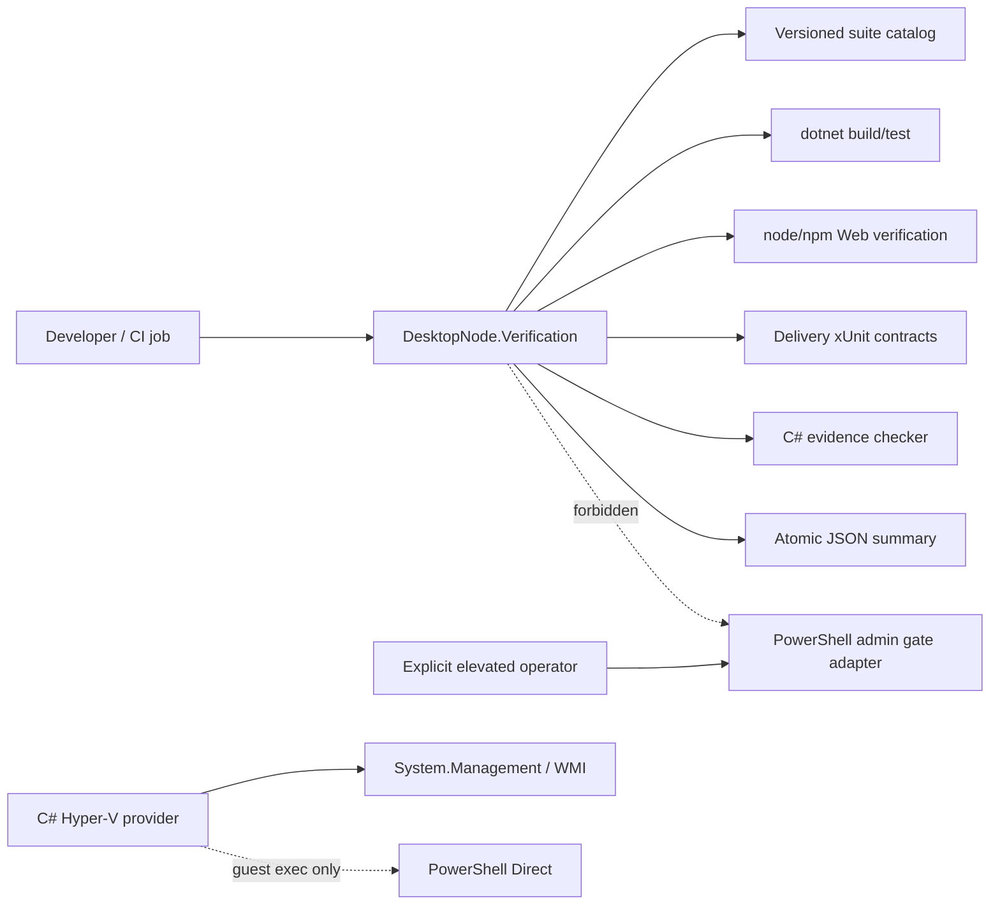

# PureCVisor Desktop Node Pester-free C# Verification Design

- Design-ID: `purecvisor-desktop-node-pester-free-csharp-verification-20260824-v1`
- 상태: `approved`
- Written-spec approval: `2026-08-24 user-approved`
- 기준 브랜치/커밋: `main` / `bee07214cd4f2f061b30996f766b9976a9527abd`
- 대상 backlog: `AR-003`, `AR-004`, `AR-005`
- 제품/호스트 mutation: `false`
- public trusted signing / external stable publication claim: `false / false`

## 1. 목적

Desktop Node의 비관리자 개발 검증을 C#과 Node.js로 통합하고 required CI에서 Pester 및
비관리자 PowerShell 호출을 제거한다. 제품 VM/Host 제어는 C#과 Hyper-V WMI를 유지하고,
PowerShell은 승인된 관리자 gate와 ADR-0009 Guest PowerShell Direct transport에만 남긴다.

이 설계의 완료 상태는 다음 두 문장으로 고정한다.

1. required CI의 Pester 호출 수는 `0`이다.
2. required CI의 비관리자 `pwsh`/`powershell` 호출 수는 `0`이다.

기존 Pester 파일을 곧바로 삭제하는 것이 목적은 아니다. 새 C#/Node 계약의 동등성을 먼저
증명하고 required gate를 전환한 뒤, 기존 파일은 비필수 parity reference로 안정화 기간 동안
보존한다.

## 2. 현재 기준선

### 2.1 제품과 검증 경계

- 일반 Hyper-V 제어는 `System.Management` WMI 기반 C# product path다.
- active product runtime은 generic PowerShell helper fallback을 받지 않는다.
- Guest Execution의 현재 transport는 ADR-0009에 따른 PowerShell Direct다.
- required CI는 `.NET`, Web, Packaging Pester, Installer/Web Pester 네 job이다.
- 현재 PowerShell 개발 orchestration은 `Invoke-PcvDevelopmentVerification.ps1`과 Pester가
  소유한다.

### 2.2 Pester 자산 계량

2026-08-24 read-only inventory 기준이다.

| 영역 | Pester 파일 | 테스트 코드 줄 |
|---|---:|---:|
| Packaging | 55 | 17,675 |
| Installer | 6 | 1,284 |
| Web | 1 | 1,207 |
| 합계 | **62** | **20,166** |

같은 기준 commit에서 `.NET Release` solution은 7개 test assembly, `967/967` PASS,
skipped `0`이었다.

## 3. 결정

### 3.1 채택 접근법

`하이브리드 C# runner`를 채택한다.

- 로컬 개발자는 하나의 C# CLI로 Fast/Full/Release 검증을 실행한다.
- CI는 네 개의 병렬 job을 유지해 실패 격리와 wall-clock 효율을 보존한다.
- 각 CI job은 동일 C# suite catalog의 부분 집합을 실행한다.
- Web 검증 구현은 Node/TypeScript가 소유한다.
- Delivery/Installer/evidence 정적 계약은 xUnit이 소유한다.

### 3.2 거부한 접근법

1. 단일 monolithic CI job은 병렬성과 실패 격리를 약화하므로 거부한다.
2. framework만 교체하고 orchestration을 CI YAML에 중복하는 접근은 로컬/CI 정책 drift를
   유지하므로 거부한다.
3. C# runner가 내부에서 `pwsh`를 다시 호출하는 wrapper 전환은 목표를 위반하므로 거부한다.
4. 62개 Pester 파일을 동등성 증명 없이 즉시 삭제하는 접근은 회귀 복구 기준을 없애므로 거부한다.

## 4. 아키텍처



### 4.1 `DesktopNode.Verification`

새 `.NET 10` console project다. 다음만 소유한다.

- lane/change-tier 검증과 승격
- changed-path classification
- suite catalog와 실행 계획
- shell 없는 child-process 실행
- 병렬성, timeout, cancellation
- stdout/stderr 제한과 redaction
- deterministic result와 atomic summary write

제품 API, WMI provider, MSI 설치, SCM, host mutation을 참조하거나 실행하지 않는다.

### 4.2 `DesktopNode.Verification.Tests`

runner 자체의 pure policy와 process boundary를 xUnit으로 검증한다. 실제 dotnet/npm을 매 unit
test에서 실행하지 않고 `IProcessRunner`, clock, filesystem boundary를 대체 가능한 port로 둔다.
소수 end-to-end test만 임시 fixture executable을 실행한다.

### 4.3 `DesktopNode.Delivery.Tests`

Packaging과 Installer의 비관리자 정적·결정론 계약을 xUnit으로 이전한다. 한 giant test class를
만들지 않고 다음 namespace/fixture 경계로 분리한다.

- evidence/current projection
- product plan/manifest
- installer/WiX/signing descriptors
- admin-preflight plan contracts
- orchestration/policy boundaries

실제 MSI 설치, Service 변경, Hyper-V/OS mutation은 이 test project의 범위 밖이다.

### 4.4 Web 검증

`web/tests/PcvDesktopWeb.Static.Tests.ps1`의 정적 계약은 TypeScript/Node verifier로 이동한다.
TypeScript source, generated served asset, feature surface, browser fixture를 기존 npm graph 안에서
검증한다. Web 계약을 C#으로 재작성하지 않는다.

### 4.5 Current evidence checker

`Update-PcvCurrentEvidenceDocs.ps1 -Check`의 schema validation, projection, expected/current 비교를
순수 C# library로 옮긴다. projector와 writer를 분리하고 required gate는 check-only API만 호출한다.
쓰기 동작은 별도 명시 명령이며 required verification이 자동 생성으로 drift를 숨기지 않는다.

## 5. 명령 계약

```text
dotnet run --project src/DesktopNode.Verification -- verify
  --lane Fast|Full|Release
  --change-tier S|M|L
  --changed-path <path>...
  --artifact-root <path>
  [--suite <id>...]
  [--shard dotnet|web|delivery|installer-policy]
  [--plan-only]
```

### 5.1 입력 규칙

- `Fast + M`은 `Full`로 승격한다.
- 모든 `L`은 `Release`로 승격한다.
- unknown path는 검증 축소 대신 `Full`로 승격한다.
- unknown suite, 잘못된 enum, 중복 suite ID, schema mismatch는 실행 전 실패한다.
- `--suite`는 국소 진단 전용이다. 이 결과는 `execution_scope=partial`이며 lane 완료 증거가 아니다.
- CI 부분 실행은 임의 suite 목록 대신 catalog-defined `--shard`만 사용한다.
- `--shard`와 `--suite`를 함께 사용할 수 없다.
- `policy-boundaries`는 네 required shard의 합집합이 Full의 일곱 suite와 정확히 같고 누락·중복이
  없음을 검증한다.

### 5.2 고정 suite

| Suite ID | owner | 기본 실행 |
|---|---|---|
| `dotnet` | C# | solution restore/build/test |
| `web-typecheck` | Node | TypeScript typecheck와 served freshness |
| `web-parity` | Node | static parity와 browser fixture |
| `delivery-contracts` | xUnit | Packaging/evidence non-admin contracts |
| `installer-contracts` | xUnit | WiX/installer non-admin contracts |
| `evidence-check` | C# | canonical current evidence check-only |
| `policy-boundaries` | C# | repo/CI/migration boundary guards |

`Full`은 일곱 suite를 모두 요구한다. `Fast`는 경로 분류 결과의 최소 집합을 실행한다.
`Release`는 Full에 비관리자 release preflight만 추가하고 package build나 mutation은 포함하지 않는다.

### 5.3 실행 규칙

1. catalog와 요청을 검증한다.
2. effective lane과 suite 계획을 계산한다.
3. `--plan-only`이면 child process 없이 planned summary를 반환한다.
4. 실제 실행은 최대 네 suite를 병렬 수행한다.
5. 각 결과의 duration, exit code, timeout/cancel, bounded output digest를 기록한다.
6. required failure/missing/skip 하나라도 있으면 전체 실패다.
7. summary는 temporary file 후 atomic rename으로 확정한다.

## 6. 결과 계약

contract는 `pcv-development-verification-summary-v2`다.

```json
{
  "schema_version": 2,
  "contract": "pcv-development-verification-summary-v2",
  "requested_lane": "Full",
  "effective_lane": "Full",
  "change_tier": "M",
  "execution_scope": "lane",
  "shard_id": null,
  "plan_only": false,
  "ok": true,
  "started_at": "2026-08-24T00:00:00Z",
  "completed_at": "2026-08-24T00:01:30Z",
  "duration_ms": 90000,
  "results": [
    {
      "suite_id": "dotnet",
      "status": "passed",
      "exit_code": 0,
      "duration_ms": 30000,
      "timed_out": false,
      "cancelled": false
    }
  ]
}
```

summary는 환경변수 전체, token, credential value, raw command secret을 포함하지 않는다.
timestamp를 제외한 plan-only serialization과 suite ordering은 결정론적이어야 한다.

## 7. 오류와 안전 경계

### 7.1 Process 안전성

- shell command string을 사용하지 않고 executable과 argument 배열을 사용한다.
- required executable allowlist는 파일명 정규화 후 `dotnet(.exe)`, `node(.exe)`, `npm(.cmd)`,
  `git(.exe)`다.
- `pwsh`, `powershell`, `msiexec`, `sc.exe`와 host/VM mutation 명령은 required catalog에서
  거부한다.
- timeout/cancel 시 child process tree를 종료하고 terminal result를 반드시 기록한다.
- suite별 timeout과 전체 timeout은 versioned catalog가 소유한다.

### 7.2 Filesystem 안전성

artifact root의 resolved absolute path는 repository `artifacts/` 또는 명시된 CI temporary root
아래여야 한다. repository root, drive root, 사용자 profile 또는 unresolved environment variable을
출력 대상으로 허용하지 않는다.

### 7.3 Fail-closed 오류 코드

```text
PCV_VERIFY_CONFIG_INVALID
PCV_VERIFY_UNKNOWN_SUITE
PCV_VERIFY_PROCESS_FAILED
PCV_VERIFY_TIMEOUT
PCV_VERIFY_CANCELLED
PCV_VERIFY_PARITY_UNMAPPED
PCV_VERIFY_NONADMIN_PWSH_FORBIDDEN
PCV_VERIFY_ARTIFACT_ROOT_INVALID
```

failure, timeout, cancellation, required skip, missing result를 PASS로 축약하지 않는다.

## 8. CI 구조

네 병렬 job은 유지한다.

1. `.NET product/tests`
2. `Web type/parity/browser`
3. `Delivery/evidence contracts`
4. `Installer/policy contracts`

각 job은 같은 C# runner에 catalog-defined `--shard`를 전달한다. Web shard는 Node setup 후 runner가
Node suite를 실행한다. 각 shard summary는 `execution_scope=shard`와 고정 `shard_id`를 기록하며
단독으로 Full lane 완료를 주장하지 않는다.
required workflow executable step에는 `shell: pwsh`, `pwsh`, `powershell`, `Invoke-Pester`가 없어야
한다. 관리자 operational workflow는 required development workflow와 분리한다.

## 9. Pester migration program

### Wave A — C# runner foundation

이 설계 다음에 작성할 첫 구현 계획의 유일한 범위다.

- verification console/test projects
- versioned suite catalog와 schema
- lane/path policy
- fake process runner와 JSON summary
- forbidden PowerShell guard
- 기존 CI를 변경하지 않는 PlanOnly/dry foundation evidence

### Wave B — Web

Web Pester 1개 파일을 Node/TypeScript 계약으로 이전한다. served asset과 feature parity owner를
중복하지 않고 기존 npm graph에 통합한다.

### Wave C — Installer

Installer Pester 6개 파일을 xUnit으로 이전한다. WiX source, plan, lifecycle descriptor, signing,
wrapper, trust 계약을 실제 설치 없이 검증한다.

### Wave D — Packaging

Packaging Pester 55개 파일을 domain별 xUnit fixture로 이전한다. 한 commit이나 한 test class로
합치지 않고 독립 migration batches로 수행한다.

### Wave E — Cutover

동일 commit에서 legacy와 replacement parity를 증명한 뒤 required CI를 전환한다. cutover는 별도
commit으로 만들어 한 번의 revert로 기존 gate를 복구할 수 있어야 한다.

## 10. Migration manifest

versioned machine manifest는 기존 62개 파일 각각에 대해 다음을 기록한다.

- legacy path
- domain
- replacement owner project/script
- replacement test/contract IDs
- parity status: `unmapped|mapped|dual-run-pass|cutover`
- last parity evidence locator

누락과 legacy path 중복은 `0`이어야 한다. `unmapped`가 하나라도 있으면 cutover를 금지한다.

## 11. 테스트 전략

### 11.1 Runner unit/contract

- lane/tier 승격 matrix
- path classification과 unknown fallback
- suite dependency/selection
- argument-array fidelity
- parallelism upper bound
- timeout, cancellation, process-tree cleanup
- output cap과 secret redaction
- deterministic JSON ordering
- atomic summary semantics
- artifact-root containment
- forbidden PowerShell executable/argument detection

### 11.2 Migration parity

- legacy contract ID와 replacement contract ID mapping `62/62`
- 같은 commit의 legacy Pester와 replacement C#/Node local Windows PASS
- 같은 commit의 CI parity PASS
- failure fixture가 legacy와 replacement 양쪽에서 실패하는 negative parity
- host/service/MSI/VM mutation count `0`

### 11.3 Cutover guards

- required workflow `pwsh|powershell|Invoke-Pester` executable occurrence `0`
- required suite missing/skip `0`
- migration manifest missing/duplicate/unmapped `0`
- Full required CI wall-clock이 기존 상한 약 3분 34초를 넘지 않음

## 12. 관리자와 Guest PowerShell 경계

다음은 제거 대상이 아니다.

- 명시 승인된 MSI install/update/rollback 및 clean-host runner
- Service/SCM, firewall, Event Log, trust-store, Credential Manager mutation adapter
- Hyper-V actual-VM/manual-admin evidence runner
- ADR-0009 Guest PowerShell Direct transport

이 경계는 required non-admin CI와 별도 workflow, 별도 manifest, 별도 승인으로 유지한다. 새 C#
verification runner에는 관리자 gate 실행 옵션을 추가하지 않는다.

## 13. Cutover 완료 조건

다음을 모두 만족해야 required gate 전환을 완료로 판정한다.

1. Pester file mapping `62/62`, missing/duplicate/unmapped `0`.
2. 동일 commit local Windows dual-run PASS.
3. 동일 commit CI dual-run PASS.
4. required CI Pester invocation `0`.
5. required CI non-admin PowerShell invocation `0`.
6. host/service/MSI/VM mutation `0`.
7. Full CI wall-clock이 기존 상한 3분 34초 이하.
8. cutover 단일 revert로 이전 gate 복구 가능.
9. 기존 Pester 파일은 비필수 parity reference로 남아 있고 자동 삭제되지 않음.

## 14. 비범위

- 기존 Pester 파일의 즉시 삭제
- 관리자 runner의 C# 전환
- Guest PowerShell Direct transport 교체
- MSI/package build 또는 host/VM mutation
- ASP.NET Core transport 전환
- public signing, publication, release claim

## 15. 구현 계획 경계

다음 implementation plan은 Wave A만 다룬다. Web, Installer, Packaging migration과 CI cutover는
각각 독립 계획과 검토 checkpoint를 가져야 한다. 이 분리는 최종 목표를 축소하는 것이 아니라
62개 계약의 회귀 원인을 한 번에 섞지 않기 위한 실행 경계다.

Wave A 완료만으로 Pester-free를 주장하지 않는다. 최종 주장은 Wave E의 모든 종료 조건이 실제
증빙으로 PASS한 뒤에만 가능하다.
