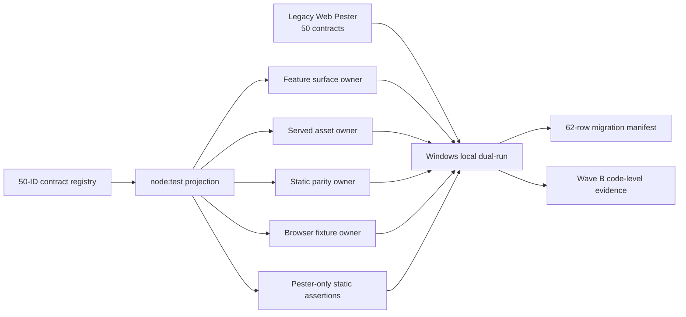

# PureCVisor Desktop Node Pester-free Web Verification Wave B Design

- Design-ID: `purecvisor-desktop-node-pester-free-web-verification-wave-b-20260824-v1`
- 상태: `approved`
- Conversation design approval: `2026-08-24 user-approved`
- Written-spec approval: `2026-08-24 user-approved`
- 기준 브랜치/커밋: `main` / `[private-source-commit]`
- 상위 설계:
  `docs/superpowers/specs/2026-08-24-purecvisor-desktop-node-pester-free-csharp-verification-design.md`
- 범위: `Wave B — Web`
- 제품/호스트 mutation: `false`
- public trusted signing / external stable publication claim: `false / false`

## 1. 목적

`web/tests/PcvDesktopWeb.Static.Tests.ps1`의 50개 정적 계약을 고유한 Node contract ID로
1:1 추적하고, 기존 npm 검증 owner를 재사용하는 로컬 replacement를 만든다. 같은 commit의
Windows 환경에서 legacy Pester와 Node replacement의 양성·음성 parity를 증명한다.

Wave B는 required CI 전환 단계가 아니다. 기존 Web Pester, `.github/workflows/development-gates.yml`,
Wave A C# catalog의 `activation_state=plan-only-foundation`을 유지한다. required CI의 Pester와
비관리자 PowerShell 호출 제거는 계속 Wave E가 소유한다.

## 2. 기준선

2026-08-24 read-only 조사 결과는 다음과 같다.

- Web legacy Pester: `1`파일, `1,207`줄, `50`개 `It` 계약.
- 기존 Web npm owner:
  - `check:feature-surfaces`
  - TypeScript `tsc --noEmit`
  - `check:served`
  - `check:frontend-batches`
  - `verify:parity`
  - `browser:fixture`
- 기준 `npm test --prefix web`: PASS, feature surface `52`, excluded `8`.
- 기준 `npm run verify:parity --prefix web`: PASS.
- migration manifest: 아직 없음.
- 전체 Pester inventory: Packaging `55` + Installer `6` + Web `1` = `62`파일.

Legacy Pester는 현재 `package.json`의 `test` 문자열을 완전 일치로 검증한다. 따라서 Wave B가
신규 Node command를 기존 `npm test`에 삽입하면 같은 commit parity가 실패한다. 신규 command는
`test:web-contracts`로 별도 등록하며 required npm graph 편입은 Wave E까지 보류한다.

## 3. 승인 결정

1. Wave B는 로컬 dual-run까지만 수행한다. CI shadow와 required 전환은 수행하지 않는다.
2. 50개 legacy `It`은 50개 replacement contract ID로 1:1 추적한다.
3. 구현은 도메인 분할 registry와 Node 내장 `node:test`를 사용한다.
4. 기존 feature, served asset, static parity, browser fixture owner를 재작성하지 않는다.
5. Pester에만 있던 정적 assertion만 신규 registry 함수가 소유한다.
6. 전역 migration manifest는 62개 legacy 파일을 모두 수록한다.
7. Web 행은 local parity가 PASS해도 CI parity 전까지 `parity_status=mapped`를 유지한다.
8. 기존 Web Pester 파일, required workflow와 기존 `npm test` 문자열은 변경하지 않는다.

## 4. 아키텍처



`web/contracts/web-static-contracts.mjs`가 contract metadata와 검증 함수를 소유한다. 하나의
`node:test` projection은 registry를 순회하여 contract ID를 그대로 테스트 이름으로 사용한다.
여러 contract가 같은 기존 owner에 위임되면 harness는 그 owner를 argument-array process로 한 번만
실행하고 결과를 캐시한다. owner 실행은 shell을 사용하지 않는다.

정적 contract는 파일을 한 번 읽어 context cache에 보관하고 literal, 정규식, JSON 구조,
파일 존재, 파일 순서 assertion을 수행한다. 기존 owner에 위임되는 contract는 owner 결과와 필요한
최소 wiring assertion만 확인한다. 기존 verifier의 내부 assertion을 복제하지 않는다.

## 5. 구성 요소와 파일 책임

| 파일 | 책임 |
| --- | --- |
| `web/contracts/web-static-contracts.mjs` | 50개 ID, legacy 이름, domain, owner와 검증 함수의 단일 registry. |
| `web/contracts/web-contract-harness.mjs` | root containment, 파일/JSON cache, assertion, cached owner process, redacted error. |
| `web/node-tests/web-static-contracts.test.mjs` | registry 50개를 `node:test` 개별 테스트로 투영. |
| `web/scripts/verify-web-contract-registry.mjs` | Pester `It` 이름과 registry의 exact 50/50 mapping 검증. |
| `web/scripts/verify-verification-migration-manifest.mjs` | schema와 실제 62파일 inventory의 누락·중복·상태 전이 검증. |
| `web/scripts/verify-web-contract-negative-parity.mjs` | 임시 fixture 생성, focused Pester/Node failure parity, 정리. |
| `web/package.json` | 별도 `check:web-contract-registry`, `check:verification-migration-manifest`, `test:web-contracts`, `verify:web-contract-negative-parity` command. |
| `config/development-verification-migration-manifest.schema.json` | strict v1 schema. |
| `config/development-verification-migration-manifest.json` | 62개 legacy path의 versioned migration ledger. |
| `docs/DEVELOPMENT_VERIFICATION_POLICY.md` | Wave B 로컬 replacement와 비전환 경계. |
| `docs/DEVELOPER_INDEX.md` | Wave B 설계·계획·evidence 진입점. |
| `docs/ga-ready/EVIDENCE_INDEX.md` | Wave B code-level evidence locator. |
| `docs/ga-ready/evidence/pester-free-web-verification-wave-b-2026-08-24.md` | 명령, 수치, parity와 false claim. |

다음 파일은 Wave B에서 수정하지 않는다.

- `web/tests/PcvDesktopWeb.Static.Tests.ps1`
- `.github/workflows/development-gates.yml`
- `config/development-verification-suites.json`
- `config/development-verification-suites.schema.json`
- `docs/ga-ready/current-evidence.json`

## 6. Contract registry

각 contract는 다음 interface를 만족한다.

```javascript
{
  id: "web.static.root-assets",
  legacyName: "ships index, stylesheet, and script assets under the Desktop Node web root",
  domain: "shell-assets",
  owners: ["static-contract"],
  async verify(context) {}
}
```

고정 규칙은 다음과 같다.

- `id`는 `web.static.` prefix의 소문자 kebab-case이며 exact unique다.
- `legacyName`은 Pester `It` 문자열과 ordinal exact match다.
- domain은 `shell-assets|routes-actions|operations-evidence|typescript-parity` 중 하나다.
- owner는 allowlist에 속하고 알 수 없는 command 또는 executable을 허용하지 않는다.
- registry 순서는 legacy Pester source order와 같다.
- test count는 정확히 `50`, skip과 conditional omission은 `0`이다.
- 한 contract 실패는 다른 contract 실행을 숨기지 않는다.

### 6.1 고정 50개 mapping

아래 Owner 열의 `+`는 복수 owner 배열을 사람이 읽기 쉽게 표시한 구분자다. 예를 들어
`feature-surface+static-contract`는 실제 registry에서
`owners: ["feature-surface", "static-contract"]`로 기록하며 하나의 owner ID가 아니다.

| # | Replacement contract ID | Legacy contract 요약 | Owner |
| ---: | --- | --- | --- |
| 1 | `web.static.feature-surface-ledger` | stable Feature ID surface ledger | `feature-surface` |
| 2 | `web.static.root-assets` | Web root index/style/script assets | `static-contract` |
| 3 | `web.static.inline-favicon` | inline favicon | `static-contract` |
| 4 | `web.static.single-edge-isolation` | Single Edge UI tree isolation | `static-contract` |
| 5 | `web.static.design-boundary` | Web DESIGN runtime boundary | `static-contract` |
| 6 | `web.static.supanova-tokens` | active stylesheet tokens | `static-contract` |
| 7 | `web.static.visual-shell` | Single Edge visual shell port | `static-contract` |
| 8 | `web.static.workbench-frame` | workbench frame and Linux exclusion | `static-contract` |
| 9 | `web.static.frontend-mockups` | completion mockup samples | `static-contract` |
| 10 | `web.static.frontend-batches` | five automatic staged batches | `frontend-batches` |
| 11 | `web.static.phase2h-endpoints` | Phase 2H endpoints | `static-contract` |
| 12 | `web.static.local-api-registry` | centralized Local API registry | `feature-surface+static-contract` |
| 13 | `web.static.qos-guest-readback` | QoS and guest readback | `static-contract` |
| 14 | `web.static.qos-guest-control` | QoS and Guest Execution controls | `static-contract` |
| 15 | `web.static.guest-exec-cancel` | running guest execution cancel | `static-contract` |
| 16 | `web.static.search-event-table` | search, event center and table helpers | `static-contract` |
| 17 | `web.static.served-source-parts` | staged served source parts | `served-asset+static-contract` |
| 18 | `web.static.optional-bearer` | optional bearer request wiring | `static-contract` |
| 19 | `web.static.account-rbac-console` | account, RBAC, JWT and console UX | `static-contract` |
| 20 | `web.static.listener-api-base` | listener-provided API base URL | `static-contract` |
| 21 | `web.static.vm-create-payload` | VM create payload fields | `static-contract` |
| 22 | `web.static.vm-lifecycle-routes` | VM lifecycle endpoints | `static-contract` |
| 23 | `web.static.vm-detail-mount` | VM detail mount point | `static-contract` |
| 24 | `web.static.vm-lifecycle-actions` | lifecycle actions and confirmation | `static-contract` |
| 25 | `web.static.checkpoint-actions` | checkpoint actions | `static-contract` |
| 26 | `web.static.browser-job-history` | local tracked job history | `static-contract` |
| 27 | `web.static.job-orchestration` | pending state, polling and pagination | `static-contract` |
| 28 | `web.static.shell-controls` | shell control binding | `static-contract` |
| 29 | `web.static.activity-troubleshooting` | activity and troubleshooting | `static-contract` |
| 30 | `web.static.ops-cockpit` | multi-view ops cockpit | `static-contract+browser-fixture` |
| 31 | `web.static.evidence-dashboard` | batch evidence dashboard | `static-contract+browser-fixture` |
| 32 | `web.static.evidence-degradation` | evidence degradation and triage | `static-contract+browser-fixture` |
| 33 | `web.static.diagnostic-bundle` | diagnostic bundle UX safety | `static-contract+browser-fixture` |
| 34 | `web.static.operator-terms` | internal distribution terminology | `static-contract` |
| 35 | `web.static.frontend-edge-cases` | final frontend edge cases | `static-contract+browser-fixture` |
| 36 | `web.static.token-rotation` | token rotation UX boundary | `static-contract+browser-fixture` |
| 37 | `web.static.beta-followup` | beta follow-up no-mutation surface | `static-contract+browser-fixture` |
| 38 | `web.static.monitoring` | monitoring and warning surfaces | `static-contract+browser-fixture` |
| 39 | `web.static.network-inventory` | read-only network inventory | `feature-surface+browser-fixture` |
| 40 | `web.static.workflow-polish` | P2 workflow quality gates | `static-contract` |
| 41 | `web.static.javascript-syntax` | generated JavaScript syntax | `node-check` |
| 42 | `web.static.served-typescript-output` | served asset TypeScript ownership | `served-asset+static-parity` |
| 43 | `web.static.typescript-scaffold` | Phase 25 TypeScript scaffold | `typescript+static-contract` |
| 44 | `web.static.typescript-contract-mirror` | TypeScript Local API mirror | `typescript+static-contract` |
| 45 | `web.static.parity-manifest` | generated TypeScript parity manifest | `static-parity` |
| 46 | `web.static.user-visible-fixtures` | user-visible fixture snapshots | `static-parity` |
| 47 | `web.static.verifier-wiring` | parity and served verifier wiring | `served-asset+static-parity+browser-fixture+frontend-batches` |
| 48 | `web.static.generated-parity-alignment` | generated parity alignment | `static-parity+browser-fixture` |
| 49 | `web.static.secret-mutation-guard` | secret and mutation command guard | `static-contract+static-parity` |
| 50 | `web.static.no-fabricated-values` | no fabricated operational values | `static-contract+browser-fixture` |

## 7. Owner execution

Owner adapter는 다음 ID만 허용한다.

| Owner ID | 실행 |
| --- | --- |
| `feature-surface` | `node scripts/verify-feature-surface-parity.mjs` |
| `typescript` | local TypeScript CLI의 `tsc --noEmit -p tsconfig.json` |
| `served-asset` | `node scripts/build-served-asset.mjs --check` |
| `frontend-batches` | `node scripts/validate-frontend-completion-batches.mjs` |
| `static-parity` | 기존 `verify:parity` 구성의 regenerate check와 static verifier |
| `browser-fixture` | `node scripts/verify-browser-fixture.mjs` |
| `node-check` | `node --check app.js` |
| `static-contract` | child process 없음. registry assertion만 실행. |

Node owner는 `process.execPath`와 argument array로 기존 script entrypoint를 직접 실행하고 npm
wrapper를 spawn하지 않는다. TypeScript owner도 PATH의 `tsc`나 `npm.cmd`가 아니라 repository 안의
`node_modules/typescript/bin/tsc`를 root containment 확인 후 `process.execPath`로 실행한다.
`shell=true`는 허용하지 않는다. stdout/stderr는 최대 8 KiB로 제한하고 token 형태를 redaction한다.
같은 owner는 한 test process에서 한 번만 실행한다.

## 8. Migration manifest

Manifest contract는 `pcv-development-verification-migration-manifest-v1`이다. strict schema는
`additionalProperties=false`를 모든 object에 적용한다. top-level에는 다음을 둔다.

```json
{
  "contract": "pcv-development-verification-migration-manifest-v1",
  "schema_version": 1,
  "inventory": {
    "total": 62,
    "packaging": 55,
    "installer": 6,
    "web": 1
  },
  "entries": []
}
```

각 entry의 고정 필드는 다음과 같다.

- `legacy_path`
- `domain=packaging|installer|web`
- `legacy_contract_count`
- `replacement_owner`
- `replacement_contract_ids`
- `parity_status=unmapped|mapped|dual-run-pass|cutover`
- `local_parity.status=pending|pass|fail`
- `local_parity.evidence`
- `ci_parity.status=pending|pass|fail`
- `ci_parity.evidence`

실제 filesystem inventory와 manifest path 집합은 exact match여야 한다. Web entry만 Wave B에서
replacement owner와 50개 ID를 가지며 `local_parity.status=pass`, `ci_parity.status=pending`,
`parity_status=mapped`다. 다른 61개 entry는 `unmapped`, replacement ID `[]`, local/CI `pending`이다.

`dual-run-pass`는 local과 CI가 모두 `pass`이고 두 evidence locator가 비어 있지 않을 때만 허용한다.
`cutover`는 `dual-run-pass` 전이 이후 required gate 변경 evidence가 있을 때만 허용한다. Wave B
validator는 Web entry가 조기에 `dual-run-pass|cutover`가 되는 것을 실패 처리한다.

## 9. 실행 흐름

### 9.1 양성 local dual-run

같은 commit의 Windows worktree에서 다음을 각각 한 번 실행한다.

1. Web legacy Pester 전체: 50개 PASS.
2. `npm run test:web-contracts --prefix web`: replacement 50개 PASS, skip `0`.
3. 기존 `npm test --prefix web`: PASS.
4. 기존 `npm run verify:parity --prefix web`: PASS.
5. migration manifest validator: 62 path, missing/duplicate `0`.

신규 replacement command는 기존 `npm test` 문자열에 삽입하지 않는다. 로컬 dual-run evidence와
Wave B 문서가 별도 실행을 요구한다. required npm graph 편입은 Wave E 계획에서 수행한다.

### 9.2 음성 parity

`verify-web-contract-negative-parity.mjs`는 OS temp 아래 GUID directory를 만들고 필요한 Web 파일과
legacy Pester 파일을 복사한다. `index.html`의 `id="app-root"`만 제거한다.

- Pester는 fully qualified name
  `PcvDesktopWeb static console assets.ships index, stylesheet, and script assets under the Desktop Node web root`를
  `FullNameFilter`로 실행한다. 발견된 50개 중 실행 수는 정확히 `1`, `NotRun=49`,
  `Failed=1`이어야 하며 예상 `app-root` assertion failure와 nonzero exit를 요구한다. 단순 `It`
  이름만 전달해 50개가 모두 `NotRun`이 되는 결과는 실패다.
- Node는 anchored test-name pattern `^web\.static\.root-assets$`로 정확히 한 contract만 실행한다.
  실행 수 `1`, `Failed=1`, 나머지 `49`개 filtered test와 같은 `app-root` 누락 원인 및 nonzero
  exit를 요구한다.
- 어느 한쪽이 PASS하거나 다른 원인으로 실패하면 parity 실패다.
- fixture root가 OS temp 밖이면 시작 전에 실패한다.
- 원본 worktree는 쓰지 않으며 cleanup 실패도 최종 실패로 기록한다.

이 negative tool의 `pwsh`는 legacy comparison 전용이다. required replacement command, C# catalog,
CI workflow에는 들어가지 않는다.

## 10. 오류와 안전 경계

고정 오류 코드는 다음과 같다.

| Code | 의미 |
| --- | --- |
| `PCV_WEB_CONTRACT_CONFIG_INVALID` | registry field, owner, root 또는 argument가 invalid. |
| `PCV_WEB_CONTRACT_REGISTRY_MISMATCH` | legacy 50개와 replacement mapping이 다름. |
| `PCV_WEB_CONTRACT_FILE_MISSING` | required file이 없음. |
| `PCV_WEB_CONTRACT_ASSERTION_FAILED` | contract ID의 기대/금지 assertion 실패. |
| `PCV_WEB_CONTRACT_OWNER_FAILED` | cached existing owner command 실패. |
| `PCV_WEB_CONTRACT_FIXTURE_UNSAFE` | temp containment 또는 cleanup contract 실패. |
| `PCV_VERIFICATION_MIGRATION_MANIFEST_INVALID` | 62-row schema/inventory/state transition 실패. |

검증은 fail-closed이며 skip으로 오류를 숨기지 않는다. 오류 출력은 contract ID, 상대 경로,
assertion label과 redacted owner output만 포함한다. API token, password, Authorization header,
사용자 profile 절대경로는 출력하지 않는다.

어떤 검증 command도 MSI, Service/SCM, firewall, Event Log, trust store, Credential Manager, Hyper-V,
VM 또는 Guest Execution을 호출하지 않는다. 검증 실행 중에는 OS temp의 negative fixture 외
repository file write를 금지한다.

## 11. 테스트 전략

각 구현 task는 RED → GREEN → commit 순서를 지킨다.

1. Registry contract: mapping이 없거나 중복된 상태의 RED를 먼저 확인한다.
2. Domain contract: synthetic fixture에서 해당 contract가 예상 이유로 실패하는 RED를 확인한다.
3. Owner adapter: argument array, owner cache, output cap, redaction, timeout을 injected process로 검증한다.
4. Manifest: missing path, duplicate path, 잘못된 count, 조기 `dual-run-pass`, Web ID 누락을 각각 RED로
   고정한다.
5. Negative parity: controlled `app-root` defect에서 양쪽 failure를 관측한다.
6. 전체 50 contract, 기존 npm graph, Pester 50, .NET Release를 최종 실행한다.

필수 최종 결과는 다음과 같다.

- Node contract `50/50`, failed `0`, skipped `0`.
- Legacy Web Pester `50/50`, failed `0`, skipped `0`.
- 양성·음성 local parity PASS.
- migration inventory `62/62`, missing `0`, duplicate `0`.
- `npm test`와 `npm run verify:parity` PASS.
- `.NET Release` 전체 PASS.
- `git diff --check` PASS.
- workflow, Web Pester, C# catalog, current evidence diff `0`.
- host/service/MSI/VM mutation `0`.

최종 evidence에는 legacy와 replacement wall-clock을 함께 기록한다. replacement를 기존 required Web
graph에 편입하는 Wave E는 Full required CI 상한 `3분 34초`를 다시 판정한다.

## 12. Evidence와 비주장 경계

Wave B code-level evidence는 다음 관측을 기록한다.

- base/head commit과 dirty-state `clean`.
- legacy 50 contract 이름과 replacement 50 ID mapping hash.
- 양성 Pester/Node 명령, count, duration과 exit.
- 음성 fixture defect, 양쪽 expected failure와 cleanup.
- manifest 62-row count와 Web 상태.
- 기존 npm owner PASS.
- 보호 경로 empty diff.

다음 field는 exact false 또는 pending이어야 한다.

- `ci_parity_pass=false`
- `required_ci_pester_zero=false`
- `required_ci_nonadmin_powershell_zero=false`
- `cutover_completed=false`
- `host_mutation_performed=false`
- `msi_or_service_mutation=false`
- `actual_vm_tested=false`
- `public_trusted_signing=false`
- `external_stable_publication=false`
- operational current: `0.42.74-admin-smoke` unchanged

Wave B PASS는 Web replacement와 로컬 parity 준비 완료만 의미한다. Pester-free required CI,
외부 stable publication 또는 제품 승격 evidence가 아니다.

## 13. 완료 조건

Wave B는 다음을 모두 만족해야 완료다.

1. Legacy Web path 하나가 manifest에 exact 한 번 존재한다.
2. Legacy 50개 이름과 replacement 50개 ID가 누락·중복 없이 1:1 연결된다.
3. Node contract 50개가 개별 ID로 PASS하고 skip이 없다.
4. 같은 commit의 legacy Web Pester 50개가 PASS한다.
5. controlled negative fixture가 Pester와 Node 양쪽에서 같은 계약을 실패시킨다.
6. manifest inventory 62개가 실제 filesystem과 일치한다.
7. Web entry는 local PASS, CI pending, `parity_status=mapped`다.
8. 기존 npm test/parity와 .NET Release가 PASS한다.
9. 기존 required workflow, legacy Web Pester와 C# activation은 변경되지 않는다.
10. mutation/promotion/cutover false boundary가 evidence와 architecture test에서 고정된다.

## 14. 비범위와 다음 checkpoint

Wave B에서 수행하지 않는다.

- Web Pester 삭제·수정·required 해제
- 기존 `npm test` 문자열 또는 required CI workflow 변경
- C# catalog `activation_state` 변경
- Installer 6개와 Packaging 55개 Pester replacement 구현
- CI dual-run PASS 또는 `parity_status=dual-run-pass`
- MSI/package build, service 또는 host/VM mutation
- ADR-0009 Guest PowerShell Direct transport 변경
- public signing, publication 또는 release claim

다음 checkpoint는 Wave C Installer migration 설계다. Wave C/D가 61개 `unmapped` entry를 채운 뒤
Wave E가 같은 commit의 local/CI dual-run, required gate 전환과 rollback을 소유한다.

## 15. Rollback

Wave B는 기존 required path를 변경하지 않으므로 신규 package scripts, registry, Node tests,
manifest와 문서 커밋을 revert하면 기준 상태로 돌아간다. Legacy Pester와 required workflow는 rollback
대상이 아니다. manifest 상태 변경은 구현 commit과 evidence commit을 분리하여 조기 승격을 한 번의
revert로 제거할 수 있어야 한다.
